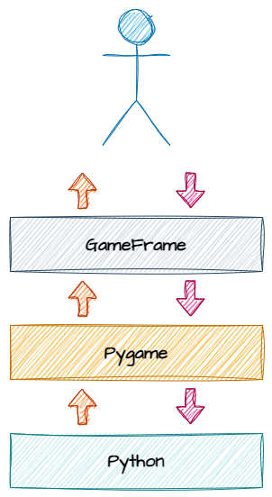

# Introduction

```{topic} In this lesson you will:
* understand what the course is about and the type of game you will build
* identify how Python, Pygame, and GameFrame are used to create a game
* recall the Python knowledge needed to complete this tutorial 
* explain how Pygame is used to create 2D games
* explain how GameFrame makes building games easier by extending Pygame
* describe how the full technology stack works together, from Python code to the finished game

```

In this course, you will build a 2D game using Python, Pygame, and GameFrame. You will also learn some basic game design ideas.

Before starting, look at the tools you will use.

## Python

To follow this course, you need a good understanding of basic Python programming. You should be familiar with:

* core syntax, including:

  * `for` and `while` loops
  * `if`, `elif`, and `else` statements
  * how to create and use functions
  * mathematical, conditional, and Boolean operations
  * different data types
* how screen coordinates work
* how to import and use libraries
* object-oriented programming (OOP), including:

  * using objects
  * creating your own objects with `class`

If you are not confident with these skills yet, complete the following Python beginner courses before continuing:

- [A Turtle Introduction to Python](https://damom73.github.io/turtle-introduction-to-python/) for foundational syntax.
- [Deepest Dungeon - Python OOP](https://damom73.github.io/python-oop-with-deepest-dungeon/) for object orientated programming.

---

## Pygame

Pygame is a popular, open-source library used to build 2D games and interactive programs in Python. It gives you the tools needed to create games, simulations, and graphical applications.

Pygame simplifies complex programming tasks by using abstraction. For example, it can automatically detect when two sprites collide. This makes game development much easier than trying to build everything from scratch in Python.

Pygame is a 2D game engine, so it is not used for large, high-budget (AAA) games like Call of Duty. However, it is still capable of creating large and detailed games. Some games on Steam have been built using Pygame.

More information is available on the [Pygame official website](https://www.pygame.org/news).

---

## GameFrame

In the words of its developer, Steven Tucker, “GameFrame has been developed to take the excellent Pygame libraries and make them more accessible and easy to use for beginner to intermediate programmers.”

Just as Pygame makes it easier to create games in Python, GameFrame makes it easier to build games using Pygame.

GameFrame is not a library like Pygame. Instead, it is an event-driven framework. It includes a set folder structure and a collection of Python files that contain classes.

When using GameFrame, you:

* define Rooms and Room Objects
* write functions that respond to events such as collisions or button clicks

GameFrame also has clear rules about where files must be stored, along with built-in commands that help you develop your game.

---

## The Stack

Below is a diagram showing the full stack of tools and technologies used in this course.



Let’s break this down:

* At the top, the **programmer** works with **GameFrame**, using its folder structure and built-in commands (API).
* **GameFrame** then communicates with Pygame through its API.
* Pygame then interacts with the core Python libraries to run the program.

```{admonition} Languages
:class: hint
Your code, GameFrame, and Pygame are all written in Python, but this is not always the case.

Some libraries used by Pygame are written in other languages. For example, NumPy is written in C or C++, which helps make it faster and more efficient.
```

You can access the Pygame API directly if you want. This means you can use Pygame commands that are not included in the GameFrame API.

You will not need these commands to complete this course, but you can use them to add extra features to your projects.

Full details are available in the [Pygame documentation](https://www.pygame.org/docs/).
