# Setup

```{topic} In this lesson you will:
* Set up your computer for the course
* Install Python
* Set up version control to manage your code
* Install an integrated development environment (IDE)
* Download the game files and the GameFrame framework
* Create a virtual environment to manage project dependencies
```

In this course, you will focus on building good programming habits. This includes using a proper development environment and version control to manage your code.

You will need to install several programs and set up your computer so everything works correctly together.

```{admonition} Reasons for workflow
:class: hint
There are many reasons for using this workflow, but most are outside the scope of this course.

In simple terms, this workflow helps avoid common mistakes that beginners often make. This means you can spend more time writing code and less time fixing problems.
```

## Programming Language - Python

The first step is to install Python, the programming language you will be using.

If you have used beginner IDEs like Thonny or Mu, Python was already included. In most real-world setups, you need to install Python yourself.

```{admonition} Versions
:class: hint
Python has multiple versions. When this course was created, Python 3.11.4 was the latest version.

New versions of Python 3 are released regularly, usually once per year. For this course, the exact version is not critical, so you can install the latest available version.
```

The best way to install Python depends on the operating system you are using.

### Windows

The easiest way to install Python on Windows is through the Microsoft Store. Search for Python and install the latest version available.

This method:

* installs Python
* keeps it updated automatically
* adds Python to your system path so it can be used anywhere

After installing, check that it worked by running Python on your computer.

### macOS

To install Python on macOS, go to the Python website and click the yellow **Download Python 3.X.X** button. The site will automatically detect your system and download the correct installer.

Open the downloaded file and follow the steps to install Python.

After installing, check that it worked by running Python on your computer.

---

## Version Control

Version control is a system that tracks changes to your files over time. It lets you save different versions of your work and return to earlier versions if needed.

You can think of it like OneDrive, but it is not automatic. After saving your work on your computer, you must choose when to sync it to the cloud.

In this course, you will only use the basic features, but it is an important part of developing good programming habits.

### Git

Git is the industry-standard version control system. It is free and open source, and is used to track changes in files over time. It is most commonly used for code, but it works for any project with files.

When using Git, your code is stored in a special folder called a repository (repo). A repo tracks all changes you make, allowing you to go back to earlier versions if something breaks.

In this course, you will not use Git directly. Instead, it will be built into the tools you use. You still need to install it.

**To install Git:**

* Go to the Git website: [https://git-scm.com/](https://git-scm.com/)
* Download the **Latest Source Release**
* Run the installer

  * macOS users: choose the Binary Installer
* Accept all default settings during installation

### GitHub

GitHub is the service you will use to store and sync your repositories in the cloud. The free version is sufficient for this course.

**Create an account:**

* Go to [https://github.com/](https://github.com/)
* Click **Sign up** in the top right corner
* Use your school email to create your account (you can change it later)

```{admonition} Git vs GitHub
:class: hint
Git is the tool that tracks changes to files and manages repositories on your computer. GitHub is a website that stores those repositories online and adds features for sharing and collaboration.

While GitHub is the most widely used platform, there are other similar options such as GitLab and Bitbucket.
```

### GitHub Desktop

GitHub Desktop is an application that makes it easier to use GitHub without needing to use commands.

**To install GitHub Desktop:**

* Go to [https://desktop.github.com/](https://desktop.github.com/)
* Click the purple **Download** button
* Run the installer

  * macOS: move the app and restart when prompted
* Accept all default options

After installing:

* Open GitHub Desktop
* Sign in using your GitHub account

---

## IDE

An Integrated Development Environment (IDE) is a program that helps you write, edit, and test your code in one place.

It acts as a workspace for programming, where you can:

* write and edit code
* get suggestions and see errors as you type
* organise your files
* run your programs and see the results

An IDE combines these tools into a single application, making coding easier and more efficient.

### Visual Studio Code

Visual Studio Code (VS Code) is the IDE you will use for this course.

```{admonition} Alternative to VS Code
:class: warning
Visual Studio Code is a professional IDE with many features beyond what you will need in this course. It also interacts with deeper parts of your computer, which can sometimes make setup more difficult.

If you prefer a simpler option, you can use Thonny instead. **[Instructions on setting up Thonny](using_thonny.md)** are provided.
```

**To install Visual Studio Code:**

* Go to [https://code.visualstudio.com/](https://code.visualstudio.com/)
* Click the **Download** button
* Run the installer
* Accept all default options

### VS Code Extensions

#### Python Extension

Visual Studio Code can be used for many programming languages. To use it for Python, you need to install the Python extension.

**To install the Python extension:**

* Go to the  [Python extension on the Visual Studio Marketplace](https://marketplace.visualstudio.com/items?itemName=ms-python.python)
* Click **Install**
* Confirm that you have VS Code installed
* Accept the prompt to open VS Code if it appears

#### Material Icon Theme

By default, Visual Studio Code does not show icons in the file panel, which can make it harder to tell files and folders apart.

To fix this, install the **Material Icon Theme**, which adds clear icons to your files and folders.

1. Go to the [Material Icon Theme on the Visual Studio Marketplace](https://marketplace.visualstudio.com/items?itemName=PKief.material-icon-theme)
2. Click **Install**
3. Acknowledge that you have VS Code
4. You may need to accept the prompt to open VS Code

---

## GameFrame and resources

```{admonition} GameFrame
:class: hint
GameFrame was developed by Steven Tucker, a Queensland teacher.

If you want the latest version of GameFrame, you can find it on his GitLab repository:
[https://gitlab.com/tuxta/gameframe](https://gitlab.com/tuxta/gameframe)
```

You will use a repository that contains a modified version of GameFrame, including all the files needed for this course.

You will clone (copy) this repository from GitHub onto your computer.

To do this:

1. Go to the **[Space Rescue Resources repo](https://github.com/DamoM73/space-rescue-resources)**
2. Click on the green **Code** button
3. Click on the **copy** button beside the https url

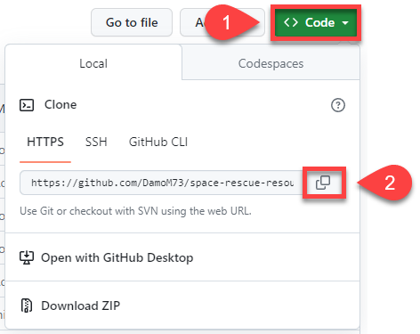

4. Open **GitHub Desktop**
5. Open the **File** menu
6. Click **Clone Repository**

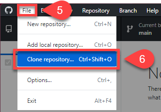

7. Choose the **URL** tab
8. Paste repo URL into **URL or username/repository** box
9.  Click **Clone**

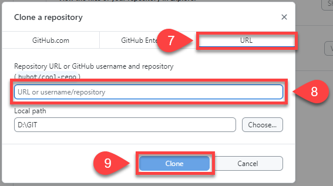 

The repo should now be copied onto your computer and ready for use.

---

## Opening repo in VS Code

You will use GitHub Desktop to manage your programming workflow.

It will be used to:

* open your code in Visual Studio Code and set up the workspace
* save your work (commit) to your local repository
* sync (push) your changes to GitHub (origin)


```{admonition} Git and GitHub terminology
:class: hint
Git and GitHub use specific terms. These are the ones you need to know:

* **Repository (repo)**: A special folder that stores your project files and their history
* **Commit**: A saved snapshot of your changes, with a message explaining what was done
* **Pull**: Getting the latest changes from others and updating your copy
* **Push**: Sending your changes to the online version of the project
* **Remote**: The online version of your project (in this course, on GitHub)
* **Clone**: Copying a project from the remote location to your computer
* **Local**: The version of the repo stored on your computer
* **Origin**: The main remote copy of your repo
* **Fork**: Creating your own copy of someone else’s project

Note: “others” can include you working on a different computer.
```

**To use GitHub Desktop to open Visual Studio Code:**

* Open GitHub Desktop
* Check that the **Current repository** (top left) is **space-rescue-resources**
* Click **Open Visual Studio Code**

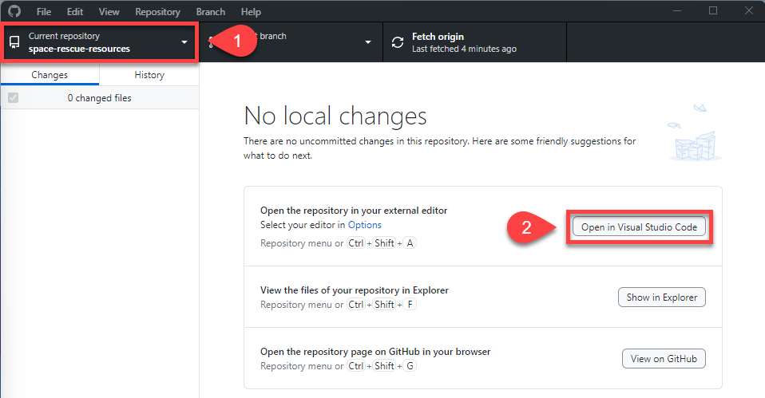

Visual Studio Code should now open. In the file panel on the left, you should see:

* **space-rescue-resources**
* all the project files shown in the image below

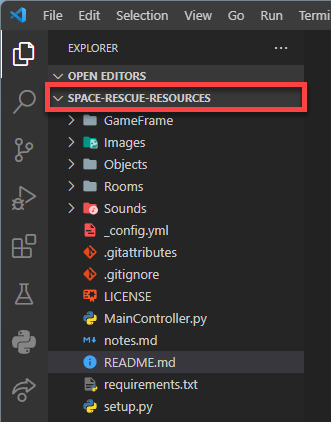

---

## Virtual Environment

Python virtual environments let you keep different projects separate.

Each project has its own space, with its own Python setup and libraries. This means changes in one project will not affect another.

You can think of it like separate rooms:

* each project has its own space
* each space can have different tools (libraries)
* nothing from one project interferes with another

Using virtual environments keeps your work organised and prevents conflicts between projects.

```{admonition} requirements.txt
:class: hint
The `requirements.txt` file lists all the extra libraries needed for this project.

You can add more libraries to this file. To install everything listed in it, run:

* Windows: `pip install -r requirements.txt`
* macOS: `pip3 install -r requirements.txt`
```

### Create Virtual Environment

```{admonition} Windows Users
:class: error
If you are using Windows, you may need to run a PowerShell command before creating a virtual environment for the first time.

**Steps:**

* Open PowerShell as Administrator
* Run the command:
  `Set-ExecutionPolicy -ExecutionPolicy RemoteSigned -Scope CurrentUser`

You should only need to do this once, unless you are using a different computer.
```

**To create a virtual environment in Visual Studio Code:**

* Press **Ctrl/Cmd + Shift + P**
* Type **Python**
* Select **Python: Create Environment...**

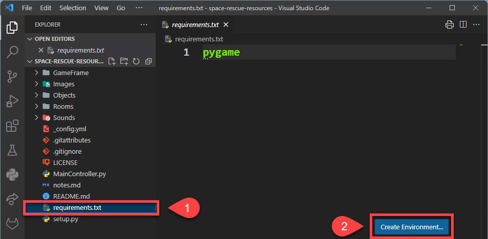

* Select the **Venv** option at the top

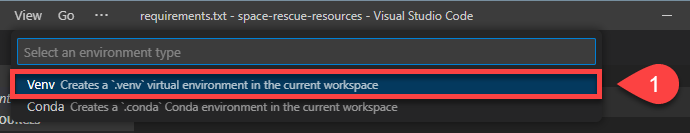

* Select the latest version of Python that you installed

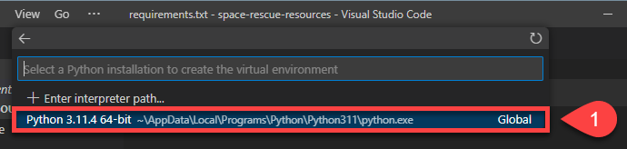

* Tick the box next to **requirements.txt**, then click **OK**

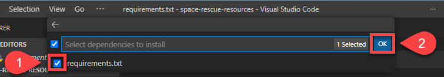

Visual Studio Code will now:

* create your virtual environment
* perform any required updates
* install the libraries listed in **requirements.txt**
* activate the virtual environment

### Check Virtual Environment

To check that your virtual environment is active in Visual Studio Code:

* Look at the status bar in the bottom left
* Check for the Python version and the name of the virtual environment

If both are shown, your virtual environment is active.


---

## Make first commit and push

* Open the **README.md** file
* Replace its contents with the text provided below
* Save the file

```
# SPACE RESCUE

Try to save the helpless astronauts who are being left stranded in space by the evil Zork.
```

* In GitHub Desktop, enter **"Made first change"** in the **Summary (required)** field
* Click **Commit to main**

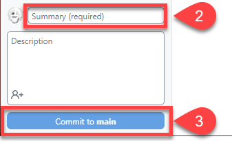

* Click **Push origin** (you will receive an error)

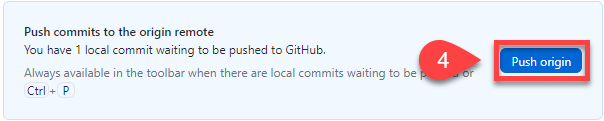

* Select **Fork this repository**
* Choose **For my own purposes**, then click **Continue**
* Click **Push origin** again
