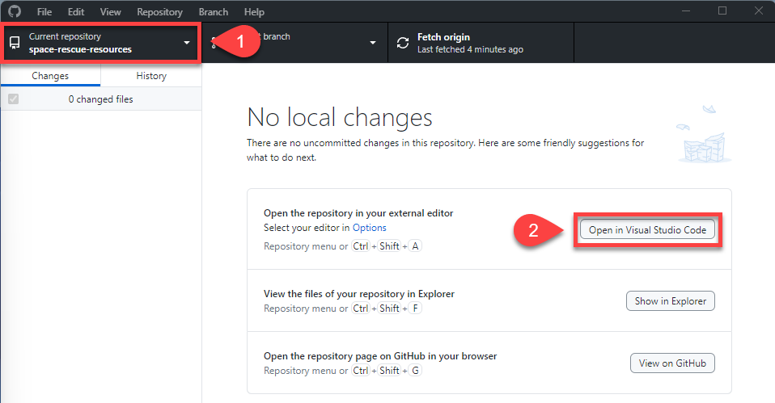
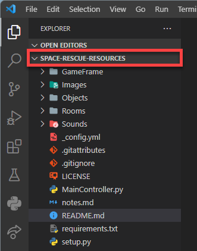
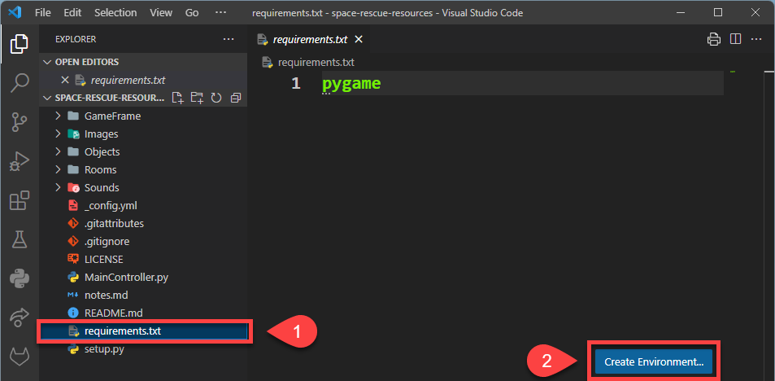
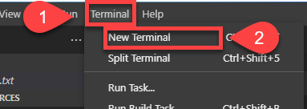

# Setup

For this course we are going emphasise developing good programming practice. This means using a proper development environment with version control. We will need to install a number of programs and then set our environment to ensure it functions properly.

```{admonition} Reasons for workflow
:class: note
There are many reason behind using the workflow I'm presenting here. Most of them are beyond the scope of this course. Put simply, through experiecne, I have discovered that using this workflow minimises a number of traps that beginners fall into. This means that we can spend more time coding and less time trouble-shooting.
```

## Programming Language - Python

The first step is to install Python our programming language. If you have been using educational IDEs like Thonny and Mu, Python normally came packaged with them. This is not normally the case.

```{admonition} Versions
:class: note
Python has many versions. At the time this site was created, Python 3.11.4 was the latest verion. This won't be the case for very long, since a new version of Python 3 comes out every year. It doesn't matter too much for the level we are working, so just go ahead and install the latest one.
```

The best way to install Python depends on the operating system you are using.

### Windows

The easiest way to install Python on Windows devices is to use the **Microsoft Store**. Just search for Python and then select the latest version (at the time of writing it is 3.11). This will install Python as well as keeping it up to date, when patches are released. It also add Python to your computer path, this allows it to be used anywhere on your computer.

Check the installation by running Python.

### macOS

To install Python for macOS go to the [Python website](https://www.python.org/) and click the yellow button that says **Download Python 3.X.X**. The website will detect your operating system and download the correct file for your computer.

Now install the downloaded file.

Check the installation by running Python.

## Version Control

Version control is a system that helps keep track of changes made to files or projects over time. It allows you to save different versions of your work and easily switch between them if needed. Think of it as OneDrive but not as automatic. After you save work to your local computer, you will need to explicitly sync it with the cloud version.

While we will only be using the simplest features of version control, this is part of you developing good programming practice.

### Git

Git is the industry standard distributed version control system. It is a free and open-source tool that helps individuals and teams manage changes to files and projects over time. Git is especially popular among software developers for tracking code changes, but it can be used for any type of file-based project.

Using Git, we will have a special folder for your code. This folder is called a repository (repo). This repo is like a supercharged folder. It will keep track of the changes you make to your code, so you can revert to your previous code. This is really useful if you have made changes that have broken your code.

We won't be using Git directly, but rather it will be integrated into other software we are using. Never-the-less, we still need to install it.

To install Git:

1. Go to the [Git website](https://git-scm.com/) and download the **Latest source Release**.
2. Run the downloaded installation file
3. Accept all the defaults for the installation process.

### GitHub

GitHub is the service we will be using to sync our repos to the cloud. We will be using the free version.

Create an account by:

1. Going to the [GitHub website](https://github.com/)
2. Choose the **Sign up** link in the top righthand corner.
3. Use your College email to create your account (you can change it later)

```{admonition} Git vs GitHub
:class: note
Git is the underlying version control system that tracks changes to files and manages repositories locally, while GitHub is a web-based platform that hosts Git repositories remotely and provides additional collaboration and project management features. While GitHub is the most popular web-based repository platform, it's important to note that there are alternative platforms similar to GitHub, such as GitLab and Bitbucket.
```

### GitHub Desktop

GitHub Desktop is an application that makes it easier to use GitHub.

To install GitHub Desktop:

1. Go to the [GitHub Desktop website](https://desktop.github.com/)
2. Click the purple **Download** button.
3. Run the downloaded installation file.
4. Accept all the default options.

Once it is installed, run GitHub Desktop and sign in using your new GitHub credentials

## IDE

An Integrated Development Environment (IDE) is a special computer program that helps you write, edit, and test your code more easily. It's like a digital workspace for programmers. Inside the IDE, you can write your code, see instant suggestions and corrections, organize your files, and run your programs to see the results. It brings together different tools and features that make coding more efficient and productive.

### Visual Studio Code

Visual Studio Code (VS Code) is the IDE that we will be using.

To install VS Code:

1. Go to the [VS Code website](https://code.visualstudio.com/)
2. Click on the **Download** button
3. Run the downloaded installation file.
4. Accept all the default options.

### VS Code Extensions

VS Code can be used to write any programming language. We need to prepare it for working with Python. We do that by adding the Python extensions.

1. Go to the [Python extension on the Visual Studio Marketplace](https://marketplace.visualstudio.com/items?itemName=ms-python.python)
2. Click **Install**
3. Acknowledge that you have VS Code
4. You may need to accept the prompt to open VS Code

## GameFrame and resources

GameFrame was developed by a Steven Tucker, a Queensland teacher. If you wish to use the latest versions of GameFrame, it can be found at his [Gitlab repository](https://gitlab.com/tuxta/gameframe?fbclid=IwAR0GnSkDPy-IdeoNZofh0YwVJ63i4m2wVyzXwBrFqpbG2cLuYox8dkbU2Ss).

Instead, we will be using a repo with an edited version of GameFrame, which includes all the assets needed for these tutorials. We will clone (copy) the repo from GitHub.

To do this:

1. Go to the [Space Rescue Resources repo](https://github.com/DamoM73/space-rescue-resources)
2. Click on the **<> Code** button
3. Click on **Open with GitHub Desktop**


The repo should now be copied onto your computer and ready for use.

## Opening repo in VS Code

We're going to use GitHub Desktop to coordinate our programming. We will use it to:

- Open our code in VS Code and set up the workspace correctly
- Save (commit) our finished code to our local repo
- Sync (Push) our committed code up to GitHub (origin)

```{admonition} Git and GitHub terminology
:class: note
Git and GitHub uses a range of different terminology. Here are some of the terms we will be using:

- Repository or repo: A repository is a special folder that stores all the files and their history for a project.
- Commit: When you make changes to files in a repository, a commit is takes a snapshot of those changes. Each commit has a unique name and a message explaining what changes were made.
- Pull: Pulling means getting the latest changes made by others and adding them to your own copy of the project.
- Push: Pushing is when you share your changes with others by sending them to a central place, like a website or server.
- Remote: A remote is a way to connect your local copy of the project with the online version. weare using GitHub. It allows you to share your work and collaborate with others.
- Clone: Cloning is making a copy of a project from a remote location to your own computer so you can work on it.
- Local: the copy of the repo that is on your computer
- Origin: the copy of the repo that is on a remote location

Note: the *other* that you could be working with might be you on another computer.
```

To use GitHub Desktop to open VS Code:

1. Open GitHub Desktop
2. Make sure the **Current repository** (top lefthand) is **space-rescue-resources**
3. Click **Open Visual Studio Code**



VS Code should now launch and you file panel of the lefthand side should show:

- space-rescue-resources
- all the files in the image below



## Virtual Environment

Python virtual environments enables you to designate distinct areas for various Python projects. It's like having various rooms in your home, each with its unique furnishings and accents. You can work on various projects in a virtual environment without their interfering with one another. Each project gets a special "playground" with its own Python installation and particular libraries. A virtual environment is similar to walking into a specific room, and any Python programmes or libraries you use are exclusive to that project once you enter it. You can easily work on numerous Python projects because everything is kept organised and conflicts between projects are avoided.

```{admonition} requirements.txt
:class: note
The `requirements.txt` file lists all the external libraries that we need to install for this project. 

You can add extra libraries to this file, but to install them you will need to run the command:

- Windows: `pip install -r requirements.txt`
- macOS: `pip3 install -r requirements.txt`
```

### Create Virtual Environment

To create a virtual environment for this project:

1. Click on the `requirements.txt` file to open it.
2. Then click on the blue **Create Environment** button on the bottom right



3. At the top choose the **Venv** option


4. Then choose the latest version of Python that you just installed


5. Tick the box beside **requirements.txt** and then **ok**


VS Code will now:

- create your virtual environment
- perform any necessary updates
- install the libraries in the **requirements.txt** file
- activate your virtual environment

```{admonition} Create Environment button missing
:class: warning
If the **Create Environment** button doesn't appear when you open the `requirements.txt` file, then:

1. Press `Ctrl` + `Shift` + `P` (Windows) / `Shift` + `Command` + `P` (macOS)
2. Type `Python` at the top
3. Choose `Python: Create Environment...`


```

### Check Virtual Environment

Finally to check that the virtual environment has been setup.

1. Click the **Terminal** menu
2. Choose **New Terminal**



3. Check that the prompt in terminal (bottom of the screen) starts with **(.venv)**

