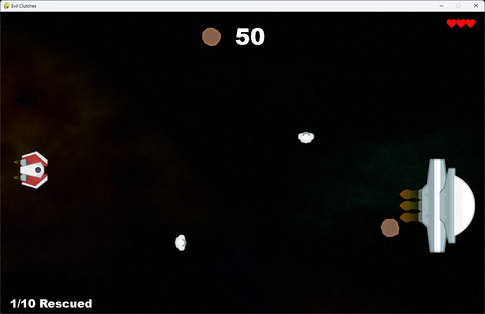

# Get to know GameFrame

```{topic} In this lesson you will:
* understand how the GameFrame project is organised into files and folders
* identify the key files in the GameFrame framework and what they do
```

## How GameFrame works

The GameFrame framework is built around **Objects**.

You will create objects that contain the logic for how your game works. These objects are then placed inside **Rooms**, where the game takes place.

```{admonition} Game Logic
:class: hint
Game logic is all the code that makes a game work.

It controls things like:

* what happens when a player presses keys
* what happens when objects collide
* how and when the score changes
```

The image below shows what the game you will create will look like.



Everything you see on the screen is an **Object**:

* the player’s spaceship on the left
* the enemy spaceship (called Zork) on the right
* asteroids
* astronauts
* score
* player’s lives
* the sub-goal counter

All of these are inside a **Room** called **GamePlay**.

### Looking closer

The player’s ship object, called **Ship**, includes:

* its sprite (image)
* code that responds to key presses
* code that stops it moving outside the top and bottom of the room
* code that shoots lasers

Other objects have their own game logic. For example:

* the **Zork** object controls when asteroids and astronauts appear
* the **Asteroid** object reduces the player’s health when it hits the ship
* the **Astronaut** object increases the score when collected
* the **Laser** object destroys asteroids and astronauts on contact

When creating a game in GameFrame, you need to think about:

* which objects are in your game
* how they interact with each other
* how they interact with the player

---

## Documentation

This tutorial will cover many of the features of GameFrame.

If you want to explore further or use GameFrame for your own projects, you can find the full details on the **[GameFrame API](./documentation.md)** page.

---

## File Structure

Another important part of GameFrame is understanding its file structure and the key files it uses.

The image below shows how the files are organised.

```{figure} assets/img/file_structure.png
---
align: left
---
```

The yellow **SPACE RESCUE** folder is the **root** folder. It contains everything for the project.

The green **.venv** folder stores your virtual environment files. This was created by Visual Studio Code when you set up the environment.

All the remaining folders and files belong to the GameFrame framework. Each GameFrame folder (root, GameFrame, Images, Objects, Rooms, and Sounds) includes a **`notes.md`** file. These files contain documentation for that specific folder. The full documentation is available on the **[GameFrame API](./documentation.md)** page.

The red **GameFrame** folder is the engine of the framework. It contains most of the core code. The main file you need to know is **`Globals.py`**, which stores variables used across the entire program.

The blue **Images** and **Sounds** folders store all the assets used in the game. They already include the files needed for Space Rescue. If you want to add your own images or sounds, place them in these folders.

The purple **Objects** and **Rooms** folders are where you will write most of your code. This is where you create your own classes. For example, you will create a file called `Ship.py` that contains the `Ship` class inside the **Objects** folder.

Both of these folders also contain a **`__init__.py`** file. This file is important because it connects all parts of the program together. When you create a new file and class, you must add it to the **`__init__.py`** file so GameFrame can find and use it.

``` python
from Objects.Ship import Ship
```

The final important file is **MainController.py** in the root folder.

This is the file you run to start the game.
