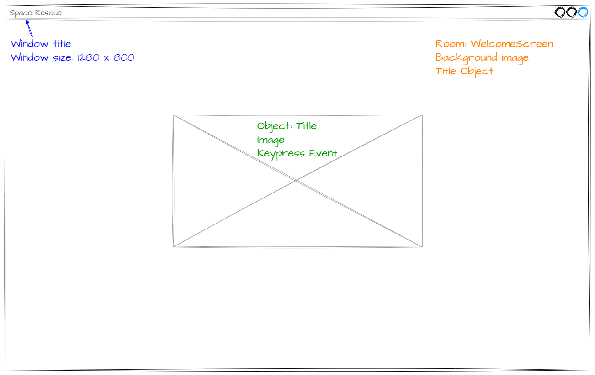

# Welcome screen

```{topic} In this lesson you will:
- learn how to plan using wireframes and class diagrams
- learn how to make adjustment to window variables
- learn how to create a GameFrame Room and add a background to it
- learn how to create a GameFrame Object and add it to a Room
```

To get the ball rolling, well create a welcome screen for our game. This is a nice easy way to introduce some of the concepts and processes we will be using throughout.

## Planning

### Wireframe

```{admonition} Wireframes
:class: note
A wireframe is like a blueprint or skeleton of a website or app. It's a simple, basic outline that shows where different elements, like buttons, images, and text, will go on the screen. It focuses on the layout and arrangement of elements rather than the colors or details. It's a helpful tool for visualizing and discussing ideas before creating the final design, just like making a rough sketch or draft of a drawing before adding all the details.
```

Below is a wireframe of our welcome screen.



This wireframe shows three different parts of the program wee need to address:

- the game window (blue text):
  - features of the window that will hold our game
  - need to change size and title
- the WelcomeScreen room (orange text):
  - the main part of our window is taken up with the game surface which holds the WelcomeScreen Room
  - it contains a background image and the Title Object
- the Title Object (green text):
  - represented by the placeholder (box with an x)
  - contains an image
  - has a key event to react to space being pressed

### Class diagram

We now know how the screen will look, but let's also consider the Class diagram. Check out [Deepest Dungeon](https://damom73.github.io/python-oop-with-deepest-dungeon/stage_1.html#class-diagram) for a refresher on Class diagrams if you need it.


We can see that the **WelcomeScreen** class has two attributes:

- background image
- Title RoomObject

We can also see that the Title class has:

- attribute: image
- method: keypressed

So we can see that there are three tasks we need to complete to create our welcome screen:

1. Adjust window values
2. Create WelcomeScreen Room
3. Create Title RoomObject
4. Add Title RoomObject to WelcomeScreen Room

Let's start.

## Adjust window values

The window values reside in `Globals.py` in the `GameFrame` folder, so open it up.

To change the window size, adjust the `SCREEN_WIDTH` and `SCREEN_HEIGHT`:

```{code-block} python
:linenos:
:lineno-start: 7
:emphasize-lines: 1-2
SCREEN_WIDTH = 1280
SCREEN_HEIGHT = 800
```

Then change the `window_name` value:

```{code-block} python
:lineno-start: 15
:emphasize-lines: 2
# - Set the Window display name - #
window_name = 'Space Rescue'
```

Save the `Globals.py` file using `control` + `S` (Windows) `command` + S (macOS)

## Create WelcomeScreen Room

Let's check the [GameFrame documentation](documentation.md#roomslevels) to see how we can create a level.

So we need to create a new file in the `Rooms` folder called `WelcomeScreen.py`.

In this file we are going to create a WelcomeScreen class. This is going to be a sub-class of the Level class provided by GameFrame. So the first thing we need to do is to import the Level class from GameFrame:

```{code-block} python
:linenos:
:emphasize-lines: 1
from GameFrame import Level
```

Now we can create our WelcomeScreen class. Following the instructions from the documentation add the following code.

```{code-block} python
:linenos:
:emphasize-lines: 3-8
from GameFrame import Level

class WelcomeScreen(Level):
    """
    Intial screen for the game
    """
    def __init__(self, screen, joysticks):
        Level.__init__(self, screen, joysticks)
```

Lets break that down a bit:

- **line 3**: defines our class &rarr; explicitly names it as a subclass of the `Level` class.
- **lines 4-6**: a doc string that explains the class.
- **line 7**: the `__init__` method &rarr; called automatically when a `WelcomeScreen` object is made.
- **line 8** calling the `__init__` method of the `Level` parent class &rarr; the `WelcomeScreen` class will inherent all the attributes and methods from `Level`.

Now save the `WelcomeScreen.py` file.

### Testing WelcomeScreen

So we've made a welcome screen, let's run the game and see what happens.

Open `MainController.py` and then click the play button in the top righthand corner.


Well, that didn't go to plan. You probably have the following error:

```{code-block}
Traceback (most recent call last):
  File "d:\GIT\space_rescue_pygame\MainController.py", line 34, in <module>
    room = class_name(screen, joysticks)
           ^^^^^^^^^^^^^^^^^^^^^^^^^^^^^
TypeError: 'module' object is not callable
```

Have a close look at this error. I guarantee this is not the last time you will see it, that's why I purposely caused it. 

Reading the error it is really obscure what the problem. Remember when looking at the file structure I said that if you add a new Room or Object you need to link it to GameFrame using the `__init__.py` file. This is the kind of error that occurs when you forget.

To remedy this error, open the `__init__.py` file in the `Rooms` folder and add the following code:

```{code-block} python
:linenos:
from Rooms.WelcomeScreen import WelcomeScreen
```

Save the `__init__.py` file, and run your program again using the `MainController.py`.

You should now have a screen like this:


Not very exciting, but it's the correct size, and the window title reads **Space Rescue**, so that's a start.

### Adding the background

Let's make it less boring by adding a background image. Again, check the [GameFrame docs](documentation.md#roomslevels) to see how we can do this.

You will see that there is a method **set_background_image** which takes an image file. So we will have to call this method, but when? Well, we want the background to appear as soon as the room is created, so, it needs to be called in the `__init__` method.

Go back to the `WelcomeScreen.py` file and then add the highlighted code to the `__init__` method.

```{code-block} python
:linenos:
:emphasize-lines: 10-11
from GameFrame import Level

class WelcomeScreen(Level):
    """
    Intial screen for the game
    """
    def __init__(self, screen, joysticks):
        Level.__init__(self, screen, joysticks)
        
        # set background image
        self.set_background_image("Background.png")
```

Breaking that down:

- **line 10**: structural comment to explain what is happening (really good habit to develop).
- **line 11**:
  - `self` &rarr; remember in OOP the need to refer all actions to the current instance of the object (self)
  - `set_background_iamge` &rarr; a method inherited from the `Level` parent class.
  - `"Background.png"` &rarr; image file in the `images` folder (go to the folder and see if you can find it).

Save `WelcomeScreen.py` and then run the program again using `MainController.py`.

## Create Title RoomObject

Not that we have a Room we can place the Title RoomObject inside it. So let's check the [GameFrame docs](documentation.md#roomobject) to see how to do this. This is a similar process to creating a Room:

1. Create a new file in the `Objects` folder
2. Import the parent class
3. Initialise the class
4. Add new file to the `__init__.py` file.

Notice that the RoomObject class has many more methods. These are used to implement the game logic.

Open the `Objects` folder create a new file and call it `Title.py`.

In `Title.py` import the parent class using the following code:

```{code-block} python
:linenos:
:emphasize-lines: 1
from GameFrame import RoomObject
```

Now create your Title class using the code below:

```{code-block} python
:linenos:
:emphasize-lines: 3-8
from GameFrame import RoomObject

class Title(RoomObject):
    """
    The object for displaying the title
    """
    def __init__(self, room, x, y):
        RoomObject.__init__(self, room, x, y)
```

This code is very similar to the code to create a the WelcomeScreen class. It creates the class, initialises the class, and runs the parent class' `__init__` in order to inherent the attributes and methods.

Next we need to add an image to the object. Add the highlighted code below

```{code-block} python
:linenos:
:emphasize-lines: 10-12
from GameFrame import RoomObject

class Title(RoomObject):
    """
    The object for displaying the title
    """
    def __init__(self, room, x, y):
        RoomObject.__init__(self, room, x, y)
        
        # set image
        image = self.load_image("Title.png")
        self.set_image(image,800,350)
```

This is fairly different to how we added an image to the WelcomeScreen room, so let's unpack it:

- **line 10**: a structural comment
- **line 11**: retrieves `"Title.png"` from the Images folder &rarr; stores it in the `image` variable
- **line 12**: assigns the image variable to this (self) RoomObject
  - Note `800` and `350` this is the width and the height of the image

```{admonition} Determine image width and height
:class: note
The easiest way to work out the height and width of an image is to open the image in VS Code and then look at the status bar at the bottom right of the screen.


```

Finally save `Title.py`. 

Open the `__init__.py` in the `Objects` folder and add the following code:

```{code-block} python
:linenos:
:emphasize-lines: 1
from Objects.Title import Title
```

```{admonition} Keeping workspace clean
:class: note
During these tutorials, you will be moving between many different files, even files with the same name, but in different folder (eg. `__init__.py`).

To reduce the chance of working in the wrong file, get into the habbit of closing a file once you have finished with it.
```

Save `__init__.py` and close it.

Now run `MainController.py` to test your code. Nothing should change, because we haven't added the RoomObject into the Room yet. This was just to check that there are no errors in your code so far.

## Add Title RoomObject to WelcomeScreen Room

Now that we have made the Title RoomObject and the WelcomeScreen Room, we can put them together.

Open `WelcomeScreen.py` and add the code highlighted below:

```{code-block} python
:linenos:
:emphasize-lines: 2, 14-15
from GameFrame import Level
from Objects.Title import Title

class WelcomeScreen(Level):
    """
    Intial screen for the game
    """
    def __init__(self, screen, joysticks):
        Level.__init__(self, screen, joysticks)
        
        # set background image
        self.set_background_image("Background.png")
        
        # add title object
        self.add_room_object(Title(self, 240, 200))
```

Breaking that down:

- **line 2**: imports the Title RoomObject we just created
- **line 14**:
  - `add_room_object` &rarr; a Level method that adds RoomObjects to Rooms
  - `Title(self, 240, 200)` &rarr; creates a new `Title` RoomObject and tells it that it belongs to **this** room at the position of `x` of `240` and `y` of `200`.

```{admonition} Pygame screen coordinates
:class: note
Pygame screen coordinates start with (0,0) in the top lefthand corner and increase as you move right and down. For example, on our screen the top left is (0,0) whilst the bottom right is (1279,799)
```

Save `WelcomeScreen.py` and close it.

## Testing

Now we have our welcome screen ready, it's time to test it.

Open `MainController.py` and run it. Your screen should look like this:


## Commit and Push


Now that we have finished a section of code and we have tested it to ensure it works, we should make a Git commit. Each commit creates an easy roll-back point. So if we break a our code, we can always return to a point that it worked.

To do this:

1. In GitHub Desktop go to the bottom left-hand box and write into the summary `Created WelcomeScreen`.
2. Click on **Commit to main**
3. Click on **Push origin**

Now the work from this lesson is committed and synced with the online repo.

## Completed file states

Below are all the files we used in this lesson in their finished state.

### `GameFrame\Globals.py`

```{code-block} python
:linenos:

class Globals:

    running = True
    FRAMES_PER_SECOND = 30

    SCREEN_WIDTH = 1280
    SCREEN_HEIGHT = 800

    SCORE = 0

    # - Set the starting number of lives - #
    LIVES = 3

    # - Set the Window display name - #
    window_name = 'Space Rescue'

    # - Set the order of the rooms - #
    levels = ["WelcomeScreen", "Maze", "ScrollingShooter", "BreakOut"]

    # - Set the starting level - #
    start_level = 0

    # - Set this number to the level you want to jump to when the game ends - #
    end_game_level = 4

    # - This variable keeps track of the room that will follow the current room - #
    # - Change this value to move through rooms in a non-sequential manner - #
    next_level = 0

    # - Change variable to True to exit the program - #
    exiting = False


# ############################################################# #
# ###### User Defined Global Variables below this line ######## #
# ############################################################# #

    total_count = 0
    destroyed_count = 0
```

### `Rooms\WelcomeScreen.py`

```{code-block} python
:linenos:
from GameFrame import Level
from Objects.Title import Title

class WelcomeScreen(Level):
    """
    Intial screen for the game
    """
    def __init__(self, screen, joysticks):
        Level.__init__(self, screen, joysticks)
        
        # set background image
        self.set_background_image("Background.png")
        
        # add title object
        self.add_room_object(Title(self, 240, 200))
```

### `Rooms\__init__.py`

```{code-block} python
:linenos:
from Rooms.WelcomeScreen import WelcomeScreen
```

### `Objects\Title.py`

```{code-block} python
:linenos:
from GameFrame import RoomObject

class Title(RoomObject):
    """
    The object for displaying the title
    """
    def __init__(self, room, x, y):
        RoomObject.__init__(self, room, x, y)
        
        # set image
        image = self.load_image("Title.png")
        self.set_image(image,800,350)
```

### `Objects\__init__.py`

```{code-block} python
:linenos:
from Objects.Title import Title
```
