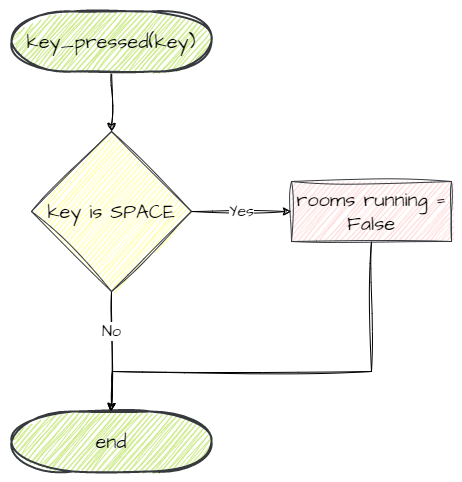

# GamePlay Room

```{topic} In this lesson you will:
- learn about event driven programming
- apply learnt knowledge to create a new room
- learn how listen for and handle keyboard events in GameFrame
- learn to plan using flowcharts
- learn how to change GameFrame Rooms
- apply learnt knowledge to commit and push your code to GitHub
```

In this lesson we are going to create the central room for our game. All the game play will occur in this room, so it is aptly names GamePlay. 

We will:

- Create a new Room called GamePlay
- Indicate that this is the next room after the WelcomeScreen
- Make the game switch from WelcomeScreen to GamePlay when the player presses space.

Before starting we need to understand event-driven programming.

## Event-driven Programming

Event-driven programming is an approach where a program waits for specific events to occur and then performs designated actions in response to those events. Instead of following a predetermined sequence, the program listens for events, such as a button press or a message arriving, and executes specific code based on those events. It allows programs to be more interactive and responsive by dynamically responding to user actions or external inputs, enhancing the overall user experience.

We will be creating an event driven program, which makes sense for a computer game. You want the game to respond when the user does something, or when characters bump into each other.

To create an event-driven program you need to typically follow these steps:

1. Identify the **Events** that will trigger actions.
2. Define **Event Handlers**: the code that will be executed when an event is triggered.
3. **Register** Event Handlers: associate the event handlers with their corresponding events.
4. Start **Event Loop**: Begin the event loop or **event listener**, which continuously waits for events to occur.
5. **Execute** Event Handlers: When an event occurs, the event loop triggers the associated event handler.
6. **Repeat**: The event loop continues running, waiting for more events. This cycle repeats until the program is exited or a specific condition is met.

GameFrame handles many of the tasks above, but its important to understand the terminology before we continue.

## Create GamePlay Room

To create the GamePlay Room we follow the same steps as we did for the WelcomeScreen Room.

1. Create a new file in the `Rooms` folder
2. Import the Levels class from GameFrame
3. Create the GamePlay class
4. Initialise the GamePlay class calling the parent class `__init__` and then add a backdrop
5. Add the new file to the `__init__.py` in the `Rooms` folder

### `Rooms/GamePlay.py`

Create a **new file** in the `Rooms` folder called `GamePlay.py`, then add the following code to it.

```{code-block} python
:linenos:
from GameFrame import Level

class GamePlay(Level):
    def __init__(self, screen, joysticks):
        Level.__init__(self, screen, joysticks)
        
        # set background image
        self.set_background_image("Background.png")
```

**Save** the `GamePlay.py` file.

### `Rooms/__init__.py`

Then **open** the `__init__.py` file in the `Rooms` folder and add the highlighted code below.

```{code-block} python
:linenos:
:emphasize-lines: 2
from Rooms.WelcomeScreen import WelcomeScreen
from Rooms.GamePlay import GamePlay
```

**Save** and **close** the `__init__.py` file.

## Make GamePlay next room

### `GameFrame/Globals.py`

To make this change we need to go back to the `Globals.py` file in the `GameFrame` folder.

Look for the `levels` variable. It contains a list of strings. According to the [GameFrame docs](99_documentation.md#gameframeglobalspy) this holds the names of all the levels in the game, in the order that a player progresses through them.

Currently that list is the default `["WelcomeScreen", "Maze", "ScrollingShooter", "BreakOut"]` with `"WelcomeScreen"` first. This works with our program, but the rest don't. So change the list to the highlighted code below:

```{code-block} python
:linenos:
:lineno-start: 18
# - Set the order of the rooms - #
levels = ["WelcomeScreen", "GamePlay"]
```

**Save** and **close** `Globals.py`.

## Changing Rooms using space

Now we have created the new Room and have added it to the list of rooms, we can create the trigger to swap from the WelcomeScreen to the GamePlay. So let's investigate how to do this.

Remember that the game logic resides within RoomObjects, therefore we will check out RoomObject in the [GameFrame docs](99_documentation.md#roomobject). 

Reading the RoomObject docs section we see that there are two references to the **keys**: the **handle_key_events** variable, and the **key_pressed** method. Lets look into these two.

### handle_key_events variable

The **handle_key_events** variable determines whether an object is notified of keyboard presses. The GameFrame docs tell us to listen for key events, we need to set this variable to `True`. We want to the Title RoomObject to listen for keypresses, so let's set that to `True`.

#### `Objects/Title.py`

**Open** `Title.py` in the `Objects` folder and add the highlighted code below:

```{code-block} python
:linenos:
:emphasize-lines: 14-15
from GameFrame import RoomObject

class Title(RoomObject):
    """
    The object for displaying the title
    """
    def __init__(self, room, x, y):
        RoomObject.__init__(self, room, x, y)
        
        # set image
        image = self.load_image("Title.png")
        self.set_image(image,800,350)
        
        # register for key events
        self.handle_key_events = True 
```

### key_pressed method

The GameFrame docs tell us that when `self.handle_key_events = True` then any key presses will call the **key_pressed** function. We need to write the code that needs to run in a key press event inside the key_pressed function. The GameFrame docs also tell us that, the key identity will be supplied as the variable **key**. These are Pygame key identities, which can be found on the [Pygame docs](https://www.pygame.org/docs/ref/key.html). We want the identity for the space key which is `K_SPACE`.

So we know this method will be run when a key is pressed, specifically the space key, but what do we want it to do? Well, we want it to close the WelcomeScreen Room and move onto the next Room in the list - GamePlay. How do we do this? Lets check what the [GameFrame docs](99_documentation.md#roomslevels) say about this.

One of the Rooms/Levels variables is called **running**, and the GameFrame docs tell us that if this is set to False then the room stops running. That sounds like the what we want to do.

Putting that all together in a flowchart:



The only tricky part is we are working inside the Title RoomObject, but we want to change a value in the WelcomeScreen Room, how can we reference this?

Remember when we create a RoomObject, we pass to it the room that it is being created in (that's the `self` in the code below).

```{code-block} python
:linenos:
self.add_room_object(Title(self, 240, 200))
```

This means the RoomObject knows what room it is in. Checking the [GameFrame docs](99_documentation.md#roomobject-variables) and there is a variable called `room` which stored this information.

With all this now worked out, we can write our code.

#### `Objects/Title.py`

Still working in our `Title.py` file, add the highlighted code below:

```{code-block} python
:linenos:
:emphasize-lines: 2, 18-24
from GameFrame import RoomObject
import pygame

class Title(RoomObject):
    """
    The object for displaying the title
    """
    def __init__(self, room, x, y):
        RoomObject.__init__(self, room, x, y)
        
        # set image
        image = self.load_image("Title.png")
        self.set_image(image,800,350)
        
        # register for key events
        self.handle_key_events = True 
        
    def key_pressed(self, key):
        """
        If the key pressed is space the game will start
        """
        
        if key[pygame.K_SPACE]:
            self.room.running = False
```

Let's break those lines down:

- **line 2**: since we are using the Pygame identifier `K_SPACE` we need to import the package.
- **line 18**: 
  - `key_pressed` &rarr; creates the event handler for when keys are pressed.
  - `key` &rarr; the Pygame key identifier of the key that has been pressed.
- **line 23**: checks if the key pressed was **space**
- **line 24**: goes to the RoomObject's parent Room (WelcomeScreen) and changes it's `running` variable to `False`

**Save** `Title.py` and **close** it.

## Testing

Now to test that everything is working correctly.

**Open** `MainController.py` and run it. Your welcome screen should show. 

Next press **space** and the Title should disappear because you are now in the empty GamePlay room.

## Commit and Push

We have finished and tested another section of code so we should make a Git commit.

To do this:

1. In GitHub Desktop go to the bottom left-hand box and write into the summary **Created GamePlay room**.
2. Click on **Commit to main**
3. Click on **Push origin**

Now the work from this lesson is committed and synced with the online repo.

## Completed File States

Below are all the files we used in this lesson in their finished state. **Use this to check if your code is correct**.

### `GameFrame/Globals.py`

```{code-block} python
:linenos:

class Globals:

    running = True
    FRAMES_PER_SECOND = 30

    SCREEN_WIDTH = 1280
    SCREEN_HEIGHT = 800

    SCORE = 0

    # - Set the starting number of lives - #
    LIVES = 3

    # - Set the Window display name - #
    window_name = 'Space Rescue'

    # - Set the order of the rooms - #
    levels = ["WelcomeScreen", "GamePlay"]

    # - Set the starting level - #
    start_level = 0

    # - Set this number to the level you want to jump to when the game ends - #
    end_game_level = 4

    # - This variable keeps track of the room that will follow the current room - #
    # - Change this value to move through rooms in a non-sequential manner - #
    next_level = 0

    # - Change variable to True to exit the program - #
    exiting = False


# ############################################################# #
# ###### User Defined Global Variables below this line ######## #
# ############################################################# #

    total_count = 0
    destroyed_count = 0
```

### `Rooms/GamePlay.py`

```{code-block} python
:linenos:
from GameFrame import Level

class GamePlay(Level):
    def __init__(self, screen, joysticks):
        Level.__init__(self, screen, joysticks)
        
        # set background image
        self.set_background_image("Background.png")
```

### `Rooms/__init__.py`

```{code-block} python
:linenos:
from Rooms.WelcomeScreen import WelcomeScreen
from Rooms.GamePlay import GamePlay
```

### `Objects/Title.py`

```{code-block} python
:linenos:
from GameFrame import RoomObject
import pygame

class Title(RoomObject):
    """
    The object for displaying the title
    """
    def __init__(self, room, x, y):
        RoomObject.__init__(self, room, x, y)
        
        # set image
        image = self.load_image("Title.png")
        self.set_image(image,800,350)
        
        # register for key events
        self.handle_key_events = True 
        
    def key_pressed(self, key):
        """
        If the key pressed is space the game will start
        """
        
        if key[pygame.K_SPACE]:
            self.room.running = False
```