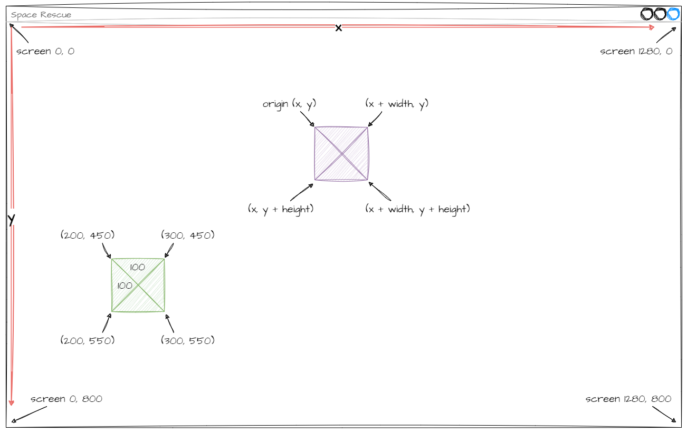
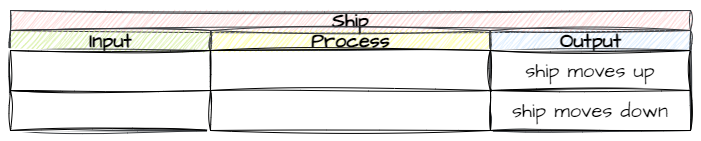
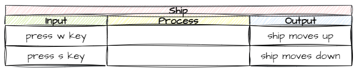
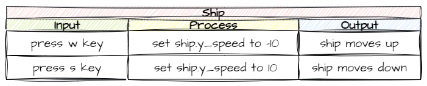

# Spaceship Object

Every game needs a player avatar, and for our game it will be a spaceship. In this lesson we are going to create a spaceship and make it move up and down the screen in response to the player.

## Pygame Graphics

Now that we are starting to work with sprites and graphics, we need to look a bit deeper at how graphics works in GameFrame. Since GameFrame is built on Pygame this mean understanding how Pygame handles graphics.

```{admonition} Graphics refresher
:class: note
Computer screens are made up of millions of little dots called pixels. Each pixel be more than 16 million colours.

Each pixel has a coordinate made up of its x value (horizontal position) and its y value (vertical position). These coordinates are written as `(x, y)`.
```

We will use the image below to explore graphics in Pygame.



### The screen

Pygame follows the common convention of have the `(0,0)` coordinate in the top lefthand corner of the screen, with the **x** value increasing as you move left and the **y** value increasing as you move down. This means that the largest coordinate value is the bottom righthand corner. Looking at our diagram this is `(1280, 800)`. The boundaries of the screen are:

| Value | Range |
| :-- | :-- |
|**x**|greater than `0` and less than `1280`|
|**y**| greater than `0` and less than `800`|

### Objects

All objects placed on the screen have three values:

- coordinates (x, y)
- width in pixels
- height in pixels

But if the object size is greater than one pixel, it will cover many coordinates. To deal with this issue objects are said to have an origin, and this is its coordinate. For objects with sprites, this is the top lefthand corner.

Using these three values, you can work out the corners of the object. Check the purple object in the diagram.

| Corner | Calculation |
| :-- | :-- |
|**top-left (origin)**|(x, y)|
|**top-right**|(x + width, y)|
|**bottom-left**|(x, y + height)|
|**bottom-right**|(x + width, y + height)|

Let's look at this in practice with the green object. It's origin is `(200, 450)`, width is `100` and height is `100`.

| Corner | Calculation | Value | 
| :-- | :-- | :-- |
|**top-left (origin)**|(x, y)| (200, 450) |
|**top-right**|(x + width, y)| (300, 450) |
|**bottom-left**|(x, y + height)| (200, 550) |
|**bottom-right**|(x + width, y + height)| (300, 500) |

### Movement

We can make an object move around the screen by changing its origin coordinates.

| Coordinate change | Resulting Movement |
| :-- | :-- |
| Increase in **x** | Object moves to the right |
| Decrease in **x** | Object moves to the left |
| Increase in **y** | Object moves down |
| Decrease in **y** | Object moves up |

## Planning

To plan what our objects are going to do, we're going to use an Input Process Output table (IPO). 

To complete and IPO table

1. Start with the desired **output**
2. Identify from the available **inputs** an appropriate trigger
3. Work out what **process** need to occur to move from **input** to **output** 

### Output

Lets think about what we want our spaceship to do. For this lesson, we're going to focus on moving the ship up and down. So that is our output.



### Input

What are our input options? Well our computers offer different types of input. Keyboard and mouse are the most common type. Ultimately, its an arbitrary choice, but lets go with keyboard. The next question is which keys? The most common keys used for up and down in games are **W** and **S**, so lets use them.



### Process

So how are we going to get the ship to move up and down in response to key presses. If we think about how Pygame handles graphics, we will have to change the **y** value of the object's origin, decreasing it when **W** is pressed and increasing it when **S** is pressed. How are we going to do that?

Let's check the [GameFrame docs](documentation.md#roomobject) to see if there are any RoomObject variables or methods that could help us. They show two possible variables. 

We could change the value of `y`, but that would results in only one change per press. meaning the player would have to repeatedly pressing keys to keep the spaceship moving. That doesn't sound like the best option.

We could change the value of `y_speed`. The docs say that this represents the number of pixels the object is moving in the vertical direction every frame. So we could set that to a number, for example `-10` for up and `10` for down. That way the ship will keep moving once the player presses the button. This sounds like our best bet.



That's the planning finished, now time to implement it.

## Adding Spaceship RoomObject

Adding the Spaceship RoomObject will initially follow the same steps as the Title RoomObject.

1. define the Ship RoomObject class
2. Initialise the Ship RoomObject class
3. Add an image to the Ship RoomObject class
4. Add Ship RoomObject class to `Objects/__init__.py`
5. Add Ship object to GamePlay Room
6. Register Ship RoomObject class to handle key events
7. Define Ship RoomObject's keypress method

### Creating Ship RoomObject

Go to the `Objects` folder and create a new file called `Ship.py`.

Open `Ship.py` and add the following code:

```{code-block} python
:linenos:
from GameFrame import RoomObject

class Ship(RoomObject):
    """
    A class for the player's avitar (the Ship)
    """
    
    def __init__(self, room, x, y):
        """
        Initialise the Ship object
        """
        RoomObject.__init__(self, room, x, y)
        
        # set image
        image = self.load_image("Ship.png")
        self.set_image(image,100,100)
```

Save `Ship.py`

Open `Objects\__init__.py` and add the highlight code below:

```{code-block} python
:linenos:
:emphasize-lines: 2
from Objects.Title import Title
from Objects.Ship import Ship
```

Save `Objects\__init__.py` and close it.

In the `Rooms` folder open the `GamePlay.py` file and add the highlighted code below:

```{code-block} python
:linenos:
:emphasize-lines: 2, 11-12
from GameFrame import Level
from Objects.Ship import Ship

class GamePlay(Level):
    def __init__(self, screen, joysticks):
        Level.__init__(self, screen, joysticks)
        
        # set background image
        self.set_background_image("Background.png")
        
        # add objects
        self.add_room_object(Ship(self, 25, 50))
```

Save and close `GamePlay.py`.

By this stage we should have a spaceship in our GamePlay room, so let's test this.

Run `MainController.py`

### Making the Ship RoomObject move

Open `Objects\Ship.py` and add the following highlighted code:

```{code-block} python
:linenos:
:emphasize-lines: 2, 19-30
from GameFrame import RoomObject
import pygame

class Ship(RoomObject):
    """
    A class for the player's avitar (the Ship)
    """
    
    def __init__(self, room, x, y):
        """
        Initialise the Ship object
        """
        RoomObject.__init__(self, room, x, y)
        
        # set image
        image = self.load_image("Ship.png")
        self.set_image(image,100,100)
        
        # register events
        self.handle_key_events = True
        
    def key_pressed(self, key):
        """
        Respond to keypress up and down
        """
        
        if key[pygame.K_w]:
            self.y_speed = -10
        elif key[pygame.K_s]:
            self.y_speed = 10
```

This is the first bit of code with something a little different, so we will unpack it.

- **lines 19-25**: should be familiar since we created a key press handler for the Title RoomObject.
- **lines 27-28**: changes the value of this object's `y_speed` to `-10` (up) when `key` is **w**
- **lines 29-30**: changes the value of this object's `y_speed` to `10` (down) when `key` is **s**

So you ship should be moving now. Save `Ship.py` and then run the game using `MainController.py`

## Commit and Push

We have finished and tested another section of code so you know what you should do - commit and push.

To do this:

1. In GitHub Desktop go to the bottom left-hand box and write into the summary `Created Spaceship object`.
2. Click on **Commit to main**
3. Click on **Push origin**

Now the work from this lesson is committed and synced with the online repo.

## Completed file states

Below are all the files we used in this lesson in their finished state.

### `Objects\Ship.py`

```{code-block} python
:linenos:
from GameFrame import RoomObject
import pygame

class Ship(RoomObject):
    """
    A class for the player's avitar (the Ship)
    """
    
    def __init__(self, room, x, y):
        """
        Initialise the Ship object
        """
        RoomObject.__init__(self, room, x, y)
        
        # set image
        image = self.load_image("Ship.png")
        self.set_image(image,100,100)
        
        # register events
        self.handle_key_events = True
        
    def key_pressed(self, key):
        """
        Respond to keypress up and down
        """
        
        if key[pygame.K_w]:
            self.y_speed = -10
        elif key[pygame.K_s]:
            self.y_speed = 10
```

### `Objects\__init__.py`

```{code-block} python
:linenos:
from Objects.Title import Title
from Objects.Ship import Ship
```

### `Rooms\GamePlay.py`

```{code-block} python
:linenos:
from GameFrame import Level
from Objects.Ship import Ship

class GamePlay(Level):
    def __init__(self, screen, joysticks):
        Level.__init__(self, screen, joysticks)
        
        # set background image
        self.set_background_image("Background.png")
        
        # add objects
        self.add_room_object(Ship(self, 25, 50))
```
