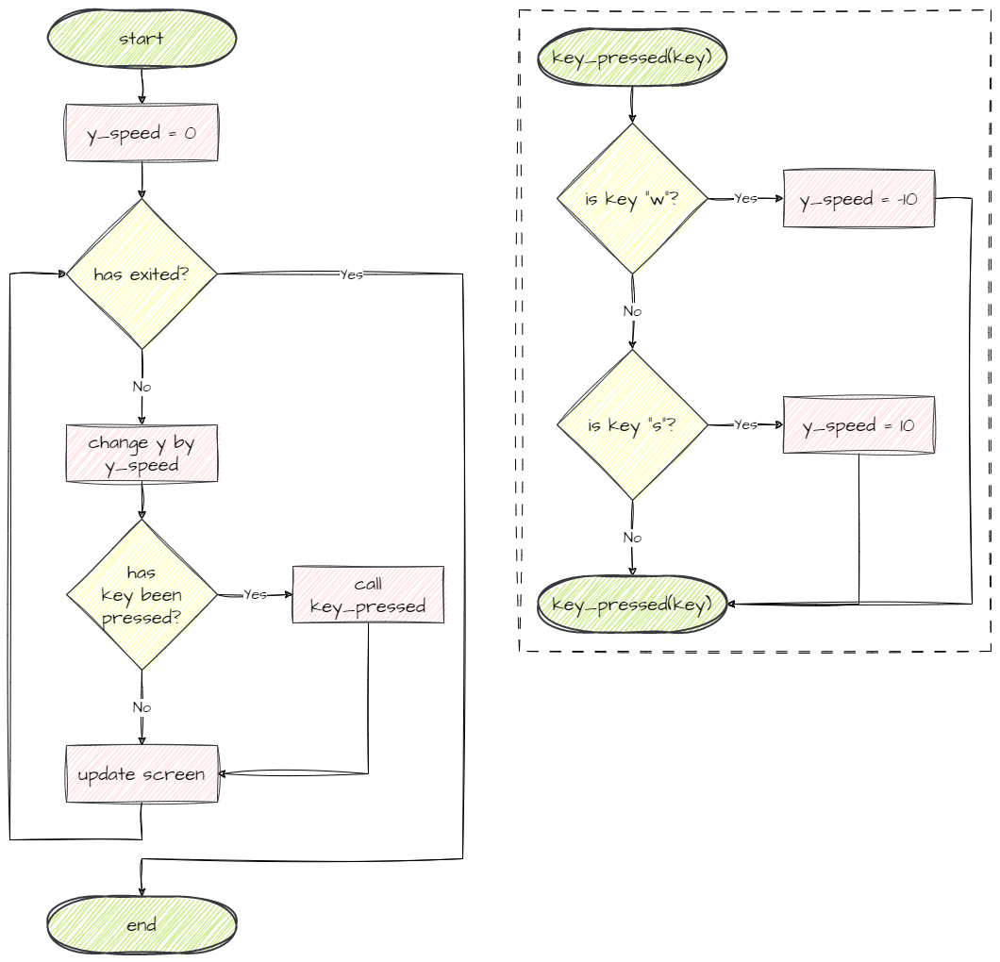
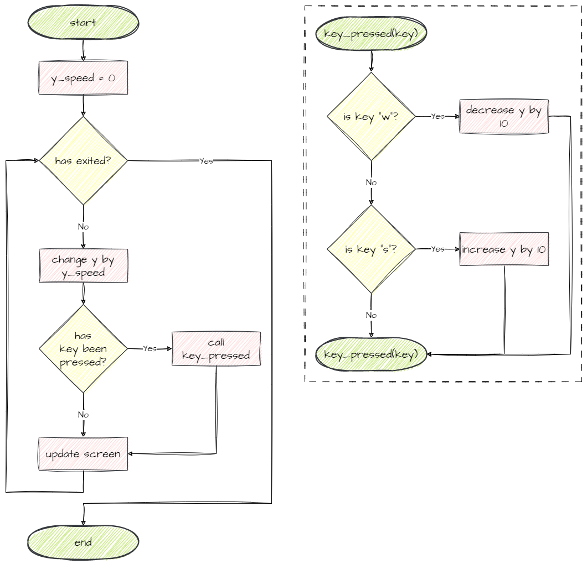
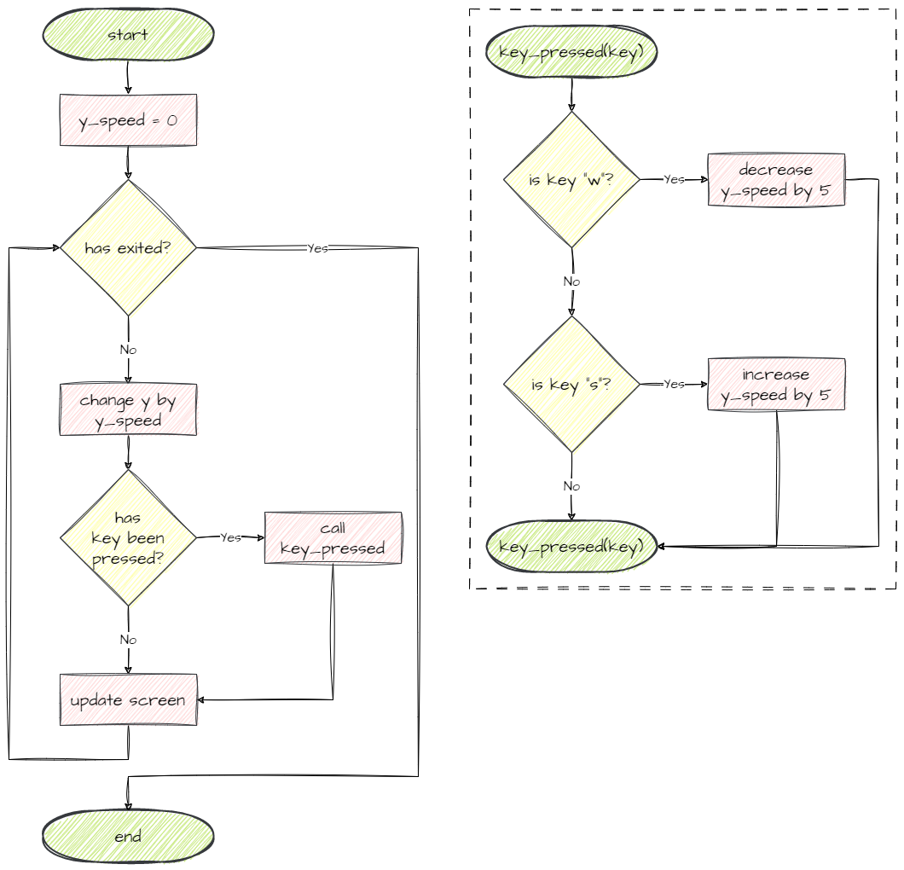

# Advanced Spaceship Movement

```{topic} In this lesson you will:
- learn about different movement options for key event handlers
- learn about GameFrame frames
- apply learnt knowledge to use flowcharts to plan algorithms
- learn how to move objects by working directly with their coordinates
- learn how to move objects by working with their `x_speed` and `y_speed` attributes
```

## Different Movement Options

Last lesson we made the player's spaceship move when a key press is detected. When we pressed the **w** key the spaceship started moving up and when we pressed the **s** the spaceship started moving down. The spaceship will keep moving in a specific direction until the opposite key is pressed, but there is different ways we can make the movement work:

- Always in motion
- In motion while key is pressed
- Always in motion with acceleration

To understand how to do this we need to understand how GameFrame works with Object's coordinates.

According to the [GameFrame documents](documentation.md#roomobject-variables) there are six attributes that deal with the location of an object in the Room:

- `x` and `y` which are the current coordinates of the Object
- `prev_x` and `prev_y` which were hold the coordinates of the Object in the last frame
- `x_speed` and `y_speed` which indicate the movement in the respective `x` and `y` direction each frame

```{admonition} Frames
:class: note
In GameFrame, frames refers to every time the computer screen is redrawn. The frequency of this is determined by the Global variable `FRAMES_PER_SECOND` which is set at 30. This means the computer will redraw the screen every 1/30 seconds (approx 33 nanoseconds). Therefore `x_speed` and `y_speed` show the difference in `x` and `y` positions every 33 nanoseconds.
```

### Always in motion

Below is the flowchart for the **always in motion** approach.

You can see that for each loop: 

- the `y` position changes by the value of `y_speed`.
- the value of `y_speed` starts at `0`
- the value of `y_speed` will change if either the `w` key or `s` key is pressed
- there is no way for `y_speed` to return to `0`



This style of movement is implemented in our current code for the `key_press` method:

```{code-block} python
:linenos:
:lineno-start: 22
    def key_pressed(self, key):
        """
        Respond to keypress up and down
        """
        
        if key[pygame.K_w]:
            self.y_speed = -10
        elif key[pygame.K_s]:
            self.y_speed = 10
```

### In motion while key pressed

Below is the flowchart for the **in motion while key pressed** approach.

Note that:

- the value of `y_speed` cannot change from `0` &rarr; there is no automatic update to the `y` value
- the key press directly changes the value of `y` &rarr; as long as **w** is pressed `y` will decrease by 10



To implement this style of movement, change the `key_pressed` function to the code below:

```{code-block} python
:linenos:
:lineno-start: 22
    def key_pressed(self, key):
        """
        Respond to keypress up and down
        """
        
        if key[pygame.K_w]:
            self.y -= 10
        elif key[pygame.K_s]:
            self.y += 10
```

### Always in motion with acceleration

Below is the flowchart for the **always in motion with acceleration** approach.

Looking at the flowchart, we can see that this is a combination of the last two approaches:

- `y_speed` will be used to update the `y` of the object
- pressing a key will increase or decrease the `y_speed`
- this gives the movement a sense if acceleration &rarr; the longer you hold a key the faster it will move in the appropriate direction.



To use this style of movement, change the `key_pressed` function to the following.

```{code-block} python
:linenos:
:lineno-start: 22
    def key_pressed(self, key):
        """
        Respond to keypress up and down
        """
        
        if key[pygame.K_w]:
            self.y_speed -= 5
        elif key[pygame.K_s]:
            self.y_speed += 5
```

### Choose your movement

Give all three movement options a try, and choose the one that you want to use. Just remember that if you choose either the **in motion while key is pressed** or the **always in motion with acceleration** option, your code will be slightly different.