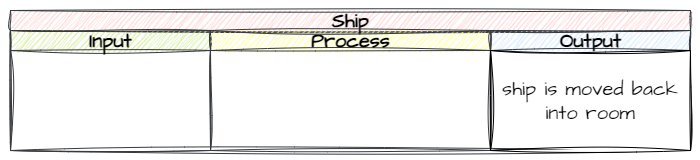
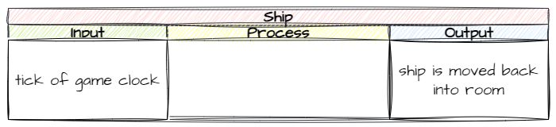

# Keeping Ship in the Room

```{topic} In this lesson you will:
- learn about how screen coordinates and object coordiantes interact with each other
- learn about game clocks and how to use their ticks to time events
- apply learnt knowledge to plan algorithms using IPO tables
```

By now you would have noticed that the ship can move both below the bottom of the screen and above the top of the screen. Lets prevent this from happening.

## Planning

Before we write the code to prevent our ship from flying off the screen, we first have to work out how we can tell the program that this is happening. 

In English this it is quite simple:

- if the top of the ship is above the screen &rarr; move it to inside the screen
- if the bottom of the ship is below the screen &rarr; move it to inside the screen

Some of those concepts we need to translate into Python, so lets look at how we can talk to our program about the concepts:

- top of the ship
- bottom of the ship
- above the screen
- below the screen

In order to do this we need to consider the screen and how we can reference these different concepts. 


Each of the concepts is related to a value we use in program.

- top of the ship &rarr; the origin **y** value &rarr; `y`
- bottom of the ship &rarr; the origin **y** value + the height of the object &rarr; `y + self.height`
- above the screen &rarr; a **y** value less than zero &rarr; `y < 0`
- below the screen &rarr; a **y** value greater than the screen height &rarr; `y > Globals.SCREEN_HEIGHT`

Therefore we need to regularly check that:

- `ship.y > 0`
- `ship.y + ship.height < Globals.SCREEN_HEIGHT`

What we need is a way to do this. Let's consult the docs. Remember we said that the game logic resides in the objects, so let's look specifically at the [RoomObject methods](documentation.md#roomobject-methods).

Notice the **step** method? According to the docs, we can use it to run code for the object on each tick of the game clock.

```{admonition} Game Clock
:class: note
In the early days of computers, games use to run as fast as the hardware they were running on wouild let them. This meant that the same game could run faster or slower depending on the computer you were using. This also presented a problem when computers rapidly increased their power, resulting in games that were unplayable. The game clock was created to address this issue.

Game clocks ensure that each run of the game loop takes a consistent time. During the run the game loop will, handle inputs, update the game state, update the screen. If all this is finished with time to spare, the computer (sleeps) waits until the next **tick** of the game clock.

In GameFrame the game clock is the same as our frame rate, so there is a tick of the game clock every 1/30 of a second.
```

Now we know the mechanism and values we can use, we can plan our code.

First, what output do we want from this process?



Next, what inputs will trigger this process?



Finally, what process can get us from the input to the output?


In summary, every tick of the game clock we will check if the ship is outside the screen, and if it is, we will move it back in.

## Coding

### `Object/Ship.py`

All this code needs to be implemented inside the `Ship` class so we need to open `Objects/Ship.py`.

Now we need to work out where. We could put this all inside the `step` method, and it would work, but what if we want to do other things with the ship on each tick of the clock? It could start getting really messy.

To make our code more maintainable, we're going to keep our `step` method as small and clean as possible. We will do this by creating methods for the game logic and then calling those methods in `step`.

#### keep_in_room

So, lets put the game logic into a method called `keep_in_room`. Add the code below to the bottom of the `Ship` class.

```{code-block} python
:linenos:
:lineno-start: 32
    def keep_in_room(self):
        """
        Keeps the ship inside the room
        """
        if self.y < 0:
            self.y = 0
        elif self.y + self.height> Globals.SCREEN_HEIGHT:
            self.y = Globals.SCREEN_HEIGHT - self.height
```

Let's break down lines 36-39 (it might be useful to check the screen diagram in the planning):

- **line 36**: checks if the top of the ship (`self.y`) is less then the top of the screen (`0`)
- **line 37**: sets the ship's origin position to the top of the screen
- **line 38**: checks if bottom of the ship (self.y + self.height) is less then the bottom of the screen (Globals.SCREEEN_HEIGHT)
- **line 39**: sets the ship's origin position to far enough above the bottom that the ship will fit (Globals.SCREEN_HEIGHT - self.height)

Notice that we are using `Global.SCREEN_HEIGHT` but the squiggly line underneath it tells us the VS Code can't find it. That's because we haven't imported the Globals module.

So at the top of `Ship.py` and change the highlighted code below:

```{code-block} python
:linenos:
:emphasize-lines: 1
from GameFrame import RoomObject, Globals
import pygame
```

#### step

Now we have to call the `keep_in_room()` method from the `step` method.

Go to the bottom of the `Ship` class and add the code below:

```{code-block} python
:linenos:
:lineno-start: 41
    def step(self):
        """
        Determine what happens to the Ship on each click of the game clock
        """
        self.keep_in_room()
```

## Testing

Now go to `MainController.py` and run the program and make sure that our spaceship stays within the window.

## Commit and Push

We have finished and tested another section of code so we should make a Git commit.

To do this:

1. In GitHub Desktop go to the bottom left-hand box and write into the summary **Kept ship on screen**.
2. Click on **Commit to main**
3. Click on **Push origin**

Now the work from this lesson is committed and synced with the online repo.

## Completed file states

Below are all the files we used in this lesson in their finished state. **Use this to check if your code is correct**.

### `Objects/Ship.py`

```{code-block} python
:linenos:
from GameFrame import RoomObject, Globals
import pygame

class Ship(RoomObject):
    """
    A class for the player's avitar (the Ship)
    """
    
    def __init__(self, room, x, y):
        """
        Initialise the Ship object
        """
        RoomObject.__init__(self, room, x, y)
        
        # set image
        image = self.load_image("Ship.png")
        self.set_image(image,100,100)
        
        # register events
        self.handle_key_events = True
        
    def key_pressed(self, key):
        """
        Respond to keypress up and down
        """
        
        if key[pygame.K_w]:
            self.y_speed = -10
        elif key[pygame.K_s]:
            self.y_speed = 10
            
    def keep_in_room(self):
        """
        Keeps the ship inside the room
        """
        if self.y < 0:
            self.y = 0
        elif self.y + self.height> Globals.SCREEN_HEIGHT:
            self.y = Globals.SCREEN_HEIGHT - self.height
            
    def step(self):
        """
        Determine what happens to the Ship on each click of the game clock
        """
        self.keep_in_room()
```