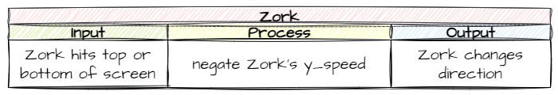

# Add Zork Object

```{topic} In this lesson you will:
- learn to intiate movement when objects are created
- using `* -1` to negate numbers (swap + and -)
```

Our boss for this game is called Zork, who is an evil alien. Most of the creation of Zork follows the same processes as creating the ship so we will race through those steps, then we will plan and implement the differences.

## Create Zork class and add to Room

### `Objects/Zork.py`

In the `Objects` directory make a new file and call it `Zork.py`. Then add the following code which creates the Zork class and adds its image:

```{code-block} python
:linenos:
from GameFrame import RoomObject

class Zork(RoomObject):
    """
    A class for the game's antagoist
    """
    def __init__(self, room, x, y):
        """
        Initialise the Boss object
        """
        # include attributes and methods from RoomObject
        RoomObject.__init__(self, room, x, y)
        
        # set image
        image = self.load_image("Zork.png")
        self.set_image(image,135,165)
```

**Save** the `Zork.py` file.

### `Objects/__init__.py`

In the `Objects` directory open the `__init__.py` file. Then add the following highlighted code:

```{code-block} python
:linenos:
:emphasize-lines: 3
from Objects.Title import Title
from Objects.Ship import Ship
from Objects.Zork import Zork
```

**Save** and **close** the `__init__.py` file.

### `Rooms/GamePlay.py`

In the `Rooms` folder, open the `GamePlay.py` file. Then add the highlighted code below:

```{code-block} python
:linenos:
:emphasize-lines: 3, 14
from GameFrame import Level
from Objects.Ship import Ship
from Objects.Zork import Zork

class GamePlay(Level):
    def __init__(self, screen, joysticks):
        Level.__init__(self, screen, joysticks)
        
        # set background image
        self.set_background_image("Background.png")
        
        # add objects
        self.add_room_object(Ship(self, 25, 50))
        self.add_room_object(Zork(self,1120, 50))
```

**Save** and **close** the `GamePlay.py` file, then use the `MainController.py` to run and test the code.

If everything tests ok, you should now have our boss on the screen. Now it is time to think about it's unique features.

## Planning

Since Zork is run by the computer we will have to animate it's movement. Just like our spaceship, Zork will only move up and down. Unlike our spaceship, this will not be in response to a keystroke.

There are two aspects of Zork's movement we need to automate:

1. starting Zork moving when the game begins
2. changing the direction of Zork's direction when it reaches the top or bottom of the screen

### Initial movement

Let's use an IPO table to plan out the initial Zork movement.

- **Output** &rarr; we want Zork to move either up or down
- **Input** &rarr; we want this to start when Zork is created
- **Process** &rarr; we can randomly set Zork's `y_speed` to either `-10` (up) or `10` (down)

So our IPO table would look as such:


```{admonition} Instantiation
:class: note
Remember classes are like blueprints that we use to create object instances. The term **object** refers to all the objects created from the same class (ie. Zork object), while the term instance refers to each individual object.

When we create an **instance** of an **object** from a **class**, this is called **instantiation**.
```

### Changing direction

When Zork hits the top or bottom of the screen, we don't want it to stop, but rather to change direction (ie. `y_speed` from `-10` to `10` or vice versa).

Let's think about this in IPO terms:

- Output &rarr; Zork moves in the opposite direction
- Input &rarr; Zork touches top or bottom of the screen
- Process &rarr; negate the value of Zork's `y_speed` (ie. `-10` becomes `10` or `10` becomes `-10`)

So our IPO table would be something like this:



Now we have conceptualised how we will make these happen, let's get to the coding.

## Initial movement code

### `Objects/Zork.py`

Return the the `Objects/Zork.py` file to add the code for the initial movement. According to our IPO plan the event that triggers the movement is the instantiation of the Zork object. We know that when instantiate an object the `__init__` method gets called, so that would be the logical place to put it. 

We also know that we can use `random.choice` to choose a random item from a list. So if we have a list consisting of `-10` and `10`, `random.choice` can choose one. So let's make these changes to the the `Zork` class by adding the highlighted code below:

```{code-block} python
:linenos:
:emphasize-lines: 2, 19-20
from GameFrame import RoomObject
import random

class Zork(RoomObject):
    """
    A class for the game's antagoist
    """
    def __init__(self, room, x, y):
        """
        Initialise the Boss object
        """
        # include attributes and methods from RoomObject
        RoomObject.__init__(self, room, x, y)
        
        # set image
        image = self.load_image("Zork.png")
        self.set_image(image,135,165)
        
        # set inital movement
        self.y_speed = random.choice([-10,10])
```

Unpacking this:

- **line 2** &rarr; importing random so we can use choice
- **line 20** &rarr; randomly choose between `-10` and `10` and set that as Zork's `y_speed`

Now **save** `Zork.py` and **run** `MainController.py` to test our code. Zork should either move up or down until it is off the screen.

## Reverse Zork Direction

### `Objects/Zork.py`

To reverse Zork's direction we will use a similar process that we used to stop the ship from moving off screen. This will involve using `step()` to test if Zork is off screen. The only difference will be in the `keep_in_room` method where we will just reverse Zork's `y_speed`.

Go back to `Objects/Zork.py` and add the highlighted code below:

```{code-block} python
:linenos:
:emphasize-lines: 1, 22-27
from GameFrame import RoomObject, Globals
import random

class Zork(RoomObject):
    """
    A class for the game's antagoist
    """
    def __init__(self, room, x, y):
        """
        Initialise the Boss object
        """
        # include attributes and methods from RoomObject
        RoomObject.__init__(self, room, x, y)
        
        # set image
        image = self.load_image("Zork.png")
        self.set_image(image,135,165)
        
        # set inital movement
        self.y_speed = random.choice([-10,10])
        
    def keep_in_room(self):
        """
        Keeps the Zork inside the top and bottom room limits
        """
        if self.y < 0 or self.y > Globals.SCREEN_HEIGHT - self.height:
            self.y_speed *= -1
```

We really only need to look at two lines here:

- **line 26** &rarr; checks if Zork has touched either the top or the bottom of the screen
- **line 27**
  - negate a number (change its sign) &rarr; multiply it by `-1`
  - `*=` is similar to `+=`, it means take the value stored in `y_speed` multiply it by `-1`, then store it back in `y_speed`

## Testing

**Save** `Zork.py` then **run** `MainController.py` to test that our code works. 

If it work, go to **GitHub Desktop**, add a summary, **Commit to main** then **Push origin**.

## Completed file states

Below are all the files we used in this lesson in their finished state. **Use this to check if your code is correct**.

### `Objects/Zork.py`

```{code-block} python
:linenos:
from GameFrame import RoomObject, Globals
import random

class Zork(RoomObject):
    """
    A class for the game's antagoist
    """
    def __init__(self, room, x, y):
        """
        Initialise the Boss object
        """
        # include attributes and methods from RoomObject
        RoomObject.__init__(self, room, x, y)
        
        # set image
        image = self.load_image("Zork.png")
        self.set_image(image,135,165)
        
        # set inital movement
        self.y_speed = random.choice([-10,10])
        
    def keep_in_room(self):
        """
        Keeps the Zork inside the top and bottom room limits
        """
        if self.y < 0 or self.y > Globals.SCREEN_HEIGHT - self.height:
            self.y_speed *= -1
            
    def step(self):
        """
        Determine what happens to the Dragon on each tick of the game clock
        """
        self.keep_in_room()
```

### `Objects/__init__.py`

```{code-block} python
:linenos:
from Objects.Title import Title
from Objects.Ship import Ship
from Objects.Zork import Zork
```

### `Rooms/GamePlay.py`

```{code-block} python
:linenos:
from GameFrame import Level
from Objects.Ship import Ship
from Objects.Zork import Zork

class GamePlay(Level):
    def __init__(self, screen, joysticks):
        Level.__init__(self, screen, joysticks)
        
        # set background image
        self.set_background_image("Background.png")
        
        # add objects
        self.add_room_object(Ship(self, 25, 50))
        self.add_room_object(Zork(self,1120, 50))
```
