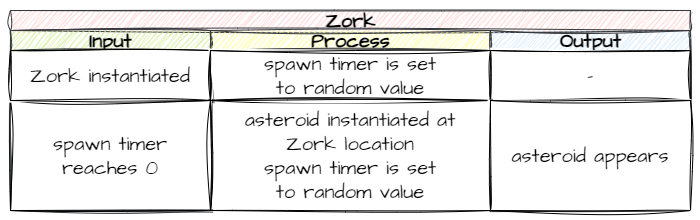
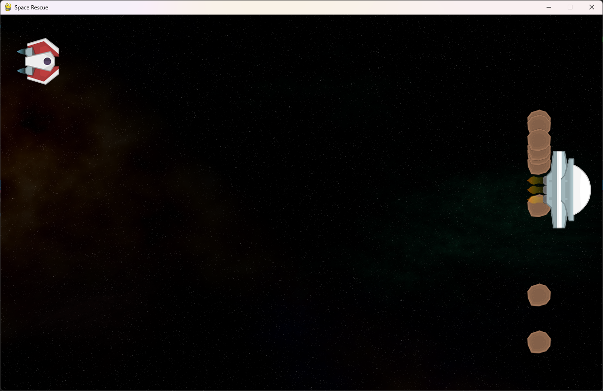

# Add Asteroid Object

```{topic} In this lesson you will:
- learn to how to make objects instatiate other objects
- use GameFrame timers
- calling functions from within other functions
```

In the game the Zork will hurl asteroids back at the player's ship, which the player will the need to dodge. To create an asteroid RoomObject we will need to go through many of the steps we also used for the Ship and Zork.

## Create Asteroid Object

First we need to create the Asteroid RoomObject. The code for this should be very familiar by now.

### `Objects/Asteroid.py`

Create a new file in the `Objects` folder called `Asteroid.py`, then add the code below to it.

```{code-block} python
:linenos:
from GameFrame import RoomObject

class Asteroid(RoomObject):
    """
    A class for Zorks danerous obstacles
    """
    
    def __init__(self, room, x, y):
        """
        Initialise the Asteroid object
        """
        # include attributes and methods from RoomObject
        RoomObject.__init__(self, room, x, y)

        # set image
        image = self.load_image("asteroid.png")
        self.set_image(image,50,49)
```

We won't unpack this since it is the same as the Ship and Zork Objects. **Save** the file.

### `Objects/__init__.py`

Open the `Objects/__init__.py` file and add the highlighted code:

```{code-block} python
:linenos:
:emphasize-lines: 4
from Objects.Title import Title
from Objects.Ship import Ship
from Objects.Zork import Zork
from Objects.Asteroid import Asteroid
```

**Save** and close `Objects/__init__.py`.

### Testing

**Run** the code using `MainController.py`. There should be no changes, but this just checks that we haven't made a mistake.

## Spawn Asteroid Object

Now we have an Asteroid Object we need to:

1. make it spawn
2. make it move in a random direction across the screen when it spawns
3. bounce the asteroid off the top and bottom of the screen
4. de-spawn the asteroid once if exits the left of screen 

Let's do that in order.

## Spawn asteroids

### Planning

We should do some planning for the spawning process. Some considerations:

- we want the asteroids to spawn at Zork's location.
- we want the asteroids to spawn at random intervals - regular intervals are too predictable and therefore less fun.

Spawning at Zork's location is fairly simple, since we know it's location is `Zork.x` and `Zork.y`.

Spawning at a random time is a bit trickier. If we looks that the **[Room/Levels Methods](documentation.md#roomslevels-methods)** docs we can see a method called `set_timer`. It starts a timer that will call a function when it's countdown reaches `0`. This would be a good thing to use.

So we now have the mechanisms, but where do we put them? Since Zork will be spawning the asteroids the method for spawning the asteroids should go in the Zork class.

Lets put this all together in a IPO table.



You can see that there are two separate step to this process.

1. When Zork is instantiated, we need to set a timer to a random value.
2. When the time reaches 0 it will call a function that will spawn the asteroid and then set the timer again.

Let's put that into code.

### Coding

#### `Objects/Zork.py`

**Open** `Objects/Zork.py` and the ASteroid import to the top.

```{code-block} python
:linenos:
:emphasize-lines: 2
from GameFrame import RoomObject, Globals
from Objects.Asteroid import Asteroid
import random
```

We now need to add the code that will start the spawn timer. Since this needs to happen when Zork is instantiated, it has to go into the `__init__` method. So add the highlighted code below to your `__init__`.

```{code-block} python
:linenos:
:emphasize-lines: 23-25
from GameFrame import RoomObject, Globals
from Objects.Asteroid import Asteroid
import random

class Zork(RoomObject):
    """
    A class for the game's antagoist
    """
    def __init__(self, room, x, y):
        """
        Initialise the Boss object
        """
        # include attributes and methods from RoomObject
        RoomObject.__init__(self, room, x, y)
        
        # set image
        image = self.load_image("Zork.png")
        self.set_image(image,135,165)
        
        # set inital movement
        self.y_speed = random.choice([-10,10])
        
        # start asteroid timer
        asteroid_spawn_time = random.randint(15,150)
        self.set_timer(asteroid_spawn_time, self.spawn_asteroid)
```

Let's break that code down:

- **line 25** - creates a random timer number between 15 ticks and 150 ticks.
- **line 26** - sets timer and declares `self.spawn_asteroid` as the method to call when the timer is `0`.

```{admonition} Calling methods from method
:class: note
When we use a method to call another method (like in the timer), the target method just uses it's name. The `()` after the name is dropped.

If you include the `()` after the method name, it will be automatically called rather then waiting for the trigger.
```

We currently have the timer calling the `self.spawn_asteroid` method, which does not exist, so we need to create that. Go to the bottom of the `Zork.py` file and add the code below:

```{code-block} python
:linenos:
:lineno-start: 40
    def spawn_asteroid(self):
        """
        Randomly spawns a new Asteroid
        """
        # spawn Asteroid and add to room
        new_asteroid = Asteroid(self.room, self.x, self.y + self.height/2)
        self.room.add_room_object(new_asteroid)
        
        # reset time for next Asteroid spawn
        asteroid_spawn_time = random.randint(15, 150)
        self.set_timer(asteroid_spawn_time, self.spawn_asteroid)
```

**Save** `Zork.py` and then **run** the program using `MainController.py`

Zork should move up and down, spawning asteroids, much like below:



Obviously the next thing we need to do is make the asteroids move. We'll do that in the next lesson.

## Commit and Push

We have finished and tested another section of code so we should make a Git commit.

To do this:

1. In GitHub Desktop go to the bottom left-hand box and write into the summary `Created GamePlay room`.
2. Click on **Commit to main**
3. Click on **Push origin**

Now the work from this lesson is committed and synced with the online repo.

## Completed File States

Below are all the files we used in this lesson in their finished state. **Use this to check if your code is correct**.

### `Objects/Asteroid.py`

```{code-block} python
:linenos:
from GameFrame import RoomObject

class Asteroid(RoomObject):
    """
    A class for Zorks danerous obstacles
    """
    
    def __init__(self, room, x, y):
        """
        Initialise the Asteroid object
        """
        # include attributes and methods from RoomObject
        RoomObject.__init__(self,room, x, y)
        
        # set image
        image = self.load_image("asteroid.png")
        self.set_image(image,50,49)
```

### `Objects/__init__.py`

```{code-block} python
:linenos:
from Objects.Title import Title
from Objects.Ship import Ship
from Objects.Zork import Zork
from Objects.Asteroid import Asteroid
```

### `Objects/Zork.py`

```{code-block} python
:linenos:
from GameFrame import RoomObject, Globals
from Objects.Asteroid import Asteroid
import random

class Zork(RoomObject):
    """
    A class for the game's antagoist
    """
    def __init__(self, room, x, y):
        """
        Initialise the Boss object
        """
        # include attributes and methods from RoomObject
        RoomObject.__init__(self, room, x, y)
        
        # set image
        image = self.load_image("Zork.png")
        self.set_image(image,135,165)
        
        # set inital movement
        self.y_speed = random.choice([-10,10])
        
        # start asteroid timer
        asteroid_spawn_time = random.randint(15,150)
        self.set_timer(asteroid_spawn_time, self.spawn_asteroid)
        
    def keep_in_room(self):
        """
        Keeps the Zork inside the top and bottom room limits
        """
        if self.y < 0 or self.y > Globals.SCREEN_HEIGHT - self.height:
            self.y_speed *= -1
            
    def step(self):
        """
        Determine what happens to the Dragon on each tick of the game clock
        """
        self.keep_in_room()
        
    def spawn_asteroid(self):
        """
        Randomly spawns a new Asteroid
        """
        # spawn Asteroid and add to room
        new_asteroid = Asteroid(self.room, self.x, self.y + self.height/2)
        self.room.add_room_object(new_asteroid)
        
        # reset time for next Asteroid spawn
        asteroid_spawn_time = random.randint(15, 150)
        self.set_timer(asteroid_spawn_time, self.spawn_asteroid)
```
