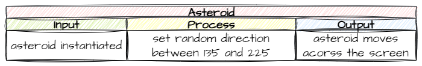

# Animate Asteroids

```{topic} In this lesson you will:
- learn about Object direction
- making Objects bounce off the edges of a screen
- testing if an Object is outside the screen
- removing an object
```

In this lesson we are going to cover all the animations for asteroid. In particular:

- initial movement left but at a random angle
- bouncing off the top and bottom of the screen
- de-spawning the asteroid when it moves past the left of the screen

Lets get going.

## Initial movement

### Planning

So far, all of our Object movements have been using the cartesian coordinates of the screen, specifically, up and down the y-axis, but we want our asteroids to move diagonally, on both the x-axis and the y-axis. We could use trigonometry to work out the `x_speed` and `y_speed` required to make this happen, but, fortunately, Steven Tucker has already done the hard work for us.

If you check the [RoomObject Methods](documentation.md#roomobject-methods) in the docs you will see the `set_direction` method that allows us to make the object move in a designated direction at a designated speed. The docs explain that 0&deg; is moving right. So, we now know our mechanism to make the asteroids move diagonally. But what value should we make them move?

We want some randomness to the direction, so we need to choose a value from a range. Let's consider our options.


We can see that:

- 180&deg; will just move strait across the screen
- 135&deg; which is 45&deg; less than 180&deg;, gives a nice bounce across the screen
- 260&deg; which is 90&deg; more than 180&deg;, will just bounce up and down and barely transverse the screen.

From the we can see that the best range of angles would be 180&deg; plus or minus 45&deg;, or for our purposes the values `135` to `225`.

Putting all of this into an IPO table



### `Objects/Asteroid.py`

Let's put that plan into code.

**Open** `Objects/Asteroid.py` and add the highlighted code below:

```{code-block} python
:linenos:
:emphasize-lines: 2, 20-22
from GameFrame import RoomObject
import random

class Asteroid(RoomObject):
    """
    A class for Zorks danerous obstacles
    """
    
    def __init__(self, room, x, y):
        """
        Initialise the Asteroid object
        """
        # include attributes and methods from RoomObject
        RoomObject.__init__(self,room, x, y)
        
        # set image
        image = self.load_image("asteroid.png")
        self.set_image(image,50,49)
        
        # set travel direction
        angle = random.randint(135,225)
        self.set_direction(angle, 10)
```

Let's unpack that code:

- **line 2**: we need to import the `random` module to use `randint`
- **line 21**: using `randint` to provide a number between 135 and 225
- **line 22**: set the asteroid in motion at the random angle and speed of 10

**Save** `Asteroid.py` and then **run** `MainController.py` to test your code.