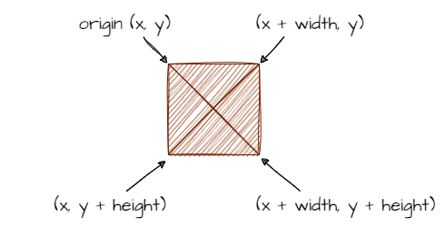

# Ship and Asteroid Collision

```{topic} In this lesson you will:
- learn about hitboxes and collisions
- learn how to detect collisions
- learn about `self` and `other` objects in collisions
- learn to use the build-in GameFrame feature to detect and handle collisions
- apply learnt knowledge to plan code using IPO tables
```

## Hitboxes

Collisions refer to the interactions between different game objects in a game when they overlap or come into contact with each other. GameFrame uses Rectangular Collisions which involve bounding rectangles that surround objects. This rectangles are often referred to as hitboxes.

We have already been using this this concept of hitboxes. For example, in our game asteroids look like this.


But we have used the image below to represent asteroids.



We have been using hitboxes to represent all our objects. For example, when the **top boundary** of the Zork **hitbox** **collides** with the top of the screen, we reverse Zork's direction.

## Collisions

Collisions occur between two objects when their hitboxes touch or overlap. 

- obj_1's left boundary is less than obj_2's right boundary **and**
- obj_1's right boundary is greater than obj_2's left boundary **and**
- obj_1's top boundary is less than obj_2's bottom boundary **and**
- obj_1's bottom boundary is greater than obj_2's top boundary.

If we wanted to use the coordinates from this image:


Then the code would be:

```{code-block} python
if (obj1.x < obj2.x + obj2.width and
    obj1.x + obj1.width > obj2.x and
    obj1.y < obj2.y + obj2.height and
    obj1.y + obj1.height > obj2.y):
```

That's a whole heap of code to understand and remember. Fortunately, this is all just for background. Since GameFrame is based on Pygame, there are is a built in process for detecting and handling collisions.

Lets check the GameFrame docs to how it handles collisions. If we look at the [RoomObject methods](documentation.md) we will see to methods that address collisions:

- `register_collision_object(collision_object)`
- `handle_collision(self, other, other_type)`

```{admonition} Collisions Terminology
:class: note
In game design there are two objects involved.

- **self** &rarr; the object that contains the event handler
- **other** &rarr; the object that **self** has collided with
```

### Register Collision Object

Each room can be filled with many objects, which means an object can collide with many other objects. We may not be interested in all of these collisions, so need to register which collisions we want to worry. We use `register_collision_object(collision_object)` to do this.

This method is added on an object's `__init__()` method and tells GameFrame to detect any collisions between the object (self) and the collision object.

### Handle Collisions

Every tick GameFrame will check if any of the registered collisions have occurred. If a registered collision has occurred it will call the `handle_collision` method. GameFrame will also pass the other object (`other`) and the class of the object (`other_type`). These have distinct uses.

- `other` &rarr; gives you access to the other objects attributes and methods, for example, you could change the other's x_speed using `other.x_speed = 0`
- `other_type` &rarr; allows for the differentiation of handling collisions with different types of objects. For example, handling collisions with the player differently to collisions with a bullet.

With that theory under our belt, let's plan how to handle collisions between asteroids and the space ship

## Planning

First, we need to decide which `class` we will get to handle this collision between `Ship` and `Asteroid`. At this stage, it could be handled by either class, but to make life easier later on, we will get `Asteroid` to handle the collision.

Let's use the simplest outcome for the collision &rarr; ends the level. Since we only have one level, this will also end the game. Thinking back to `WelcomeScreen` we end a level by using `self.room.running = False`.

Putting this into a IPO table:


Lets add this to the program

## Coding

### `Objects\Asteroid.py`

**Open** `Objects\Asteroid.py` and add the highlighted code to the `__init__()` method.

```{code-block} python
:linenos:
:lineno-start: 9
:emphasize-lines: 16-17
    def __init__(self, room, x, y):
        """
        Initialise the Asteroid object
        """
        # include attributes and methods from RoomObject
        RoomObject.__init__(self,room, x, y)
        
        # set image
        image = self.load_image("asteroid.png")
        self.set_image(image,50,49)
        
        # set travel direction
        angle = random.randint(135,225)
        self.set_direction(angle, 10)
        
        # register events
        self.register_collision_object("Ship")
```

Unpacking that code:

- **line 25**: tell GameFrame to detect and collisions between this object and and object of the `Ship` class.

Move to the bottom of `Asteroid.py` add the following code:

```{code-block} python
:linenos:
:lineno-start: 53
    def handle_collision(self, other, other_type):
        """
        Handles the collision events for the Asteroid
        """
        
        if other_type == "Ship":
            self.room.running = False
```

Breaking that code down:

- **line 53**: when GameFrame detects a registered collision it will call this method
- **line 58**: checks if the collision is with a `Ship` object
- **line 59**: ends the level, and therefore the game.

**Save** `Asteroid.py` and run `MainController.py` to test your code.

## Commit and Push

We have finished and tested another section of code so we should make a Git commit.

To do this:

1. In GitHub Desktop go to the bottom left-hand box and write into the summary **Ship asteroid collision**.
2. Click on **Commit to main**
3. Click on **Push origin**

Now the work from this lesson is committed and synced with the online repo.

## Completed File States

Below are all the files we used in this lesson in their finished state. **Use this to check if your code is correct**.

### `Objects/Asteroid.py`

```{code-block} python
:linenos:
from GameFrame import RoomObject, Globals
import random

class Asteroid(RoomObject):
    """
    A class for Zorks danerous obstacles
    """
    
    def __init__(self, room, x, y):
        """
        Initialise the Asteroid object
        """
        # include attributes and methods from RoomObject
        RoomObject.__init__(self,room, x, y)
        
        # set image
        image = self.load_image("asteroid.png")
        self.set_image(image,50,49)
        
        # set travel direction
        angle = random.randint(135,225)
        self.set_direction(angle, 10)
        
        # register events
        self.register_collision_object("Ship")
        
    def step(self):
        """
        Determines what happens to the asteroid on each tick of the game clock
        """
        self.keep_in_room()
        self.outside_of_room()
        
    def keep_in_room(self):
        """
        Keeps the asteroid inside the top and bottom room limits
        """
        if self.y < 0:
            self.y = 0
            self.y_speed *= -1
        elif self.y > Globals.SCREEN_HEIGHT - self.height:
            self.y = Globals.SCREEN_HEIGHT - self.height
            self.y_speed *= -1
            
    def outside_of_room(self):
        """
        removes asteroid that have exited the room
        """
        if self.x + self.width < 0:
            print("asteroid deleted")
            self.room.delete_object(self)
            
    def handle_collision(self, other, other_type):
        """
        Handles the collision events for the Asteroid
        """
        
        if other_type == "Ship":
            self.room.running = False
```
