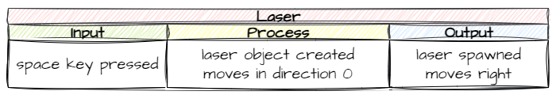

# Add Laser

Since Zork is hurling Asteroids at our defenceless space ship, we better give it something to fight back. In this lesson will will arm the space ship with a laser.

## Planning

We want to ship to spawn a laser whenever we press the space key. 



This involves:

- creating a new laser class
- adding an event handler of the space key which create a laser object
- make the laser object move across the room when spawned
- deleting the laser object when it leaves the room

We already know how to do all this, so lets get to the coding.

## Coding

### `Objects/Laser.py`

**Create** a new file in the `Objects` folder called `Laser.py` and then add the following code to it.

```{code-block} python
:linenos:
from GameFrame import RoomObject, Globals

class Laser(RoomObject):
    """
    Class for the lasers shot by the Ship
    """
    
    def __init__(self, room, x, y):
        """
        Inistialise the laser
        """
        # include attributes and methods from RoomObject
        RoomObject.__init__(self, room, x, y)
        
        # set image
        image = self.load_image("Laser.png")
        self.set_image(image, 33, 9)
        
        # set movement
        self.set_direction(0, 20)
        
    def step(self):
        """
        Determine what happens to the laser on each tick of the game clock
        """
        self.outside_of_room()
        
    def outside_of_room(self):
        """
        removes laser if it has exited the room
        """
        if self.x > Globals.SCREEN_WIDTH:
            self.room.delete_object(self)
```

The only change worth noting is:

- **line 32**: since the laser is moving right, we delete it after it's `x` has moved past the screen width

**Save** `Objects/Laser.py`

## `Objects/__init__.py`

We need to tell GameFrame that we have added a new RoomObject to the `Objects` folder.

**Open** `Objects/__init__.py` and add the highlighted code below:

```{code-block} python
:linenos:
:emphasize-lines: 5
from Objects.Title import Title
from Objects.Ship import Ship
from Objects.Zork import Zork
from Objects.Asteroid import Asteroid
from Objects.Laser import Laser
```

**Save** and **close** `Objects/__init__.py`

## `Objects/Ship.py`

**Open** `Objects/Ship.py` and add the highlighted code below:

```{code-block} python
:linenos:
:emphasize-lines: 1, 32-33, 50-57
from GameFrame import RoomObject, Globals
from Objects.Laser import Laser
import pygame

class Ship(RoomObject):
    """
    A class for the player's avitar (the Ship)
    """
    
    def __init__(self, room, x, y):
        """
        Initialise the Ship object
        """
        RoomObject.__init__(self, room, x, y)
        
        # set image
        image = self.load_image("Ship.png")
        self.set_image(image,100,100)
        
        # register events
        self.handle_key_events = True
        
    def key_pressed(self, key):
        """
        Respond to keypress up and down
        """
        
        if key[pygame.K_w]:
            self.y_speed = -10
        elif key[pygame.K_s]:
            self.y_speed = 10
        if key[pygame.K_SPACE]:
            self.shoot_laser()
            
    def keep_in_room(self):
        """
        Keeps the ship inside the room
        """
        if self.y < 0:
            self.y = 0
        elif self.y + self.height> Globals.SCREEN_HEIGHT:
            self.y = Globals.SCREEN_HEIGHT - self.height
            
    def step(self):
        """
        Determine what happens to the Ship on each click of the game clock
        """
        self.keep_in_room()
        
    def shoot_laser(self):
        """
        Shoots a laser from the ship
        """
        new_laser = Laser(self.room, 
                          self.x + self.width, 
                          self.y + self.height/2 - 4)
        self.room.add_room_object(new_laser)
```

**Save** `Ship.py` and then test the code by running `MainController.py`.

