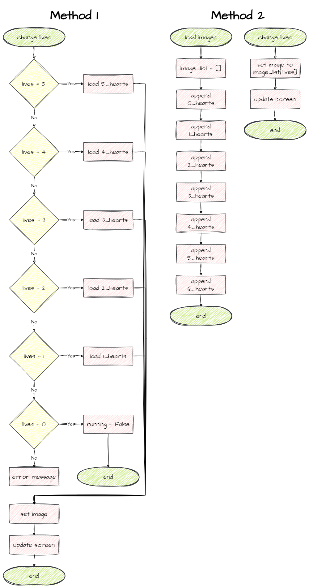

# Add Lives

At the moment colliding with just one asteroid ends the game. This is a bit tough. So for the final step in our game development journey is giving our player lives.

## Planning

We need to work out what mechanisms will use for lives. Looking at the  GameFrame documentation for **[Global Variables](documentation.md#globals-variables)** you will notice there is a variable called `LIVES`. This is similar to `SCORE`. 

We could just have the score value show as a number, but that is a bit boring. Instead we will display hearts to represent the number of lives. If you look inside the `Images/Lives_frames` and you will see five images with 1 to 5 hearts. So when a player loses a life, we will change the image showing the number of lives. How can we do that?

To this point we have only used `set_image` in the `__init__` to assign an image to an object when it is instantiated. There is nothing stopping us from using `set_image` elsewhere in response to other events, like loosing a life. You will also remember that we need to use `load_image` before we can use `set_image`. 

Below are flowcharts of two possible ways to approach this:

- **Method 1** &rarr; **each** time `LIVES` changes, load the image and then set the image
- **Method 2** &rarr; preload the images into a list once and then set the image when `LIVES` changes



Both methods require the same resource if you intend for players lives to only decrease. In this case each possible `LIVES` score will only be displayed once. Therefore, each image will only be loaded once.

**Method 2** is superior if you indent player's lives go up as well as down. In this case it is possible that any given `LIVES` score may be displayed multiple times. **Method 1** may need to load each image **multiple times**, but **Method 2** will still only load each image **once**.

```{admonition} When to use data structures
:class: note
Data structures are used in computer science to organize, store, and manage data in a way that enables efficient operations and access. The most common Python data structures are: **lists**, **tuples**, **dictionaries** and **sets**.

Use data structures to gather values that logically belong together. For example, we use tuples to gather coordinates together. Coordinates contain two variables `x` and `y` that logically belong together so we place them in a tuple: `(x, y)`
```

Since we want to leave open the option of giving bonus lives, we'll use **Method 2** which will look like this in an IPO:


With all that sorted out, lets get on with the coding.

## Coding

### `Objects/Hud.py`

Since the lives icons are still part of the HUD, we will put the `Lives` class in `Objects/Hud.py`.

**Open** `Objects/Hud.py` and then add or adjust the highlighted code below:

```{code-block} python
:linenos:
:emphasize-lines: 1, 30-52
from GameFrame import TextObject, Globals, RoomObject

class Score(TextObject):
    """
    A class for displaying the current score
    """
    def __init__(self, room, x: int, y: int, text=None):
        """
        Intialises the score object
        """         
        # include attributes and methods from TextObject
        TextObject.__init__(self, room, x, y, text)
        
        # set values         
        self.size = 60
        self.font = 'Arial Black'
        self.colour = (255,255,255)
        self.bold = False
        self.update_text()
        
    def update_score(self, change):
        """
        Updates the score and redraws the text
        """
        Globals.SCORE += change
        self.text = str(Globals.SCORE)
        self.update_text()
        

class Lives(RoomObject):
    """
    A class for displaying the number of lives remaining
    """
    def __init__(self, room, x: int, y: int):
        """
        Intialises the lives object
        """   
        RoomObject.__init__(self, room, x, y)
        
        # set image
        self.lives_icon = []
        # load the various lives images into a live list
        for index in range(6):
            self.lives_icon.append(self.load_image(f"Lives_frames/Lives_{index}.png"))
        self.update_image()
        
        
    def update_image(self):
        """
        Updates the number of lives on the UI
        """
        self.set_image(self.lives_icon[Globals.LIVES], 125, 23)
```

Unpacking those changes:

- **line 1**: the `Lives` is going to be a RoomObject, so we need to import this class.
- **lines 30-38**: defines the `Lives` class as a RoomObject
- **line 41**: creates the `lives_icon` list that we will use to store our images
- **line 43 & 44**: create a loop that appends each of the loaded images to the `lives_icon` list
  - `load_image` accepts a string that is the file name
  - we can use the index value to create that file name
- **line 45**: calls `update_image` to load the first image
- **lines 48-51**: defines the `update image` method
- **line 52**: sets the `Lives` image to the image that corresponds to `Globals.LIVES`, For example:
  - at the beginning of the game `Globals.LIVES` is `3`
  - this will display `self.lives_icon[3]`
  - which is the image `"Lives_frames/Lives_3.png"`

**Save** `Objects/Hud.py`.

### `Object/__init__.py`

Although we haven't created a new file, we still need to let GameFrame know about our new `Lives` class.

**Open** `Object/__init__.py` and then adjust the highlighted code below.

```{code-block} python
:linenos:
:emphasize-lines: 7
from Objects.Title import Title
from Objects.Ship import Ship
from Objects.Zork import Zork
from Objects.Asteroid import Asteroid
from Objects.Laser import Laser
from Objects.Astronaut import Astronaut
from Objects.Hud import Score, Lives
```

**Save** and **close** `Object/__init__.py`. 

### `Rooms/GamePlay.py`

Finally we need to add a `Lives` object to the `GamePlay` Room so **open** `Rooms/GamePlay.py`, and then add or adjust the highlighted code below.

```{code-block} python
:linenos:
:emphasize-lines: 4, 22-23
from GameFrame import Level, Globals
from Objects.Ship import Ship
from Objects.Zork import Zork
from Objects.Hud import Score, Lives

class GamePlay(Level):
    def __init__(self, screen, joysticks):
        Level.__init__(self, screen, joysticks)
        
        # set background image
        self.set_background_image("Background.png")
        
        # add objects
        self.add_room_object(Ship(self, 25, 50))
        self.add_room_object(Zork(self,1120, 50))
        
        # add HUD items
        self.score = Score(self, 
                           Globals.SCREEN_WIDTH/2 - 20, 20, 
                           str(Globals.SCORE))
        self.add_room_object(self.score)
        self.lives = Lives(self, Globals.SCREEN_WIDTH - 150, 20)
        self.add_room_object(self.lives)
```

The new code is so similar to the `Score` code, we won't bother exploring it.

**Save** and **close** `Rooms/GamePlay.py` then test that our mechanism correctly loads the initial 3 lives by **running** `MainController.py`.

### `Objects/Asteroid.py`

Now we need to associate the change in `Globals.LIVES` with the Asteroid and Ship collision. This collision event handler in the the `Asteroid` class, so **Open** `Objects/Asteroid.py` and then add or adjust the highlighted code below:

```{code-block} python
:linenos:
:emphasize-lines: 7-12
:lineno-start: 53
    def handle_collision(self, other, other_type):
        """
        Handles the collision events for the Asteroid
        """
        
        if other_type == "Ship":
            self.room.delete_object(self)
            Globals.LIVES -= 1
            if Globals.LIVES > 0:
                self.room.lives.update_image()
            else:
                self.room.running = False
```

Exploring that code:

- **line 59**: deletes **this** asteroid (`self`)
- **line 60**: reduces `Global.LIVES` by `1`
- **line 61**: checks if the player still has lives left
- **line 62**: calls `lives.update_image` to change the number of lives on display
- **line 64**: ends the game

**Save** `Objects/Asteroid.py` and then run `MainController.py` to test our code. Make sure that the lives are reduced every time an Asteroid collides with the Ship.

## Commit and Push

We have finished and tested another section of code so we should make a Git commit.

To do this:

1. In GitHub Desktop go to the bottom left-hand box and write into the summary **Added lasers**.
2. Click on **Commit to main**
3. Click on **Push origin**

Now the work from this lesson is committed and synced with the online repo.

## Completed File States

Below are all the files we used in this lesson in their finished state. **Use this to check if your code is correct**.

### `Objects/Hud.py`

```{code-block} python
:linenos:
from GameFrame import TextObject, Globals, RoomObject

class Score(TextObject):
    """
    A class for displaying the current score
    """
    def __init__(self, room, x: int, y: int, text=None):
        """
        Intialises the score object
        """         
        # include attributes and methods from TextObject
        TextObject.__init__(self, room, x, y, text)
        
        # set values         
        self.size = 60
        self.font = 'Arial Black'
        self.colour = (255,255,255)
        self.bold = False
        self.update_text()
        
    def update_score(self, change):
        """
        Updates the score and redraws the text
        """
        Globals.SCORE += change
        self.text = str(Globals.SCORE)
        self.update_text()
        

class Lives(RoomObject):
    """
    A class for displaying the number of lives remaining
    """
    def __init__(self, room, x: int, y: int):
        """
        Intialises the lives object
        """   
        RoomObject.__init__(self, room, x, y)
        
        # set image
        self.lives_icon = []
        # load the various lives images into a live list
        for index in range(6):
            self.lives_icon.append(self.load_image(f"Lives_frames/Lives_{index}.png"))
        self.update_image()
        
        
    def update_image(self):
        """
        Updates the number of lives on the UI
        """
        self.set_image(self.lives_icon[Globals.LIVES], 125, 23)
```

### `Object/__init__.py`

```{code-block} python
:linenos:
from Objects.Title import Title
from Objects.Ship import Ship
from Objects.Zork import Zork
from Objects.Asteroid import Asteroid
from Objects.Laser import Laser
from Objects.Astronaut import Astronaut
from Objects.Hud import Score, Lives
```

### `Rooms/GamePlay.py`

```{code-block} python
:linenos:
from GameFrame import Level, Globals
from Objects.Ship import Ship
from Objects.Zork import Zork
from Objects.Hud import Score, Lives

class GamePlay(Level):
    def __init__(self, screen, joysticks):
        Level.__init__(self, screen, joysticks)
        
        # set background image
        self.set_background_image("Background.png")
        
        # add objects
        self.add_room_object(Ship(self, 25, 50))
        self.add_room_object(Zork(self,1120, 50))
        
        # add HUD items
        self.score = Score(self, 
                           Globals.SCREEN_WIDTH/2 - 20, 20, 
                           str(Globals.SCORE))
        self.add_room_object(self.score)
        self.lives = Lives(self, Globals.SCREEN_WIDTH - 150, 20)
        self.add_room_object(self.lives)
```

### `Objects/Asteroid.py`

```{code-block} python
:linenos:
from GameFrame import RoomObject, Globals
import random

class Asteroid(RoomObject):
    """
    A class for Zorks danerous obstacles
    """
    
    def __init__(self, room, x, y):
        """
        Initialise the Asteroid object
        """
        # include attributes and methods from RoomObject
        RoomObject.__init__(self,room, x, y)
        
        # set image
        image = self.load_image("asteroid.png")
        self.set_image(image,50,49)
        
        # set travel direction
        angle = random.randint(135,225)
        self.set_direction(angle, 10)
        
        # register events
        self.register_collision_object("Ship")
        
    def step(self):
        """
        Determines what happens to the asteroid on each tick of the game clock
        """
        self.keep_in_room()
        self.outside_of_room()
        
    def keep_in_room(self):
        """
        Keeps the asteroid inside the top and bottom room limits
        """
        if self.y < 0:
            self.y = 0
            self.y_speed *= -1
        elif self.y > Globals.SCREEN_HEIGHT - self.height:
            self.y = Globals.SCREEN_HEIGHT - self.height
            self.y_speed *= -1
            
    def outside_of_room(self):
        """
        removes asteroid that have exited the room
        """
        if self.x + self.width < 0:
            print("asteroid deleted")
            self.room.delete_object(self)
            
    def handle_collision(self, other, other_type):
        """
        Handles the collision events for the Asteroid
        """
        
        if other_type == "Ship":
            self.room.delete_object(self)
            Globals.LIVES -= 1
            if Globals.LIVES > 0:
                self.room.lives.update_image()
            else:
                self.room.running = False
```