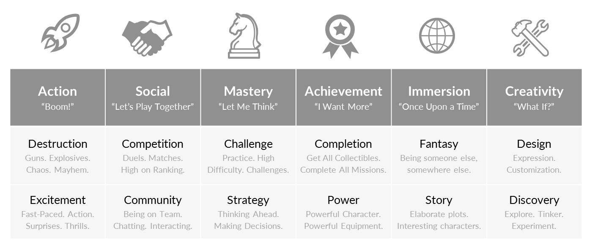

# Game Design

```{topic} In this lesson you will:
- learn about the unique characteristics that make games (challenge and interactivity)
- learn mechanics that can be used to enhance challenge.
- learn mechanics that can be used to enhace interactivity.
```

There are general principles which help create better games. In fact there is an entire industry dedicated to the design of games. There is heaps of academic research into gamer's preferences and how to influence gamers. So the material we cover here, is a really simple introduction into a topic so big that it can cover a range of different careers. If you are interested in diving deeper, I can suggest checking out **[The Psychology of Video Games](https://www.psychologyofgames.com/)**.

First, what makes a game a game?

## Interactive Challenges

Games can be described a interactive challenges, detailing the two prerequisites aspects - interactivity and challenge. Take either of these aspects away and you no longer have a game.

### Interactivity

**Interactivity** means that players have some control over the outcome. They provide input and then the game interacts with the input to produce outcomes. The input could be pressing a button, or moving a mouse, or even rolling a dice (this game definition isn't limited to computer games).

Without interactivity the game becomes some for of passive entertainment, like watching a movie or reading a book.

### Challenge

Games normally have their own set of **challenges** that the player needs to overcome to win. This could be explicit like quests or implicit through scoring for completing tasks.

Without challenge the game becomes play, like playing with a toy.

The question is, what makes a good game? Is it the graphics and sound or something else?

So we know games need both interactivity and challenge, but how do we incorporate these to create a good game.

## Game Mechanics

Game **mechanics** are the basic rules and interactions that make games fun to play. Mechanics are how we incorporate both interactivity and challenge to produce our game. If games were a car, then game mechanics are like the engine. The graphics, characters, storylines and music are like the bodywork. It doesn't matter how good the bodywork is, if your engine is poor, so is your car's performance.

The best games have great game mechanics, superb graphics, believable characters, spectacular music and compelling storylines, but it is the mechanics that make games stand out from other media. Movies can also have superb graphics, believable characters, spectacular music and compelling storylines. Books can have believable characters, and compelling storylines.

We are going to look at eight basic mechanics, four that address challenge and four that address interactivity. They are:

| Challenge | Interactivity |
| --- | --- |
| Difficulty | Choices and Control |
| Goals | Control Overload! |
| Rewards | Unfair Punishment |
| Subgoals | Audio Feedback |

### Challenge Mechanics

Different players want different kinds of challenges. **[Quantic Foundry](https://quanticfoundry.com/)** is a market research firm who specialises in assessing games. Their Gamer Motivation Model has 12 different motivations and is based on the idea that different gamers want different types of challenges. 



If you are curious to see what your Gamer Profile is, you can **[take a survey](https://apps.quanticfoundry.com/surveys/start/gamerprofile/)**.

We will look at four simple mechanics that improve a game's challenge

- Difficulty
- Goals
- Rewards
- Subgoals

#### Difficulty

Best a challenge causes our brains to release provide a little shot of dopamine. Dopamine is our reward hormone and makes us feel pleasure. But there is a trick to getting that release, we need to set the difficulty at the right level. That means challenges must be easy enough to achieve, but hard enough to be worth it.

If the challenge is too hard, players will not get a success and will loose interest. On the other hand, if the challenge is too easy then the game just become boring. So, you need to aim for the just right level.

You also need to consider that you will have players of different skill levels playing, the the right level of challenge will vary according to the player.


If you think of our game we have already introduced some mechanics that effect its difficulty. But we can do more.

| The Problem | Impact | The Solution | Implemented |
| --- | --- | --- | --- |
| One asteroid touch ends the game. | Make it too hard | Add spaceship lives | Yes |
| Spaceship escapes asteroids by moving outside the screen | Makes it too easy | Restrict spaceship movement to inside the screen | Yes |
| Not change in difficulty | Not accessible to all skill levels | Add a difficulty menu which changes asteroid frequency and speed | No |

#### Goals

Challenges are created by setting goals for players to achieve. It is important that goals are clear and progress towards them is obvious. Therefore players need to know what their goals are, and they need to know how they are progressing towards achieving those goals.

Goals also have an interesting impact called the **what-if effect**. The what-if effect occurs when a player fails at something and then thinks "What if I had ..." and then thinks of things they could do differently. The Dark Souls series of games thrives on this effect.

While the what-if effect can be felt at anytime, it is most keenly felt the closer you are to a goal. If they player fall just short of a goal, they will think of a heap of things they could have done differently to ensure success. To this extent, game designers tend to increase the difficulty the closer a player gets to a goal. This is why you find bosses at the end of quests.

```{admonition} Judging Difficulty
:class: note
Game developers are notoriouly bad at judging the diffifult of their game. That's because they know how their games works and therefore find them easier. To judge the difficulty of games, have someone else play your games and give feedback on the difficulty
```

In our game of Space Rescue, we haven't got any goals. Just endlessly collecting astronauts. Lets change that:

| The Problem | Impact | The Solution | Implemented |
| --- | --- | --- | --- |
| Player doesn't have a goal | No goal or what-if effect | Set a number of astronauts rescued goal | No |
| Player doesn't know what the goal is | Goal is unclear | Display number of astronauts to be rescued | No |
| Player doesn't know their progress towards the goal | Progress is unclear | Display number of astronauts rescued | No |
| Player might achieve goal too quickly | Might not experience "what-if" effect | Reduce the rate of astronaut spawns as more astronauts are rescued | No |

#### Rewards

Rewards are extremely important for maintaining interest the challenges. They make the player feel better about the effort taken to complete the challenge. They also make the player more likely to complete other challenges.

Helps to give occasional bonus rewards for no reason at all, for example, power-ups at random intervals. The random aspect is important, as it gives hope that a pickup may come at any point. This encourages players to stick with it in desperate situations and adds to the “what if…” effect.

In our game we have a very simple reward system of increasing the score for rescuing astronauts and shooting asteroids, and decreasing the score for shooting astronauts. May be we should add more.

| The Problem | Impact | The Solution | Implemented |
| --- | --- | --- | --- |
| No reward for reaching goals | Reducing motivation and undermines the goal | Give big bonus points for reaching goal | No |
| No random bonus reward | Reduces what-if effect and excitement | Have Zork randomly spawn life and shield bonuses<br>- life bonus add one life <br>- shield bonus gives immunity for a random time | No |

#### Subgoals

Subgoals provide players with short-term or optional challenges. This gives the player something to aim for in the short term, on the way to achieving their Goal. In addition optional subgoals are a good way of providing extra challenges to advanced players.

What kind of sub-goals can we add to our game?

| Subgoal | Application |
| --- | --- |
| To shoot demons without taking damage | - Count the number of asteroids shot in a row<br>- Reset the count when the ship loses a life<br>- Limit number of lasers on screen to the current asteroid count |
| Try to not accidently shoot the astronauts | - Each shot astronaut subtracts one from the goal total<br> - Goal bonus points calculated on the number of astronauts collected |

### Interactivity Mechanics

Interactivity is about putting the player in control. Remember without interactivity, games become a passive experience.

A good games leave the player ***feeling*** they are in control of the game. They ***believe*** they have influence on the outcomes and the decisions they make will significantly impact the gameplay. It is important to note that this is subjective. For example, the upgrading stats in a RPG has negligible effect, especially since the difficulty of the enemies also increases.

A bad game minimises the player's sense of control. For example, being taken-out in a PVP match by someone who is obviously using a cheat.

These are some of the common mechanics for promoting the feeling of control:

- Choices and Control
- Control Overload!
- Unfair Punishment
- Audio Feedback

#### Choices and Control

Players need to be provided with choices that **seem** to have a real effect on the outcome of the game. They may result in different gameplay options, or seem to provide an advantage, while in reality their impact is minimal. For example, choosing different characters in Mario Cart.

If a choice is perceived to provide a real difference to the game play by giving players more control, it gets the player more involved.

We can incorporate choice into our game by letting the player choose between two types of ships. Each ship will have a special power they can activate for a short period by pressing the **ctrl** button.

| Ship | Special Power |
| --- | --- |
| Attractor | When active astronauts move towards the ship |
| Swerver | When active ship's speed increases |

#### Control Overload

Giving the player too many choices can be self-defeating. Too many choices can overwhelm a player and reduce their sense of control. The extent that this is true depends on the type of game being played. A first person shooter that requires the use of all the keys on a keyboard will result in overload, where-as this is the standard expectation for a slight simulator.

In simple games like our, it is worth remembering that most people can only remember five to nine things at once. Therefore, you need to limit the number of elements of gameplay that a player has to hold in their memory.

If you need to include more element, then outsource the remembering to the UI. For example, the bottom of the Minecraft screen displays all the items bound to the `1` to `0` keys. Another example is the 

Another option is to make one key perform different functions according to the context. Instead of having one key for opening doors, and another key for talking to NPCs and another key to pick up items, modern RPG will have one **interact key** that will perform all these tasks depending on what the player is looking at.

Our game has minimal feature and control, so this is not a concern at the moment. Although, it is something you should take into consideration when adding features to this game. 

#### Unfair Punishment

Punishing players for something that is not under their control quickly destroys their sense of control. These punishments are usually unintended and can vary greatly. For example, the below experiences can erode a players sense of control:

- lag between a button press and an action
- game crashes which loose progress
- enemy players shooting while clipped into a wall
- dialogue options with unexpected outcomes

It is important to make sure that the game is playing properly, even when the player is not playing it like you intended.

Lets consider out game

| Unfair punishment | Solution |
| --- | --- |
| A laser shot at an asteroid can pass through the asteroid and hit an astronaut | Have the asteroid disappear when it collides with the first object |

#### Audio Feedback

We have already established that confusion reduces a player’s sense of control. A effective way of reducing confusion is through reinforcement during gameplay. We already do this using the score. The score increases when the player does the correct thing, and decreases when the player does the wrong thing.

Another effective way of reinforcing is through using sound. Sounds can feel positive and negative and can provide feedback to player on what they are doing. This informs player if their interactions are good or bad. It is a way of automatically instructing the player.

Lets look at which game events can have sound attached to them:

| Event | Sound Effect|
| --- | --- |
| Shooting laser | Positive |
| Shooting asteroid | Positive |
| Saving astronaut | Positive |
| Ship collides with asteroid | Negative |
| Shooting astronaut | Negative |

## Enhancing the game

Now that you have a better understanding of game mechanics and ways you can enhance the game. Choose some of the suggested mechanics and implement them.

