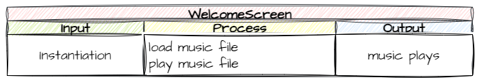

# Mechanic - Audio

```{topic} In this lesson you will:
- apply learnt knowledge to plan code using using IPO tables
- improve gameplay by incorporating identified mechanics
- learn how to add background music
- learn how to add sound effects to events
```

In the **[Game Design lesson](18_game_design.md)**, we identified adding audio feedback would enhance the interactivity of our game. Below are the identified events that we could add sound effects to:

| Event | Sound Effect |
| --- | --- |
| Shooting laser | Positive |
| Shooting asteroid | Positive |
| Saving astronaut | Positive |
| Ship collides with asteroid | Negative |
| Shooting astronaut | Negative |

It is also common for computer games to have a backing track being played throughout the entire game. 

In this lesson we will implement all the sound effects and add a backing track.

## Planning

### Mechanisms

First we will need to work out what mechanisms are available for playing sounds. As always, our first place to look is the **[GameFrame Documentation](documentation.md)**. Once your on the documentation page, perform a search for **sound** (`ctrl` + `F` or `command` + `F`) to find all the sound related GameFrame features.

You will find:

- [**Sounds folder**](documentation.md#sounds) &rarr; holds all the sound files. Check your **sounds** folder you will notice that you have been provided with all the required sound effect, along with some extra ones.
- **`load_sounds()`** which is a Rooms Method &rarr; we will use this to add our sounds.
- **PyGame sound methods** is something new. This is the first time that we use methods from the Pygame layer of our stack. From the Pygame methods, we can find methods for using sounds that we have loaded.

So there are two steps to playing sounds in GameFrame.

1. Load the sound &rarr; the sound is an attribute of the Room/Level object, therefore it must happen within the Room `__ init__()`
2. Play the sound &rarr; this can be used by any object with the Room/Level, including RoomObjects, but they need to access the attribute of the Room they are in.

We now have our mechanisms, so let's plan the code.

### IPO tables

#### Background Music

The first question we need to resolve, is what Room/Level does the sound reside in? Normally background music starts playing as soon as the game has loaded, therefore, our music should be loaded and played from into the `WelcomeScreen` Room/Level.



#### Sound Effects

The sound effects are a bit more complicated. They all occur in the `GamePlay` Room/Level, but they are triggered by events tied to various RoomObjects within that room. Therefore, we need to split the loading and the playing over different objects:

- loading will occur in the `GamePlay` class
- `play()` call will occur wherever the relevant event is handled


Now we know what we have to, lets start coding.

## Coding

### `Rooms/WelcomeScreen.py`

We'll start with the background music.

**Open** `Rooms/WelcomeScreen.py` and then add or adjust the highlighted code below:

```{code-block} python
:linenos:
:emphasize-lines: 17-18, 20-21
from GameFrame import Level
from Objects.Title import Title

class WelcomeScreen(Level):
    """
    Intial screen for the game
    """
    def __init__(self, screen, joysticks):
        Level.__init__(self, screen, joysticks)
        
        # set background image
        self.set_background_image("Background.png")
        
        # add title object
        self.add_room_object(Title(self, 240, 200))
        
        # load sounds
        self.bg_music = self.load_sound("Music.mp3")
        
        # play background music
        self.bg_music.play(loops=1)
```

Let's investigate this code:

- **line 18**: loads the `"Music.mp3"` sound file and saves it as `bg_music`
- **line 21**: starts playing the music. Note `loops=1` means the music will restart once it reaches the end.

**Save** `Rooms/WelcomeScreen.py` and the run `MainController.py` to test if the music plays.

### `Rooms/GamePlay.py`

Now we need to load all the sound effects that will be used in the GamePlay room.

**Open** `Rooms/GamePlay.py` and the add or adjust the highlighted code below:

```{code-block} python
:linenos:
:emphasize-lines: 25-30
from GameFrame import Level, Globals
from Objects.Ship import Ship
from Objects.Zork import Zork
from Objects.Hud import Score, Lives

class GamePlay(Level):
    def __init__(self, screen, joysticks):
        Level.__init__(self, screen, joysticks)
        
        # set background image
        self.set_background_image("Background.png")
        
        # add objects
        self.add_room_object(Ship(self, 25, 50))
        self.add_room_object(Zork(self,1120, 50))
        
        # add HUD items
        self.score = Score(self, 
                           Globals.SCREEN_WIDTH/2 - 20, 20, 
                           str(Globals.SCORE))
        self.add_room_object(self.score)
        self.lives = Lives(self, Globals.SCREEN_WIDTH - 150, 20)
        self.add_room_object(self.lives)
        
        # load sound files
        self.shoot_laser = self.load_sound("Laser_shot.ogg")
        self.asteroid_shot = self.load_sound("Asteroid_shot.wav")
        self.astronaut_saved = self.load_sound("Astronaut_saved.ogg")
        self.asteroid_collision = self.load_sound("Ship_damage.ogg")
        self.astronaut_shot = self.load_sound("Astronaut_hit.ogg")
```

Unpacking the new code:

- **line 26**: loads the `"Laser_shot.ogg"` sound file and saves it as `shoot_laser`
- **line 27**: loads the `"Asteroid_shot.wav"` sound file and saves it as `asteroid_shot`
- **line 28**: loads the `"Astronaut_saved.ogg"` sound file and saves it as `astronaut_saved`
- **line 29**: loads the `"Ship_damage.ogg"` sound file and saves it as `asteroid_collision`
- **line 30**: loads the `"Astronaut_hit.ogg"` sound file and saves it as `astronaut_shot`

**Save** and close `Rooms/GamePlay.py`.

We now need to insert the sound effects into their respective event handlers.

### `Objects/Laser.py`

**Open** `Objects/Laser.py` and the add or adjust the highlighted code below:

```{code-block} python
:linenos:
:lineno-start: 39
:emphasize-lines: 7, 11
    # --- Event handlers
    def handle_collision(self, other, other_type):
        """
        Handles laser collisions with other registered objects
        """
        if other_type == "Asteroid":
            self.room.asteroid_shot.play()
            self.room.delete_object(other)
            self.room.score.update_score(5)
        elif other_type == "Astronaut":
            self.room.astronaut_shot.play()
            self.room.delete_object(other)
            self.room.score.update_score(-10)
```

Looking at the code:

- **line 45**: plays the `asteroid_shot` sound when a laser collides with an asteroid.
  - since the `asteroid_shot` is an attribute of the `GamePlay` Room the laser needs to access an attribute of another object.
  - all RoomObjects have an attribute called `room` which identifies which room it belongs to.
  - `self.room.asteroid_shot.play()` should be read as:
    - play the `asteroid_shot` sound
    - the belongs to the room
    - this asteroid is in
- - **line 46**: plays the `astronaut_shot` sound when a laser collides with an astronaut.

**Save** and close `Rooms/Laser.py`.

### `Objects/Ship.py`

**Open** `Objects/Ship.py` and the add or adjust the highlighted code below:

```{code-block} python
:linenos:
:lineno-start: 52
:emphasize-lines: 12
    def shoot_laser(self):
        """
        Shoots a laser from the ship
        """
        if self.can_shoot:
            new_laser = Laser(self.room, 
                            self.x + self.width, 
                            self.y + self.height/2 - 4)
            self.room.add_room_object(new_laser)
            self.can_shoot = False
            self.set_timer(10,self.reset_shot)
            self.room.shoot_laser.play()
```

Looking at the code:

- **line 63**: plays the `shoot_laser` sound when the space bar is pressed

**Save** and close `Objects/Ship.py`

### `Objects/Asteroid.py`

**Open** `Objects/Asteroid.py` and the add or adjust the highlighted code below:

```{code-block} python
:linenos:
:lineno-start: 53
:emphasize-lines: 8
    def handle_collision(self, other, other_type):
        """
        Handles the collision events for the Asteroid
        """
        
        if other_type == "Ship":
            self.room.delete_object(self)
            self.room.asteroid_collision.play()
            Globals.LIVES -= 1
            if Globals.LIVES > 0:
                self.room.lives.update_image()
            else:
                self.room.running = False
```

Looking at the code:

- **line 60**: plays the `asteroid_collision` sound when asteroid collides with the ship

**Save** and close `Objects/Asteroid.py`

### `Objects/Astronaut.py`

**Open** `Objects/Astronaut.py` and the add or adjust the highlighted code below:

```{code-block} python
:linenos:
:lineno-start: 31
:emphasize-lines: 8
    # --- Event Handlers
    def handle_collision(self, other, other_type):
        """
        Handles the collision event for Astronaut objects
        """
        # ship collision
        if other_type == "Ship":
            self.room.astronaut_saved.play()
            self.room.delete_object(self)
            self.room.score.update_score(50)
```

Looking at the code:

- **line 60**: plays the `astronaut_saved` sound when astronaut collides with the ship

**Save** and close `Objects/Astronaut.py`

## Testing

Now it is time to test that the sounds effects are working. 

In testing, use a testing table to make sure that you check all five of the sound effects:

| Event | Expected Sound | Actual Sound | Resolution |
| --- | --- | --- | --- |
| Shooting laser | Laser_shot | | |
| Shooting asteroid | Asteroid_shot | | |
| Saving astronaut | Astronaut_saved | | |
| Ship collides with asteroid | Ship_damage | | |
| Shooting astronaut | Astronaut_hit | | |

## Adjusting volume

After testing the game, you may want to adjust the mix of the sound. If you are using the sound file provided you will find the background music is too loud and overpowers the sound effect. Fortunately, we can adjust the volume of individual sounds by using the Pygame `.volume()` method.

### `Rooms/WelcomeScreen.py`

**Open** `Rooms/WelcomeScreen.py` and then add or adjust the highlighted code below:

```{code-block} python
:linenos:
:emphasize-lines: 21
from GameFrame import Level
from Objects.Title import Title

class WelcomeScreen(Level):
    """
    Intial screen for the game
    """
    def __init__(self, screen, joysticks):
        Level.__init__(self, screen, joysticks)
        
        # set background image
        self.set_background_image("Background.png")
        
        # add title object
        self.add_room_object(Title(self, 240, 200))
        
        # load sounds
        self.bg_music = self.load_sound("Music.mp3")
        
        # play background music
        self.bg_music.set_volume(0.1)
        self.bg_music.play(loops=1)
```

**Save** and close `Rooms/WelcemeScreen.py` and test that the volume levels are now correct using `MainController.py`

## Commit and Push

We have finished and tested another section of code so we should make a Git commit.

To do this:

1. In GitHub Desktop go to the bottom left-hand box and write into the summary **Added lasers**.
2. Click on **Commit to main**
3. Click on **Push origin**

Now the work from this lesson is committed and synced with the online repo.

## Completed File States

Below are all the files we used in this lesson in their finished state. **Use this to check if your code is correct**.

### `Rooms/WelcomeScreen.py`

```{code-block} python
:linenos:
from GameFrame import Level
from Objects.Title import Title

class WelcomeScreen(Level):
    """
    Intial screen for the game
    """
    def __init__(self, screen, joysticks):
        Level.__init__(self, screen, joysticks)
        
        # set background image
        self.set_background_image("Background.png")
        
        # add title object
        self.add_room_object(Title(self, 240, 200))
        
        # load sounds
        self.bg_music = self.load_sound("Music.mp3")
        
        # play background music
        self.bg_music.set_volume(0.1)
        self.bg_music.play(loops=1)
```

### `Rooms/GamePlay.py`

```{code-block} python
:linenos:
from GameFrame import Level, Globals
from Objects.Ship import Ship
from Objects.Zork import Zork
from Objects.Hud import Score, Lives

class GamePlay(Level):
    def __init__(self, screen, joysticks):
        Level.__init__(self, screen, joysticks)
        
        # set background image
        self.set_background_image("Background.png")
        
        # add objects
        self.add_room_object(Ship(self, 25, 50))
        self.add_room_object(Zork(self,1120, 50))
        
        # add HUD items
        self.score = Score(self, 
                           Globals.SCREEN_WIDTH/2 - 20, 20, 
                           str(Globals.SCORE))
        self.add_room_object(self.score)
        self.lives = Lives(self, Globals.SCREEN_WIDTH - 150, 20)
        self.add_room_object(self.lives)
        
        # load sound files
        self.shoot_laser = self.load_sound("Laser_shot.ogg")
        self.asteroid_shot = self.load_sound("Asteroid_shot.wav")
        self.astronaut_saved = self.load_sound("Astronaut_saved.ogg")
        self.asteroid_collision = self.load_sound("Ship_damage.ogg")
        self.astronaut_shot = self.load_sound("Astronaut_hit.ogg")
```

### `Objects/Laser.py`

```{code-block} python
:linenos:
from GameFrame import RoomObject, Globals

class Laser(RoomObject):
    """
    Class for the lasers shot by the Ship
    """
    
    def __init__(self, room, x, y):
        """
        Inistialise the laser
        """
        # include attributes and methods from RoomObject
        RoomObject.__init__(self, room, x, y)
        
        # set image
        image = self.load_image("Laser.png")
        self.set_image(image, 33, 9)
        
        # set movement
        self.set_direction(0, 20)
        
        # handle events
        self.register_collision_object("Asteroid")
        self.register_collision_object("Astronaut")
        
    def step(self):
        """
        Determine what happens to the laser on each tick of the game clock
        """
        self.outside_of_room()
        
    def outside_of_room(self):
        """
        removes laser if it has exited the room
        """
        if self.x > Globals.SCREEN_WIDTH:
            self.room.delete_object(self)
            
    # --- Event handlers
    def handle_collision(self, other, other_type):
        """
        Handles laser collisions with other registered objects
        """
        if other_type == "Asteroid":
            self.room.asteroid_shot.play()
            self.room.delete_object(other)
            self.room.score.update_score(5)
        elif other_type == "Astronaut":
            self.room.astronaut_shot.play()
            self.room.delete_object(other)
            self.room.score.update_score(-10)
```

### `Objects/Ship.py`

```{code-block} python
:linenos:
from GameFrame import RoomObject, Globals
from Objects.Laser import Laser
import pygame

class Ship(RoomObject):
    """
    A class for the player's avitar (the Ship)
    """
    
    def __init__(self, room, x, y):
        """
        Initialise the Ship object
        """
        RoomObject.__init__(self, room, x, y)
        
        # set image
        image = self.load_image("Ship.png")
        self.set_image(image,100,100)
        
        # register events
        self.handle_key_events = True
        
        self.can_shoot = True
        
    def key_pressed(self, key):
        """
        Respond to keypress up and down
        """
        
        if key[pygame.K_w]:
            self.y_speed = -10
        elif key[pygame.K_s]:
            self.y_speed = 10
        if key[pygame.K_SPACE]:
            self.shoot_laser()
            
    def keep_in_room(self):
        """
        Keeps the ship inside the room
        """
        if self.y < 0:
            self.y = 0
        elif self.y + self.height> Globals.SCREEN_HEIGHT:
            self.y = Globals.SCREEN_HEIGHT - self.height
            
    def step(self):
        """
        Determine what happens to the Ship on each click of the game clock
        """
        self.keep_in_room()
        
    def shoot_laser(self):
        """
        Shoots a laser from the ship
        """
        if self.can_shoot:
            new_laser = Laser(self.room, 
                            self.x + self.width, 
                            self.y + self.height/2 - 4)
            self.room.add_room_object(new_laser)
            self.can_shoot = False
            self.set_timer(10,self.reset_shot)
            self.room.shoot_laser.play()
            
    def reset_shot(self):
        """
        Allows ship to shoot again
        """
        self.can_shoot = True
```

### `Objects/Asteroid.py`

```{code-block} python
:linenos:
from GameFrame import RoomObject, Globals
import random

class Asteroid(RoomObject):
    """
    A class for Zorks danerous obstacles
    """
    
    def __init__(self, room, x, y):
        """
        Initialise the Asteroid object
        """
        # include attributes and methods from RoomObject
        RoomObject.__init__(self,room, x, y)
        
        # set image
        image = self.load_image("asteroid.png")
        self.set_image(image,50,49)
        
        # set travel direction
        angle = random.randint(135,225)
        self.set_direction(angle, 10)
        
        # register events
        self.register_collision_object("Ship")
        
    def step(self):
        """
        Determines what happens to the asteroid on each tick of the game clock
        """
        self.keep_in_room()
        self.outside_of_room()
        
    def keep_in_room(self):
        """
        Keeps the asteroid inside the top and bottom room limits
        """
        if self.y < 0:
            self.y = 0
            self.y_speed *= -1
        elif self.y > Globals.SCREEN_HEIGHT - self.height:
            self.y = Globals.SCREEN_HEIGHT - self.height
            self.y_speed *= -1
            
    def outside_of_room(self):
        """
        removes asteroid that have exited the room
        """
        if self.x + self.width < 0:
            print("asteroid deleted")
            self.room.delete_object(self)
            
    def handle_collision(self, other, other_type):
        """
        Handles the collision events for the Asteroid
        """
        
        if other_type == "Ship":
            self.room.delete_object(self)
            self.room.asteroid_collision.play()
            Globals.LIVES -= 1
            if Globals.LIVES > 0:
                self.room.lives.update_image()
            else:
                self.room.running = False
```

### `Objects/Astronaut.py`

```{code-block} python
:linenos:
from GameFrame import RoomObject

class Astronaut(RoomObject):
    """
    Class for the astronauts escaping from Zork
    """
    
    def __init__(self,room,x,y):
        """
        Initialise the astronaut instance
        """
        # include attirbutes and method from RoomObject
        RoomObject.__init__(self,room,x,y)
        
        # set image
        image = self.load_image("Astronaut.png")
        self.set_image(image,50,49)
        
        # set travel direction
        self.set_direction(180, 5)
        
        # handle events
        self.register_collision_object("Ship")
        
    def step(self):
        """
        Determines what happend to the astronaut on each tick of the game clock
        """
        self.outside_of_room()
        
    # --- Event Handlers
    def handle_collision(self, other, other_type):
        """
        Handles the collision event for Astronaut objects
        """
        # ship collision
        if other_type == "Ship":
            self.room.astronaut_saved.play()
            self.room.delete_object(self)
            self.room.score.update_score(50)
            
    def outside_of_room(self):
        """
        removes astronauts that have exited the room
        """
        if self.x + self.width < 0:
            self.room.delete_object(self)
```
