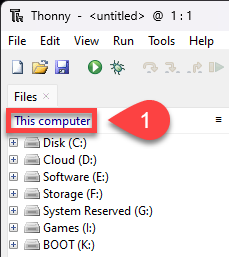

# Using Thonny as the IDE

```{admonition} Thonny as an alteravtive IDE
:class: warning
This page will finish the setup of your environment, but using Thonny as the IDE rather than VS Code. Before you follow these instructions, you should have completed the instructions in the Setup page, up to and including [GitHub Desktop](02_setup.md#github-desktop).
```

Thonny is a Python IDE for beginners. It comes packaged with Python, which helps with the setup. Despite being targeted at begginers, it has many of the feature of professional IDEs

## Install and setup Thonny

Download Thonny from [**thonny.org**](https://thonny.org/) and install it.

Then open the **View** menu and tick

- Files
- Shell


## GameFrame and resources

```{admonition} GameFrame
:class: note
GameFrame was developed by a Steven Tucker, a Queensland teacher. If you wish to use the latest versions of GameFrame, it can be found at his [Gitlab repository](https://gitlab.com/tuxta/gameframe?fbclid=IwAR0GnSkDPy-IdeoNZofh0YwVJ63i4m2wVyzXwBrFqpbG2cLuYox8dkbU2Ss).
```

We will be using a repo with an edited version of GameFrame, which includes all the assets needed for these tutorials. We will clone (copy) the repo from GitHub.

To do this:

1. Go to the **[Space Rescue Resources repo](https://github.com/DamoM73/space-rescue-resources)**
2. Click on the green **Code** button
3. Click on the **copy** button beside the https url


4. Open **GitHub Desktop**
5. Open the **File** menu
6. Click **Clone Repository**


7. Choose the **URL** tab
8. Paste repo URL into **URL or username/repository** box
9.  Remember the **Local path** that your repo will be saved in (write it down somewhere)
10. Click **Clone**


The repo should now be copied onto your computer and ready for use.

## Navigating to repo in Thonny

We now have to direct Thonny to the repo we just created.

1. Go back to Thonny
2. In the **Files** panel click on **This computer**



3. Click through the drives and directories until you have recreated the **Local path** where you saved your repo.
4. Make sure that the file in your repo folder directories match those in the image below.


## Virtual Environment

Python virtual environments enables you to designate distinct areas for various Python projects. It's like having various rooms in your home, each with its unique furnishings and accents. You can work on various projects in a virtual environment without their interfering with one another. Each project gets a special "playground" with its own Python installation and particular libraries. A virtual environment is similar to walking into a specific room, and any Python programmes or libraries you use are exclusive to that project once you enter it. You can easily work on numerous Python projects because everything is kept organised and conflicts between projects are avoided.

### Creating a virtual environment in Thonny

```{admonition} Must be in the repo directory
:class: error
Thonny will create the virtual environment in the current directory, therefore it is essential that the Files panel is showing your repo directory.
```

1. Go to the **Tools** menu and choose **Options...**


2. In the **Thonny options** dialogue box click the **Interpreter** tab
3. Then click on **New virtual environment**


4. Click **OK** on the **Creating new virtual environment** message.
5. In the File dialogue box, **right mouse click** in the white space.
6. Then choose **New** from the context menu
7. Then **Folder**


8. Name the new folder **venv**
9. Make sure that it is highlighted and then click **Select**


10. Wait for **Creating virtual environment** message to close


11. Check that the **Python executable** is pointing at your repo directory.
12. Click **OK**

![Thonny checking venv]

### Checking your virtual environment in Thonny

Each time you open Thonny it is important to ensure that your virtual environment is active. To do this look at the Python version in the Shell frame, it should point to the **venv** folder you just made.


If it is not pointing to the **venv** folder, you need to activate your virtual environment by:

1. **Right mouse click** on the **venv** folder in the **Files** panel
2. Select **Activate virtual environment**


Then recheck your Shell panel


## Make first commit and push

```{admonition} Git and GitHub terminology
:class: note
Git and GitHub uses a range of different terminology. Here are some of the terms we will be using:

- **Repository or repo**: A repository is a special folder that stores all the files and their history for a project.
- **Commit**: When you make changes to files in a repository, a commit is takes a snapshot of those changes. Each commit has a unique name and a message explaining what changes were made.
- **Pull**: Pulling means getting the latest changes made by others and adding them to your own copy of the project.
- **Push**: Pushing is when you share your changes with others by sending them to a central place, like a website or server.
- **Remote**: A remote is a way to connect your local copy of the project with the online version. weare using GitHub. It allows you to share your work and collaborate with others.
- **Clone**: Cloning is making a copy of a project from a remote location to your own computer so you can work on it.
- **Local**: the copy of the repo that is on your computer
- **Origin**: the copy of the repo that is on a remote location
- **Fork**: making your own copy of someone else's project.

Note: the *other* that you could be working with might be you on another computer.
```

1. Change the text in README.md to the text below and then save it:

```
# SPACE RESCUE

Try to save the helpless astronauts who are being left stranded in space by the evil Zork.
```

2. In GitHub desktop write "Made first change" in the **Summary (required)** box
3. Then click **Commit to main**


4. Click **Push origin** (you will receive an error)


5. Choose to **Fork this repository**
6. Choose **For my own purposes** and **Continue**
7. Click **Push origin** again
