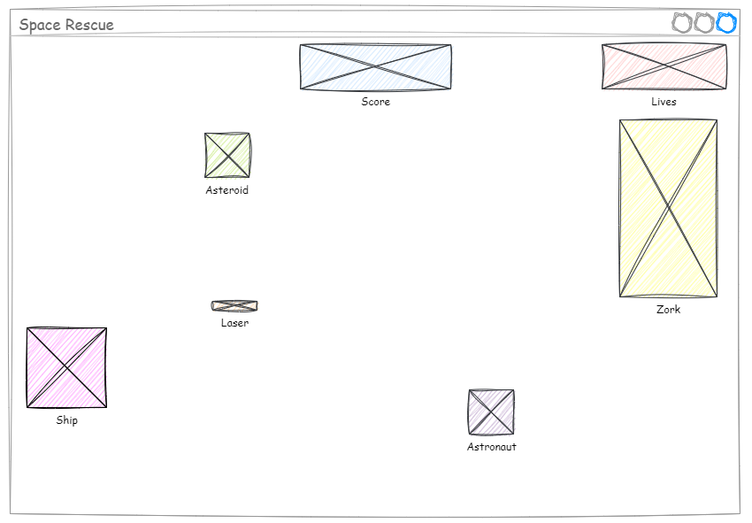
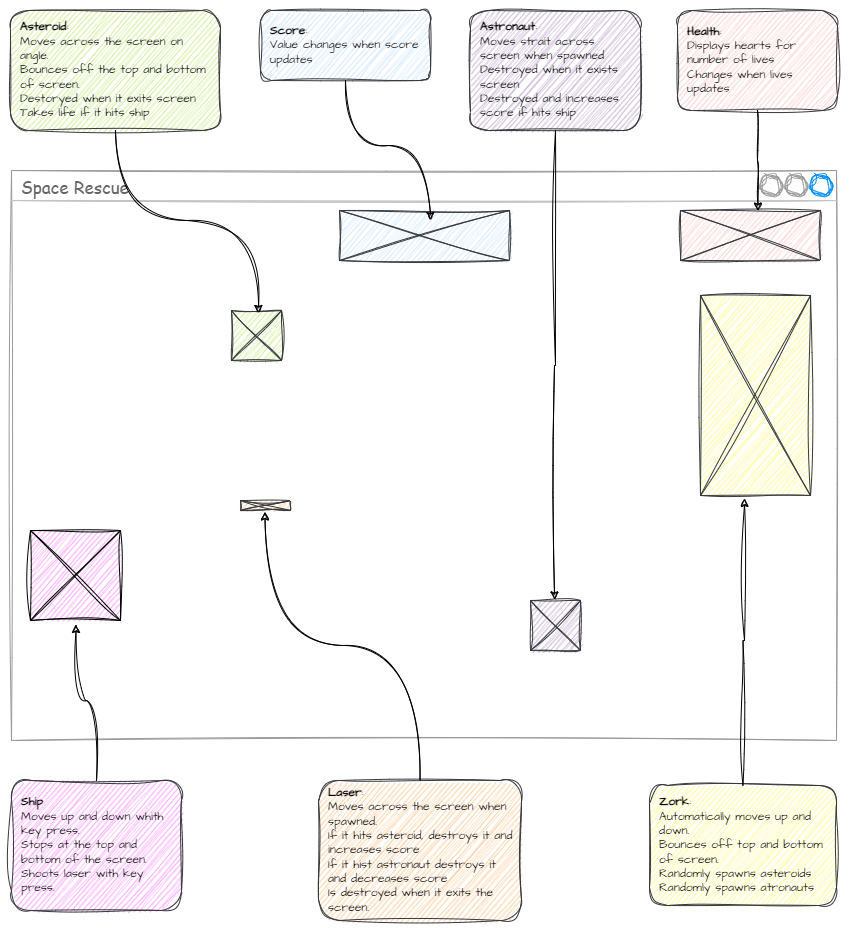
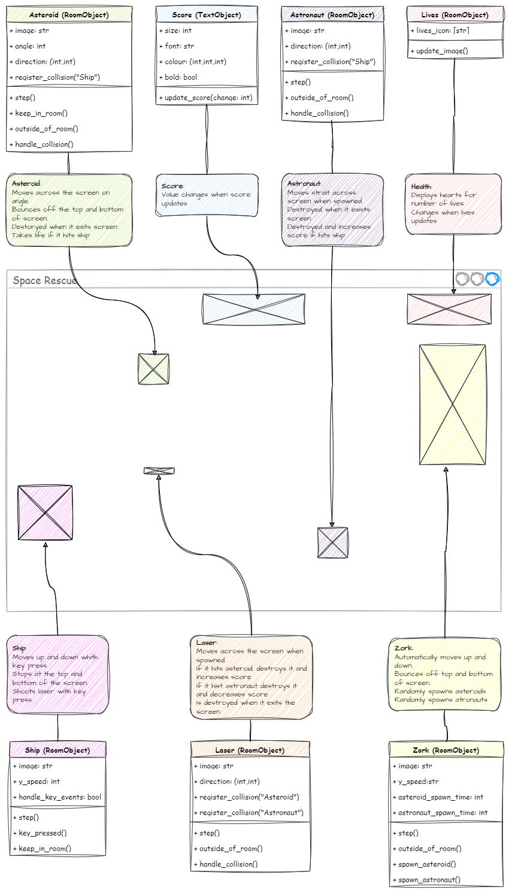

# Creating your own game

```{topic} In this lesson you will:
- learn how to plan a new game for the GameFrame framework
- learn the important processes of creating a new game
```

## Planning the Game

Way back in our **[introduction to GameFrame](./03_gameframe.md)** we identified that a GameFram game consists of the RoomObjects inside a series of Rooms. We will use this concept to help plan new games.

### Step 1 - Determine the Rooms

The first step is to work out how many levels (Rooms) the new game will have. For example, the Space Rescue game that we just completed consisted of two Rooms &mdash; WelcomeScreen and GamePlay.

### Step 2 - Draw wireframes

Once the number of Rooms have been determined, you will need to draw a wireframe for each of the Rooms.

```{admonition} Wireframes
:class: note
A wireframe is like a blueprint or skeleton of a website or app. It's a simple, basic outline that shows where different elements, like buttons, images, and text, will go on the screen. It focuses on the layout and arrangement of elements rather than the colors or details. It's a helpful tool for visualizing and discussing ideas before creating the final design, just like making a rough sketch or draft of a drawing before adding all the details.
```

A Room's wireframe should contain a placeholder for every RoomObject that is going to appear in the Room. The placeholder can be as simple a box, but it should be approximately the right size.

Below is a wireframe for Space Rescue's GamePlay Room. For the sake of brevity, we will only show the wireframe for the GamePlay Room, but in your design you should have a wireframe for each sufficiently different Room.



### Step 3 - Annotate RoomObjects

Now that you have identified all the Rooms the game will use, as well as all the RoomObjects in each Room, it is time to start describing the game.

Remember that the a GameFrame game consists through the interactions between RoomObjects. Therefore you  describe the game through describing each of the RoomObjects.

Annotate each RoomObject explaining what RoomObject does.

Below is our Space Rescue GamePlay Room wireframe, with annotations.



### Step 4 - Create Class Diagrams

Now that you know what you want your RoomObjects to do, you need to fit that into the GameFrame framework. RoomObjects are classes, so use class diagrams to rewrite the RoomObject descriptions into classes. Remember we have been using class diagrams since **[Deepest Dungeon](https://damom73.github.io/python-oop-with-deepest-dungeon/stage_1.html#class-diagram)**.

You need to create a class diagram for each RoomObject, remember:

- attributes:
  - describe features of the object
  - refer to the variable that belong to the object
  - go above the line
- methods:
  - describe actions the object take
  - refer to the differnt functions that belong to the object
  - go under the line

Below is the Space Rescue GamePlay Room wireframe with the addition of the class diagram.



### Step 5 - Start Coding

Now you have sketched out the basic structure of the new game, it is time to start creating your code.

#### Setup programming environment

The blank copy of GameFrame can be found **[here on GitHub](https://github.com/DamoM73/GameFrame)**.

Follow the sames process we used in **[the Setup page](./02_setup.md)**.

## Processes

In this section, you will find flowcharts to remind you of the steps to complete some of the most common GameFrame processes.

### Create a Room


### Create a RoomObject


