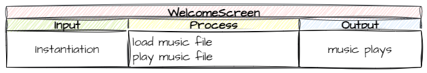
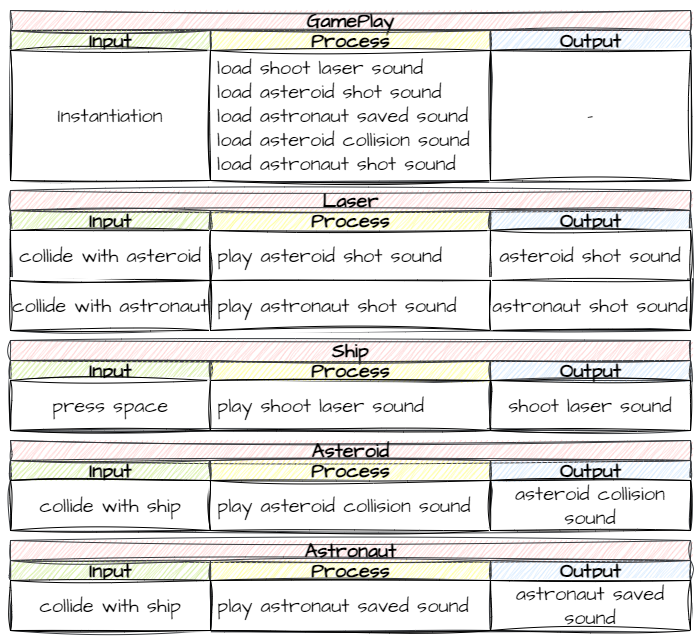

# Audio

!!! learn "In this lesson we will learn"
    - how to plan sound with IPO tables
    - how to load and play sounds in GameFrame
    - how to add background music that keeps playing between Rooms
    - how to add sound effects to events
    - how to change the volume of a sound

In [Game Design](game_design.md) we found that **audio feedback** would make our game feel more interactive. These are the events we could add sound effects to:

| Event | Sound effect |
| --- | --- |
| Shooting a laser | positive |
| Shooting an asteroid | positive |
| Rescuing an astronaut | positive |
| Ship hit by an asteroid | negative |
| Shooting an astronaut | negative |

Most games also have background music playing the whole time. In this lesson we'll add all five sound effects and some background music.

## Planning

### Mechanisms

First, let's work out how GameFrame plays sounds. As always, the first place to look is the [GameFrame API](../reference/gameframe_api.md). Search the page for **sound** (++ctrl+f++, or ++cmd+f++ on macOS) to find everything to do with sound:

- the [Sounds folder](../reference/gameframe_api.md#sounds) → holds all the sound files. Check your ***Sounds*** folder: it has all the sound effects we need, and some extras.
- `load_sound`, a Room method → loads a sound file so we can use it
- **Pygame sound methods** → something new. For the first time, we'll use methods from the Pygame layer of our stack, to play the sounds we've loaded.

So there are two steps to playing a sound in GameFrame:

1. **Load** the sound. The sound becomes an attribute of the Room, so we load it in the Room's `__init__` method.
2. **Play** the sound. Any object in the Room can play it, including RoomObjects, by using the Room's attribute.

### IPO tables

#### Background music

Which Room should the music belong to? Background music usually starts as soon as the game loads, so we'll load and play it in the `WelcomeScreen`.



There's a catch, though. The WelcomeScreen is created again every time a game ends. If it started the music every time, we'd get a new copy of the music playing over the old one. So we'll use a **flag variable** in ***Globals.py*** to remember whether the music is already playing.

#### Sound effects

The sound effects are a bit more complicated. They all happen in the `GamePlay` Room, but they're triggered by events in different RoomObjects. So we'll split the loading and the playing:

- **loading** happens in the `GamePlay` class
- **playing** happens wherever the event is handled



Now we know what we need to do, let's code it.

---

## Background music

Open ***GameFrame/Globals.py*** and add the highlighted code below at the bottom of the file, in the **User Defined Global Variables** section. Save it.

```python linenums="35" hl_lines="8-9" title="GameFrame/Globals.py"
--8<-- "examples/design/audio/step01/GameFrame/Globals.py:35:43"
```

??? note "Code explanation"
    - **line 43** → creates the `music_playing` flag, which starts as `False` because no music is playing when the game starts.

!!! warning "Indent the new variables"
    The variables at the bottom of ***Globals.py*** are still inside the `Globals` class, even though they're below the comment block. Make sure they're indented four spaces, like `total_count`.

Open ***Rooms/WelcomeScreen.py***, add the highlighted code below and save it.

```python linenums="1" hl_lines="1 17-21" title="Rooms/WelcomeScreen.py"
--8<-- "examples/design/audio/step02/Rooms/WelcomeScreen.py"
```

??? note "Code explanation"
    - **line 1** → imports `Globals` so we can use the `music_playing` flag.
    - **line 18** → checks that the music **isn't** already playing…
    - **line 19** → …loads ***Music.mp3*** from the ***Sounds*** folder and stores it as `bg_music`…
    - **line 20** → …starts playing it. `loops=-1` means it repeats forever…
    - **line 21** → …and sets the flag to `True`, so the next WelcomeScreen won't start another copy.

!!! primm "PRIMM"
    1. **Predict** what will happen to the music when a game ends and the welcome screen comes back.
    2. **Run** ***MainController.py*** and play until the game ends.
    3. **Investigate**: what would happen without lines 18 and 21? Why?

---

## Sound effects

### Load the sounds

Now we need to load all the sound effects for the GamePlay Room. Open ***Rooms/GamePlay.py***, add the highlighted code below and save it.

```python linenums="1" hl_lines="25-30" title="Rooms/GamePlay.py"
--8<-- "examples/design/audio/step03/Rooms/GamePlay.py"
```

??? note "Code explanation"
    - **line 26** → loads ***Laser_shot.ogg*** and stores it as `shoot_laser`.
    - **line 27** → loads ***Asteroid_shot.wav*** and stores it as `asteroid_shot`.
    - **line 28** → loads ***Astronaut_saved.ogg*** and stores it as `astronaut_saved`.
    - **line 29** → loads ***Ship_damage.ogg*** and stores it as `asteroid_collision`.
    - **line 30** → loads ***Astronaut_hit.ogg*** and stores it as `astronaut_shot`.

### Play the sounds

Now we add each sound to the event handler where it happens. Open ***Objects/Laser.py***, add the highlighted code below to `handle_collision` and save it.

```python linenums="39" hl_lines="7 11" title="Objects/Laser.py"
--8<-- "examples/design/audio/step04/Objects/Laser.py:39:51"
```

??? note "Code explanation"
    - **line 45** → plays the `asteroid_shot` sound when a laser hits an asteroid. The sound belongs to the GamePlay Room, so the laser reaches it through `self.room`. Read `self.room.asteroid_shot.play()` as "play the asteroid_shot sound that belongs to the Room this laser is in".
    - **line 49** → plays the `astronaut_shot` sound when a laser hits an astronaut.

Open ***Objects/Ship.py***, add the highlighted code below to `shoot_laser` and save it.

```python linenums="52" hl_lines="12" title="Objects/Ship.py"
--8<-- "examples/design/audio/step05/Objects/Ship.py:52:63"
```

??? note "Code explanation"
    - **line 63** → plays the `shoot_laser` sound every time a laser is fired.

Open ***Objects/Asteroid.py***, add the highlighted code below to `handle_collision` and save it.

```python linenums="53" hl_lines="8" title="Objects/Asteroid.py"
--8<-- "examples/design/audio/step06/Objects/Asteroid.py:53:65"
```

??? note "Code explanation"
    - **line 60** → plays the `asteroid_collision` sound when an asteroid hits the ship.

Open ***Objects/Astronaut.py***, add the highlighted code below to `handle_collision` and save it.

```python linenums="31" hl_lines="8" title="Objects/Astronaut.py"
--8<-- "examples/design/audio/step07/Objects/Astronaut.py:31:40"
```

??? note "Code explanation"
    - **line 38** → plays the `astronaut_saved` sound when the ship rescues an astronaut.

---

## Testing

Now let's test the sound effects. Use a testing table to check all five:

| Event | Expected sound | Actual sound | Remedy |
| --- | --- | --- | --- |
| Shooting a laser | ***Laser_shot.ogg*** | | |
| Shooting an asteroid | ***Asteroid_shot.wav*** | | |
| Rescuing an astronaut | ***Astronaut_saved.ogg*** | | |
| Ship hit by an asteroid | ***Ship_damage.ogg*** | | |
| Shooting an astronaut | ***Astronaut_hit.ogg*** | | |

---

## Adjusting the volume

After testing, you may want to change the mix. With the sound files provided, the background music is too loud and drowns out the sound effects. We can change the volume of each sound with the Pygame `set_volume` method, from `0.0` (silent) to `1.0` (full volume).

Open ***Rooms/WelcomeScreen.py***, add the highlighted code below and save it.

```python linenums="1" hl_lines="20" title="Rooms/WelcomeScreen.py"
--8<-- "examples/design/audio/step08/Rooms/WelcomeScreen.py"
```

??? note "Code explanation"
    - **line 20** → sets the music's volume to 10% before it starts playing.

!!! primm "PRIMM"
    1. **Predict** how the game will sound now.
    2. **Run** ***MainController.py***.
    3. **Investigate**: try some other volumes, for the music and for a sound effect in ***GamePlay.py***. Which mix do you like best?

---

## Commit and push

1. In GitHub Desktop, type **Added audio** in the **Summary** box.
2. Click **Commit to main**.
3. Click **Push origin**.
