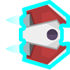

# Bonus Pickups

!!! learn "In this lesson we will learn"
    - how random rewards keep players hopeful
    - how to put two related classes in one file
    - how to call a method on the **other** object in a collision
    - how to choose a random class from a list and create an object from it
    - how to use a timer to turn a power-up off again

!!! terms "Terminology"
    - **pickup** – an item in a game that the player collects to get a reward or bonus.
    - **power-up** – a pickup that gives the player a special ability or advantage, often for a limited time.

In [Game Design](game_design.md) we learnt that random bonus rewards add excitement and give players hope when things look desperate. Let's have Zork drop two kinds of bonus pickups:

| Pickup | Image | What it does |
| --- | --- | --- |
| Repair kit |  | adds one life, up to 5 |
| Shield |  | protects the ship from asteroids for a random time |

## Planning

Both pickups behave a lot like astronauts: Zork spawns them, they move left across the screen, they're deleted when they leave the screen, and something happens when they touch the ship.

| Event | Input | Process | Output |
| --- | --- | --- | --- |
| Spawn a pickup | Zork's bonus timer reaches `0` | choose a repair kit or a shield at random, create it at Zork, restart the timer | a pickup moves across the screen |
| Repair kit | the ship touches a repair kit | delete the kit, play a sound, add a life if the player has fewer than 5 | the lives HUD shows one more heart |
| Shield on | the ship touches a shield | delete the shield, play a sound, turn on the ship's shield and start a timer | the ship glows blue |
| Asteroid hits shielded ship | an asteroid touches the ship while its shield is on | delete the asteroid, no life lost | the asteroid disappears |
| Shield off | the shield timer reaches `0` | turn off the ship's shield | the ship looks normal again |

The shield is the interesting one. The **Shield** pickup detects the collision, but the **Ship** is the object that changes. So the Shield will call a method on the **other** object: `other.shield_on()`.

---

## Create the pickups

The two pickups are closely related, so we'll keep both classes in one file, like we did with the HUD. Create a new file in the ***Objects*** folder, add the code below and save it as ***Bonus.py***.

```python linenums="1" hl_lines="1 3-11 13-15 17-18 20-21 23-28 30-39" title="Objects/Bonus.py"
--8<-- "examples/design/bonuses/step01/Objects/Bonus.py"
```

??? note "Code explanation"
    - **line 1** → imports `RoomObject` and `Globals`.
    - **line 3** → defines the `RepairKit` class as a subclass of `RoomObject`.
    - **lines 4–6** → a docstring that explains what the class is for.
    - **line 7** → defines the `__init__` method.
    - **lines 8–10** → a docstring that explains what the method does.
    - **line 11** → runs `RoomObject`'s `__init__` method.
    - **lines 14–15** → load ***Repair_kit.png*** and give it to the repair kit at 42 × 42 pixels.
    - **line 18** → starts it moving left at 6 pixels per frame.
    - **line 21** → registers collisions with the `Ship`.
    - **line 23** → defines the `step` method.
    - **lines 24–26** → a docstring that explains what the method does.
    - **line 27** → checks if the repair kit has gone past the left edge of the screen…
    - **line 28** → …and deletes it. This time the check is straight in `step`, because it's the only thing `step` does.
    - **line 30** → defines `handle_collision`.
    - **lines 31–33** → a docstring that explains what the method does.
    - **line 34** → checks if the repair kit touched the ship…
    - **line 35** → …deletes the repair kit…
    - **line 36** → …plays the life sound…
    - **line 37** → …and if the player has fewer than 5 lives (we only have images for up to 5 hearts)…
    - **line 38** → …adds a life…
    - **line 39** → …and updates the hearts on the screen.

Now add the `Shield` class. Go back to ***Objects/Bonus.py***, add the highlighted code below to the bottom and save it.

```python linenums="39" hl_lines="3-11 13-15 17-18 20-21 23-28 30-37" title="Objects/Bonus.py"
--8<-- "examples/design/bonuses/step02/Objects/Bonus.py:39:75"
```

??? note "Code explanation"
    - **line 41** → defines the `Shield` class as a subclass of `RoomObject`.
    - **lines 42–44** → a docstring that explains what the class is for.
    - **line 45** → defines the `__init__` method.
    - **lines 46–48** → a docstring that explains what the method does.
    - **line 49** → runs `RoomObject`'s `__init__` method.
    - **lines 52–53** → load the shield image and give it to the shield at 46 × 46 pixels.
    - **line 56** → starts it moving left at 6 pixels per frame.
    - **line 59** → registers collisions with the `Ship`.
    - **line 61** → defines the `step` method.
    - **lines 62–64** → a docstring that explains what the method does.
    - **lines 65–66** → delete the shield once it has left the screen.
    - **line 68** → defines `handle_collision`.
    - **lines 69–71** → a docstring that explains what the method does.
    - **line 72** → checks if the shield touched the ship…
    - **line 73** → …deletes the shield pickup…
    - **line 74** → …plays the shield sound…
    - **line 75** → …and calls `shield_on` on the **other** object, which is the Ship. We'll write that method soon.

Open ***Objects/\_\_init\_\_.py***, add the highlighted code below and save it.

```python linenums="1" hl_lines="9" title="Objects/__init__.py"
--8<-- "examples/design/bonuses/step03/Objects/__init__.py"
```

??? note "Code explanation"
    - **line 9** → imports both pickup classes from ***Bonus.py***.

Open ***Rooms/GamePlay.py***, add the highlighted code below and save it.

```python linenums="27" hl_lines="8-9" title="Rooms/GamePlay.py"
--8<-- "examples/design/bonuses/step04/Rooms/GamePlay.py:27:35"
```

??? note "Code explanation"
    - **line 34** → loads the sound for gaining a life.
    - **line 35** → loads the sound for the shield turning on.

---

## Shield the ship

Now the Ship needs a way to turn its shield on and off. Open ***Objects/Ship.py***, add the highlighted code below and save it.

```python linenums="1" hl_lines="4 26-27 75-82 84-90" title="Objects/Ship.py"
--8<-- "examples/design/bonuses/step05/Objects/Ship.py"
```

??? note "Code explanation"
    - **line 4** → imports `random`, for the random shield time.
    - **line 27** → creates a `shielded` flag. The ship isn't shielded when the game starts.
    - **line 75** → defines the `shield_on` method, which the Shield pickup calls.
    - **lines 76–78** → a docstring that explains what the method does.
    - **line 79** → sets the `shielded` flag to `True`.
    - **lines 80–81** → change the ship's image to the one with the blue shield, so the player can see it's protected.
    - **line 82** → starts a timer of 150 to 300 ticks (5 to 10 seconds) that calls `shield_off`.
    - **line 84** → defines the `shield_off` method.
    - **lines 85–87** → a docstring that explains what the method does.
    - **line 88** → sets the `shielded` flag back to `False`.
    - **lines 89–90** → change the ship back to its normal image.

{ width="100" }

Now the asteroids need to check the shield. Open ***Objects/Asteroid.py***, change the highlighted code below and save it.

```python linenums="53" hl_lines="8-9 11-16" title="Objects/Asteroid.py"
--8<-- "examples/design/bonuses/step06/Objects/Asteroid.py:53:68"
```

??? note "Code explanation"
    - **line 60** → checks the **other** object's `shielded` flag. `other` is the Ship this asteroid hit…
    - **line 61** → …and if the ship is shielded, plays the asteroid-destroyed sound. The asteroid was already deleted on line 59, so no life is lost.
    - **line 62** → …otherwise…
    - **lines 63–68** → …the ship loses a life, just like before. These lines are indented one more level so they're inside the `else`.

---

## Spawn the pickups

Finally, Zork needs to drop the pickups. Open ***Objects/Zork.py***, add the highlighted code below and save it.

```python linenums="1" hl_lines="4 33-34 73-80 82-83" title="Objects/Zork.py"
--8<-- "examples/design/bonuses/step07/Objects/Zork.py"
```

??? note "Code explanation"
    - **line 4** → imports both pickup classes.
    - **line 34** → starts a bonus timer of 300 to 600 ticks (10 to 20 seconds), so pickups are rare.
    - **line 73** → defines the `spawn_bonus` method, which the timer calls.
    - **lines 74–76** → a docstring that explains what the method does.
    - **line 78** → chooses one of the two **classes** at random. In Python, a class is a value too, so we can put classes in a list.
    - **line 79** → creates an object from whichever class was chosen, at Zork's position.
    - **line 80** → adds the new pickup to the Room.
    - **line 83** → restarts the bonus timer.

!!! primm "PRIMM"
    1. **Predict** what will happen when you collect each pickup.
    2. **Run** ***MainController.py*** and collect a repair kit and a shield. Fly into an asteroid while you're shielded.
    3. **Investigate**: what happens if you collect a second shield while the first one is still on? Why?

!!! tip "Testing rare events"
    Pickups only appear every 10 to 20 seconds, which makes testing slow. While you test, change the timer on lines 34 and 83 to something like `random.randint(30, 60)`. Just remember to change it back.

---

## Commit and push

1. In GitHub Desktop, type **Added bonus pickups** in the **Summary** box.
2. Click **Commit to main**.
3. Click **Push origin**.
