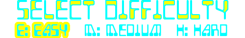

# Difficulty

!!! learn "In this lesson we will learn"
    - how to let players choose a difficulty that suits their skill
    - how to add a new Room between two existing Rooms
    - how to store settings in ***Globals.py*** so every Room and object can use them
    - how to change an object's image to show the player's choice

In [Game Design](game_design.md) we found that our game's difficulty never changes, so it doesn't suit every player. Let's add a difficulty menu.



## Planning

### What changes with difficulty?

The asteroids are the main danger in our game, so we'll change two things:

- how often Zork throws asteroids (the spawn timer)
- how fast the asteroids move

| Difficulty | Key | Asteroid spawn time (ticks) | Asteroid speed |
| --- | --- | --- | --- |
| Easy | ++e++ | 30 to 180 | 7 |
| Medium | ++m++ | 15 to 150 (what we have now) | 10 |
| Hard | ++h++ | 8 to 90 | 14 |

### Where do the settings live?

The player chooses the difficulty in one Room, but `Zork` and `Asteroid` use it in another Room. Values that need to be shared across Rooms go in ***Globals.py***, just like `SCORE` and `LIVES`. We'll add three new variables:

- `asteroid_spawn_min` and `asteroid_spawn_max` → the range for Zork's asteroid timer
- `asteroid_speed` → how fast new asteroids move

### A new Room

We'll add a **DifficultySelect** Room between the WelcomeScreen and GamePlay. It holds one RoomObject, the **DifficultyMenu**. Look in ***Images/Select_difficulty_frames***: there are three images of the menu, each with a different choice highlighted.

| Input | Process | Output |
| --- | --- | --- |
| the player presses ++e++, ++m++ or ++h++ | save the matching settings in `Globals`, show the menu with that choice highlighted, then wait half a second | the DifficultySelect Room ends and GamePlay starts |

The short wait means the player sees their choice highlighted before the game starts. We'll use a timer for that.

---

## Add the settings

Open ***GameFrame/Globals.py***, change the highlighted code below and save it.

```python linenums="1" hl_lines="19 45-48" title="GameFrame/Globals.py"
--8<-- "examples/design/difficulty/step01/GameFrame/Globals.py"
```

??? note "Code explanation"
    - **line 19** → adds `"DifficultySelect"` to the list of Rooms, between the WelcomeScreen and GamePlay.
    - **lines 46–47** → store the shortest and longest time between asteroids, starting with the Medium values.
    - **line 48** → stores the asteroid speed, starting with the Medium value.

---

## Create the DifficultyMenu

Create a new file in the ***Objects*** folder, add the code below and save it as ***DifficultyMenu.py***.

```python linenums="1" hl_lines="1-2 4-12 14-18 20-22 24-29 31-36 38-47 49-53" title="Objects/DifficultyMenu.py"
--8<-- "examples/design/difficulty/step02/Objects/DifficultyMenu.py"
```

??? note "Code explanation"
    - **lines 1–2** → import `RoomObject`, `Globals` and Pygame.
    - **line 4** → defines the `DifficultyMenu` class as a subclass of `RoomObject`.
    - **lines 5–7** → a docstring that explains what the class is for.
    - **line 8** → defines the `__init__` method.
    - **lines 9–11** → a docstring that explains what the method does.
    - **line 12** → runs `RoomObject`'s `__init__` method.
    - **lines 15–17** → load the three menu images into a list, just like we did for the lives in [Lesson 14](../lessons/14_lives.md#create-the-lives-class).
    - **line 18** → shows the menu with Medium highlighted (index `1`), because Medium is the starting setting.
    - **line 21** → registers the menu for key events.
    - **line 22** → creates a `chosen` flag, so the player can only choose once.
    - **line 24** → defines the `key_pressed` event handler.
    - **lines 25–27** → a docstring that explains what the method does.
    - **line 28** → checks if a difficulty has already been chosen…
    - **line 29** → …and if so, leaves the method straight away with `return`, so nothing else happens.
    - **lines 31–32** → if ++e++ is pressed, chooses Easy: menu image `0`, spawn time 30 to 180, speed 7.
    - **lines 33–34** → if ++m++ is pressed, chooses Medium.
    - **lines 35–36** → if ++h++ is pressed, chooses Hard.
    - **line 38** → defines the `choose` method, which takes the menu image to show and the three settings.
    - **lines 39–41** → a docstring that explains what the method does.
    - **lines 42–44** → save the settings in `Globals`, so Zork and the asteroids can use them.
    - **line 45** → shows the menu image with the chosen difficulty highlighted.
    - **line 46** → sets the `chosen` flag to `True`.
    - **line 47** → starts a 15-tick (half a second) timer that calls `start_game`.
    - **line 49** → defines the `start_game` method.
    - **lines 50–52** → a docstring that explains what the method does.
    - **line 53** → ends the DifficultySelect Room, so the game moves on to GamePlay.

!!! tip "Why a choose method?"
    Each key does the same four things with different values. Instead of writing those lines three times, we wrote them once in `choose` and passed in the values. If we want to change how choosing works later, we only change it in one place.

Open ***Objects/\_\_init\_\_.py***, add the highlighted code below and save it.

```python linenums="1" hl_lines="8" title="Objects/__init__.py"
--8<-- "examples/design/difficulty/step03/Objects/__init__.py"
```

??? note "Code explanation"
    - **line 8** → imports the `DifficultyMenu` class, so GameFrame can find it.

---

## Create the DifficultySelect Room

Create a new file in the ***Rooms*** folder, add the code below and save it as ***DifficultySelect.py***.

```python linenums="1" hl_lines="1-2 4-9 11-12 14-15" title="Rooms/DifficultySelect.py"
--8<-- "examples/design/difficulty/step04/Rooms/DifficultySelect.py"
```

??? note "Code explanation"
    - **lines 1–2** → import `Level` and the `DifficultyMenu` class.
    - **line 4** → defines the `DifficultySelect` class as a subclass of `Level`.
    - **lines 5–7** → a docstring that explains what the class is for.
    - **lines 8–9** → define `__init__` and run `Level`'s `__init__` method.
    - **line 12** → sets the background image.
    - **line 15** → adds a DifficultyMenu in the middle of the screen. The menu is 500 × 78 pixels, so `x = (1280 - 500) / 2 = 390` and `y = (800 - 78) / 2 = 361`.

Open ***Rooms/\_\_init\_\_.py***, add the highlighted code below and save it.

```python linenums="1" hl_lines="3" title="Rooms/__init__.py"
--8<-- "examples/design/difficulty/step05/Rooms/__init__.py"
```

??? note "Code explanation"
    - **line 3** → imports the `DifficultySelect` class, so GameFrame can find it.

!!! primm "PRIMM"
    1. **Predict** what will happen after you press space on the welcome screen.
    2. **Run** ***MainController.py*** and choose each difficulty in turn (you'll need to lose a game to get back to the menu).
    3. **Investigate**: does the game feel any different? Why not?

---

## Use the settings

The menu saves the settings, but nothing uses them yet. Open ***Objects/Zork.py***, change the highlighted code below and save it.

```python linenums="1" hl_lines="25 54" title="Objects/Zork.py"
--8<-- "examples/design/difficulty/step06/Objects/Zork.py"
```

??? note "Code explanation"
    - **line 25** → chooses the first asteroid's spawn time from the difficulty's range instead of `15` to `150`.
    - **line 54** → does the same when choosing the time for the next asteroid.

Open ***Objects/Asteroid.py***, change the highlighted code below and save it.

```python linenums="20" hl_lines="3" title="Objects/Asteroid.py"
--8<-- "examples/design/difficulty/step07/Objects/Asteroid.py:20:22"
```

??? note "Code explanation"
    - **line 22** → starts each asteroid moving at the difficulty's speed instead of `10`.

!!! primm "PRIMM"
    1. **Predict** how Easy and Hard will feel different.
    2. **Run** ***MainController.py*** and try all three difficulties.
    3. **Modify**: are the settings right for you? Get someone else to play too, then adjust the numbers in `key_pressed` until each level feels right.

---

## Commit and push

1. In GitHub Desktop, type **Added difficulty menu** in the **Summary** box.
2. Click **Commit to main**.
3. Click **Push origin**.
