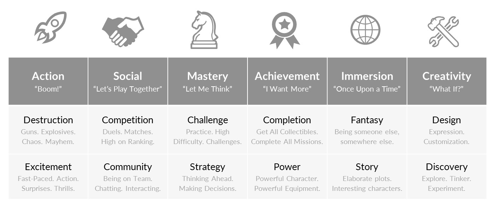

# Game Design

!!! learn "In this lesson we will learn"
    - the two things every game needs: challenge and interactivity
    - what game mechanics are
    - four mechanics that improve a game's challenge
    - four mechanics that improve a game's interactivity
    - how to spot where Space Rescue could be better

There are general principles that help us make better games. In fact, there's a whole industry built around game design, with research into what players like and how to keep them playing. What we cover here is a simple introduction to a topic big enough to fill many different careers.

If you're interested in going deeper, check out [The Psychology of Video Games](https://www.psychologyofgames.com/).

First, what makes a game a game?

## Interactive challenges

Games can be described as **interactive challenges**. That gives us the two things every game needs: interactivity and challenge. Without either one, it isn't a game any more.

### Interactivity

**Interactivity** means the player has some control over what happens. The player gives an input, and the game responds to it. The input could be pressing a button, moving a mouse, or even rolling a dice (this definition isn't just for computer games).

Without interactivity, a game becomes passive entertainment, like watching a movie or reading a book.

### Challenge

Games have **challenges** the player needs to overcome to win. These can be obvious, like a quest, or less obvious, like scoring points for completing a task.

Without challenge, a game becomes play, like playing with a toy.

So games need both interactivity and challenge. But how do we use these to make a *good* game? Is it the graphics and sound, or something else?

---

## Game mechanics

Game **mechanics** are the basic rules and interactions that make a game fun to play. They're how we build interactivity and challenge into our game. If a game were a car, the mechanics would be the engine. The graphics, characters, story and music are the bodywork. It doesn't matter how good the bodywork is: if the engine is poor, so is the car.

The best games have great mechanics, superb graphics, believable characters, great music and a compelling story. But it's the mechanics that make games different from other media. Movies can have superb graphics, believable characters, great music and a compelling story too. Books can have believable characters and a compelling story.

We'll look at eight basic mechanics, four for challenge and four for interactivity:

| Challenge | Interactivity |
| --- | --- |
| Difficulty | Choices and control |
| Goals | Control overload |
| Rewards | Unfair punishment |
| Subgoals | Audio feedback |

### Challenge mechanics

Different players want different kinds of challenge. [Quantic Foundry](https://quanticfoundry.com/) is a market research company that studies games. Their **Gamer Motivation Model** has 12 different motivations, based on the idea that different gamers want different types of challenge.

If you're curious about your own gamer profile, you can [take their survey](https://apps.quanticfoundry.com/surveys/start/gamerprofile/).

We'll look at four simple mechanics that improve a game's challenge:

- difficulty
- goals
- rewards
- subgoals

#### Difficulty

First, some neuroscience. Beating a challenge makes our brain release a little bit of **dopamine**, the reward chemical that makes us feel good. But there's a catch: the difficulty has to be right. The challenge must be easy enough to beat, but hard enough to be worth it.

If the challenge is too hard, players don't succeed and they lose interest. If it's too easy, the game is boring. So we need to pitch the difficulty at the right level.

Players also have different skill levels, so the right level of challenge is different for each player.

Our game already has some mechanics that affect its difficulty, but we can do more.

| The problem | Impact | The solution | Implemented |
| --- | --- | --- | --- |
| One asteroid hit ends the game | too hard | add lives | Yes, [Lesson 14](../lessons/14_lives.md) |
| The ship can escape asteroids by flying off the screen | too easy | keep the ship inside the screen | Yes, [Lesson 5](../lessons/05_ship_in_room.md) |
| The difficulty never changes | doesn't suit all skill levels | add a difficulty menu that changes how often asteroids spawn and how fast they move | [Difficulty](difficulty.md) |

#### Goals

We create challenges by setting **goals** for players to achieve. Goals need to be clear, and players need to see how close they are to reaching them.

Goals also create the **what-if effect**. When a player fails, they think "What if I had…?" and come up with things they could do differently. The Dark Souls games thrive on this effect.

The what-if effect is strongest the closer a player gets to a goal. If they only just miss, they'll think of lots of ways they could have made it. That's why game designers make things harder as the player gets closer to a goal, and why you find bosses at the end of quests.

!!! tip "Judging difficulty"
    Game developers are notoriously bad at judging how hard their own games are. They know how the game works, so they find it easier than other people do. To judge your game's difficulty, get someone else to play it and give you feedback.

In Space Rescue there's no goal, just collecting astronauts forever. Let's change that:

| The problem | Impact | The solution | Implemented |
| --- | --- | --- | --- |
| The player doesn't have a goal | no goal or what-if effect | set a goal for the number of astronauts rescued | [Goals and Rewards](goals_rewards.md) |
| The player doesn't know what the goal is | the goal is unclear | show the number of astronauts to rescue | [Goals and Rewards](goals_rewards.md) |
| The player doesn't know how close they are | progress is unclear | show the number of astronauts rescued | [Goals and Rewards](goals_rewards.md) |
| The player might reach the goal too quickly | might not feel the what-if effect | spawn astronauts less often as more are rescued | [Goals and Rewards](goals_rewards.md) |

#### Rewards

**Rewards** keep players interested in challenges. They make the player feel good about the effort they put in, and make them more likely to take on other challenges.

It also helps to give occasional bonus rewards for no reason, like power-ups at random times. The randomness is important: it gives hope that a pickup could come at any moment. That encourages players to stick with it when things look desperate, and adds to the what-if effect.

Our game has a simple reward system: the score goes up for rescuing astronauts and shooting asteroids, and down for shooting astronauts. Maybe we should add more.

| The problem | Impact | The solution | Implemented |
| --- | --- | --- | --- |
| No reward for reaching the goal | less motivation, and undermines the goal | give big bonus points for reaching the goal | [Goals and Rewards](goals_rewards.md) |
| No random bonus rewards | less what-if effect and excitement | Zork randomly spawns repair kits and shields: - a repair kit adds one life - a shield protects the ship for a random time | [Bonus Pickups](bonuses.md) |

#### Subgoals

**Subgoals** give players short-term or optional challenges on the way to the main goal. Optional subgoals are also a good way to give advanced players an extra challenge.

What subgoals could we add to our game?

| Subgoal | How it works | Implemented |
| --- | --- | --- |
| Shoot asteroids without taking damage | - count the asteroids shot in a row (the **streak**) - reset the streak when the ship loses a life - limit the number of lasers on the screen by the streak | [Subgoals](subgoals.md) |
| Try not to shoot the astronauts | each astronaut we shoot takes one off our rescued count | [Subgoals](subgoals.md) |

### Interactivity mechanics

Interactivity is about putting the player in control. Remember, without interactivity a game becomes a passive experience.

A good game leaves the player **feeling** in control. They **believe** they can influence what happens and that their decisions matter. This is subjective. For example, upgrading stats in an RPG often makes very little difference, especially when the enemies get stronger too, but it still feels like a choice.

A bad game takes away the player's sense of control. For example, being taken out in a PvP match by someone who's obviously cheating.

These are common mechanics for building the feeling of control:

- choices and control
- control overload
- unfair punishment
- audio feedback

#### Choices and control

Players need choices that **seem** to change the outcome of the game. They might lead to different gameplay, or seem to give an advantage, even if the real difference is small. For example, choosing different characters in Mario Kart.

If a choice feels like it makes a real difference, it gives the player more control and gets them more involved.

We can add a choice to our game by letting the player pick between two ships. Each ship has a special power the player can turn on for a short time by pressing ++ctrl++.

| Ship | Special power | Implemented |
| --- | --- | --- |
| Attractor | astronauts move towards the ship | [Ship Choice](ship_choice.md) |
| Swerver | the ship moves faster | [Ship Choice](ship_choice.md) |

#### Control overload

Too many choices can backfire. They can overwhelm the player and reduce their sense of control. How much is too much depends on the game. In a first-person shooter, needing every key on the keyboard would be overload, but that's normal for a flight simulator.

In simple games like ours, remember that most people can only hold five to nine things in their head at once. So we need to limit how many parts of the gameplay the player has to remember.

If we need more, we can let the UI do the remembering. For example, the bottom of the Minecraft screen shows the items bound to the ++1++ to ++0++ keys.

Another option is to make one key do different things depending on the situation. Instead of one key for opening doors, another for talking and another for picking up items, modern RPGs have one **interact** key that does whichever makes sense for what the player is looking at.

Our game has only a few features and controls, so this isn't a problem yet. Keep it in mind as you add features.

#### Unfair punishment

Punishing players for something they can't control quickly destroys their sense of control. These punishments are usually accidental and can be very different from game to game. For example:

- lag between pressing a button and the action happening
- crashes that lose the player's progress
- enemies shooting through walls
- dialogue options with unexpected results

It's important that the game works properly, even when the player doesn't use it the way we expected.

Let's look at our game:

| Unfair punishment | Solution | Implemented |
| --- | --- | --- |
| A laser that hits an asteroid keeps going and can hit an astronaut behind it | the laser disappears when it hits the first object | [Unfair Punishment](unfair_punishment.md) |

#### Audio feedback

Confusion reduces a player's sense of control. A good way to reduce confusion is to **reinforce** behaviour during the game. We already do this with the score: it goes up when the player does the right thing and down when they do the wrong thing.

Sound is another good way to reinforce behaviour. Sounds can feel positive or negative, so they tell the player whether what they just did was good or bad. It's a way of teaching the player without words.

Which events could have a sound?

| Event | Sound effect | Implemented |
| --- | --- | --- |
| Shooting a laser | positive | [Audio](audio.md) |
| Shooting an asteroid | positive | [Audio](audio.md) |
| Rescuing an astronaut | positive | [Audio](audio.md) |
| Ship hit by an asteroid | negative | [Audio](audio.md) |
| Shooting an astronaut | negative | [Audio](audio.md) |

---

## Improving the game

Now we know some ways to make a game better, the next pages add each mechanic to Space Rescue. Do [Audio](audio.md) and [Unfair Punishment](unfair_punishment.md) first, because they finish off the core game. Then work through the others in order. Each page continues from the code on the page before, and there's a checkpoint for each one in the [tutorial files](../index.md#tutorial-files).

!!! tip "Your own ideas"
    These aren't the only improvements we could make. As you play, keep a list of things that feel too hard, too easy, unclear or unfair, and which mechanic could fix each one.
