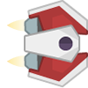
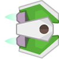
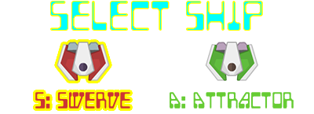

# Ship Choice

!!! learn "In this lesson we will learn"
    - how meaningful choices give players a sense of control
    - how to reuse a menu design for a new choice
    - how to set up an object differently depending on a setting
    - how to build a power-up with an active time and a cooldown
    - how one object can change its movement because of another object

!!! terms "Terminology"
    - **special power** – an ability the player can turn on for a short time to get an advantage.
    - **cooldown** – the waiting time after a power has been used before it can be used again.
    - **power meter** – a HUD item that shows whether a special power is ready, active or cooling down.

In [Game Design](game_design.md) we learnt that choices that **seem** to change the game give players more control and get them more involved. Let's give the player a choice of two ships, each with its own special power.

| Ship | Image | Special power (++ctrl++) |
| --- | --- | --- |
| Swerver | { width="60" } | the ship moves twice as fast |
| Attractor | { width="60" } | astronauts move towards the ship |

## Planning

### Choosing the ship

This works just like the [difficulty menu](difficulty.md): a **ShipSelect** Room with a **ShipMenu** object. The menu images are in ***Images/Select_ship_frames***. The player presses ++s++ for the Swerver or ++a++ for the Attractor, and the choice is saved in `Globals.ship_type`.



### The special power

Each ship's power works the same way:

1. The player presses ++ctrl++ while the power is **ready**.
2. The power is **active** for 5 seconds (150 ticks).
3. The power then **cools down** for 10 seconds (300 ticks) before it's ready again.

A **power meter** under the lives shows what's happening. The images in ***Images/Skill_frames*** go from 5 bars down to 1 bar, then COOLDOWN:


| Event | Input | Process | Output |
| --- | --- | --- | --- |
| Use power | the player presses ++ctrl++ and the power is ready | set power to active, play a sound, start the meter draining, start a 150-tick timer | the power is on |
| Power ends | the 150-tick timer finishes | set power to not active, start a 300-tick timer | the meter shows COOLDOWN |
| Power recharged | the 300-tick timer finishes | set power to ready | the meter shows 5 bars |
| Swerver power | the power is active | use a movement speed of 20 instead of 10 | the ship moves faster |
| Attractor power | the power is active | each astronaut moves up or down towards the ship | astronauts drift towards the ship |

That's a lot, so we'll build it in stages: the menu first, then the ship's images, then the meter, then the powers.

---

## Choose a ship

Open ***GameFrame/Globals.py***, change the highlighted code below and save it.

```python linenums="1" hl_lines="19 57-58" title="GameFrame/Globals.py"
--8<-- "examples/design/ship_choice/step01/GameFrame/Globals.py"
```

??? note "Code explanation"
    - **line 19** → adds `"ShipSelect"` to the list of Rooms, after DifficultySelect.
    - **line 58** → stores the chosen ship, starting with the Swerver.

Create a new file in the ***Objects*** folder, add the code below and save it as ***ShipMenu.py***. It's very like ***DifficultyMenu.py***.

```python linenums="1" hl_lines="1-2 4-12 14-18 20-22 24-29 31-34 36-43 45-49" title="Objects/ShipMenu.py"
--8<-- "examples/design/ship_choice/step02/Objects/ShipMenu.py"
```

??? note "Code explanation"
    - **lines 1–2** → import `RoomObject`, `Globals` and Pygame.
    - **line 4** → defines the `ShipMenu` class as a subclass of `RoomObject`.
    - **lines 5–7** → a docstring that explains what the class is for.
    - **line 8** → defines the `__init__` method.
    - **lines 9–11** → a docstring that explains what the method does.
    - **line 12** → runs `RoomObject`'s `__init__` method.
    - **lines 15–17** → load the two menu images into a list.
    - **line 18** → shows the menu with the Swerver highlighted, because it's the starting choice.
    - **line 21** → registers the menu for key events.
    - **line 22** → creates the `chosen` flag, so the player can only choose once.
    - **line 24** → defines the `key_pressed` event handler.
    - **lines 25–27** → a docstring that explains what the method does.
    - **lines 28–29** → leave the method straight away if a ship has already been chosen.
    - **lines 31–32** → if ++s++ is pressed, choose the Swerver (menu image `0`).
    - **lines 33–34** → if ++a++ is pressed, choose the Attractor (menu image `1`).
    - **line 36** → defines the `choose` method, which takes the menu image and the ship's name.
    - **lines 37–39** → a docstring that explains what the method does.
    - **line 40** → saves the ship's name in `Globals`, so the Ship can use it in GamePlay.
    - **line 41** → highlights the chosen ship.
    - **line 42** → sets the `chosen` flag to `True`.
    - **line 43** → starts a half-second timer that calls `start_game`.
    - **line 45** → defines the `start_game` method.
    - **lines 46–48** → a docstring that explains what the method does.
    - **line 49** → ends the ShipSelect Room, so the game moves on to GamePlay.

Open ***Objects/\_\_init\_\_.py***, add the highlighted code below and save it.

```python linenums="1" hl_lines="10" title="Objects/__init__.py"
--8<-- "examples/design/ship_choice/step03/Objects/__init__.py"
```

??? note "Code explanation"
    - **line 10** → imports the `ShipMenu` class.

Create a new file in the ***Rooms*** folder, add the code below and save it as ***ShipSelect.py***.

```python linenums="1" hl_lines="1-2 4-9 11-12 14-15" title="Rooms/ShipSelect.py"
--8<-- "examples/design/ship_choice/step04/Rooms/ShipSelect.py"
```

??? note "Code explanation"
    - **lines 1–2** → import `Level` and the `ShipMenu` class.
    - **line 4** → defines the `ShipSelect` class as a subclass of `Level`.
    - **lines 5–7** → a docstring that explains what the class is for.
    - **lines 8–9** → define `__init__` and run `Level`'s `__init__` method.
    - **line 12** → sets the background image.
    - **line 15** → adds a ShipMenu in the middle of the screen. The menu is 400 × 145 pixels, so `x = (1280 - 400) / 2 = 440` and `y = (800 - 145) / 2 = 327`.

Open ***Rooms/\_\_init\_\_.py***, add the highlighted code below and save it.

```python linenums="1" hl_lines="4" title="Rooms/__init__.py"
--8<-- "examples/design/ship_choice/step05/Rooms/__init__.py"
```

??? note "Code explanation"
    - **line 4** → imports the `ShipSelect` class.

---

## Use the chosen ship's images

Each ship has a normal image and a shielded image. Right now the Ship loads ***Ship.png*** in `__init__` and again in `shield_off`. Let's choose both images once, in `__init__`, and store them as attributes. Open ***Objects/Ship.py***, change the highlighted code below and save it.

```python linenums="1" hl_lines="17-24 86 94" title="Objects/Ship.py"
--8<-- "examples/design/ship_choice/step06/Objects/Ship.py"
```

??? note "Code explanation"
    - **line 18** → checks if the player chose the Attractor…
    - **lines 19–20** → …and if so, stores the green ship's normal and shielded images…
    - **line 21** → …otherwise…
    - **lines 22–23** → …stores the red Swerver's normal and shielded images.
    - **line 24** → shows the normal image.
    - **line 86** → shows the stored shield image when the shield turns on.
    - **line 94** → shows the stored normal image when the shield turns off.

!!! primm "PRIMM"
    1. **Predict** what you'll see after choosing each ship.
    2. **Run** ***MainController.py*** and try both ships. Pick up a shield with each one.
    3. **Investigate**: why is it better to store the images in `__init__` than to check `Globals.ship_type` again in `shield_on` and `shield_off`?

---

## Add the power meter

The power meter is part of the HUD. Open ***Objects/Hud.py***, add the highlighted code below at the bottom and save it.

```python linenums="104" hl_lines="4-12 14-18 20-24 26-33 35-40" title="Objects/Hud.py"
--8<-- "examples/design/ship_choice/step07/Objects/Hud.py:104:143"
```

??? note "Code explanation"
    - **line 107** → defines the `PowerMeter` class as a subclass of `RoomObject`, because it shows images.
    - **lines 108–110** → a docstring that explains what the class is for.
    - **line 111** → defines the `__init__` method.
    - **lines 112–114** → a docstring that explains what the method does.
    - **line 115** → runs `RoomObject`'s `__init__` method.
    - **lines 118–120** → load the six meter images (index `0` is 5 bars, index `5` is COOLDOWN) into a list.
    - **line 121** → shows the full meter.
    - **line 123** → defines the `show` method, which shows one meter image.
    - **lines 124–126** → a docstring that explains what the method does.
    - **line 127** → sets the image to the one at `index`.
    - **line 129** → defines the `drain` method.
    - **lines 130–132** → a docstring that explains what the method does.
    - **line 133** → moves the meter one image along…
    - **line 134** → …and shows it.
    - **line 135** → if the meter hasn't reached COOLDOWN (image `5`) yet…
    - **line 136** → …calls `drain` again in 30 ticks (1 second). A method that sets a timer to call itself is a handy way to repeat something a set number of times.
    - **line 138** → defines the `start` method, which the Ship calls when the power is used.
    - **lines 139–141** → a docstring that explains what the method does.
    - **line 142** → starts the meter at full.
    - **line 143** → starts draining in 1 second.

Open ***Objects/\_\_init\_\_.py***, change the highlighted code below and save it.

```python linenums="1" hl_lines="7" title="Objects/__init__.py"
--8<-- "examples/design/ship_choice/step08/Objects/__init__.py"
```

??? note "Code explanation"
    - **line 7** → imports the `PowerMeter` class as well.

Open ***Rooms/GamePlay.py***, change the highlighted code below and save it.

```python linenums="1" hl_lines="4 14-15 29-30 42" title="Rooms/GamePlay.py"
--8<-- "examples/design/ship_choice/step09/Rooms/GamePlay.py"
```

??? note "Code explanation"
    - **line 4** → imports the `PowerMeter` class.
    - **line 14** → stores the Ship in `self.ship`, so the astronauts can find it later…
    - **line 15** → …then adds it to the Room.
    - **line 29** → creates a power meter under the lives, and stores it so the Ship can use it.
    - **line 30** → adds the meter to the Room.
    - **line 42** → loads the sound for using the special power.

---

## Add the special power

Now the Ship needs to use its power. Open ***Objects/Ship.py***, change the highlighted code below and save it.

```python linenums="1" hl_lines="34-37 45 47 50-51 103-114 116-122 124-129" title="Objects/Ship.py"
--8<-- "examples/design/ship_choice/step10/Objects/Ship.py"
```

??? note "Code explanation"
    - **line 35** → stores the ship's movement speed, so the Swerver's power can change it.
    - **line 36** → creates the `power_ready` flag. The power is ready when the game starts.
    - **line 37** → creates the `power_active` flag. The power isn't on when the game starts.
    - **line 45** → moves the ship up at `move_speed` instead of `10`, so the speed can change.
    - **line 47** → moves the ship down at `move_speed`.
    - **line 50** → checks if either ++ctrl++ key is pressed…
    - **line 51** → …and tries to use the power.
    - **line 103** → defines the `use_power` method.
    - **lines 104–106** → a docstring that explains what the method does.
    - **line 107** → checks if the power is ready. If it isn't, nothing happens.
    - **line 108** → the power is no longer ready…
    - **line 109** → …because it's now active.
    - **line 110** → plays the power sound.
    - **line 111** → starts the power meter draining.
    - **line 112** → checks if this is the Swerver…
    - **line 113** → …and doubles its movement speed.
    - **line 114** → starts a 150-tick (5 second) timer that calls `end_power`.
    - **line 116** → defines the `end_power` method.
    - **lines 117–119** → a docstring that explains what the method does.
    - **line 120** → turns the power off.
    - **line 121** → sets the speed back to normal.
    - **line 122** → starts a 300-tick (10 second) cooldown timer that calls `power_recharged`.
    - **line 124** → defines the `power_recharged` method.
    - **lines 125–127** → a docstring that explains what the method does.
    - **line 128** → makes the power ready again…
    - **line 129** → …and shows the full meter.

!!! primm "PRIMM"
    1. **Predict** what will happen when you press ++ctrl++ as the Swerver, then press it again straight away.
    2. **Run** ***MainController.py***, choose the Swerver and test it. Watch the power meter.
    3. **Investigate**: what happens if you choose the Attractor and press ++ctrl++? Why?

### Attract the astronauts

The Attractor's power changes how the **astronauts** move, so the code goes in the `Astronaut` class. Each astronaut checks the ship on every tick. That's why we stored the Ship in `self.room.ship`. Open ***Objects/Astronaut.py***, add the highlighted code below and save it.

```python linenums="1" hl_lines="30 56-67" title="Objects/Astronaut.py"
--8<-- "examples/design/ship_choice/step11/Objects/Astronaut.py"
```

??? note "Code explanation"
    - **line 30** → calls `attract` on every tick.
    - **line 56** → defines the `attract` method.
    - **lines 57–59** → a docstring that explains what the method does.
    - **line 60** → gets the Ship from the Room and stores it in `ship`, to make the next lines shorter.
    - **line 61** → checks if the player chose the Attractor **and** its power is on…
    - **line 62** → …and if the middle of the astronaut is above the middle of the ship…
    - **line 63** → …moves the astronaut down towards the ship…
    - **line 64** → …otherwise…
    - **line 65** → …moves it up towards the ship.
    - **line 66** → if the power isn't on…
    - **line 67** → …the astronaut only moves left, like before.

!!! primm "PRIMM"
    1. **Predict** what the astronauts will do when the Attractor uses its power.
    2. **Run** ***MainController.py***, choose the Attractor and test it.
    3. **Modify**: which ship is better? Try changing the speeds, the power time or the cooldown time on lines 113, 114 and 122 to balance the two ships.

---

## Commit and push

1. In GitHub Desktop, type **Added ship choice** in the **Summary** box.
2. Click **Commit to main**.
3. Click **Push origin**.

That's every mechanic from Game Design in our game. Compare your game with the [finished game](../reference/finished_game.md), then use [Your Own Game](../own_game/planning.md) to plan a game of your own.
