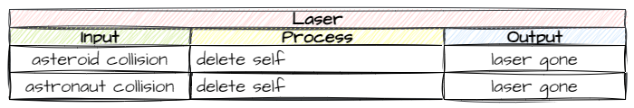

# Unfair Punishment

!!! learn "In this lesson we will learn"
    - how to plan a fix with an IPO table
    - how to improve gameplay by removing an unfair punishment
    - how an object can delete itself when an event happens

In [Game Design](game_design.md) we learnt that **unfair punishment** damages the player's sense of control. We also found one in our game:

| Unfair punishment | Solution |
| --- | --- |
| A laser that hits an asteroid keeps going and can hit an astronaut behind it | the laser disappears when it hits the first object |

In this lesson we'll remove that unfair punishment.

## Planning

We already have a solution: the laser disappears when it hits the first object. We also already know the tool for this, because we've used [`delete_object`](../reference/gameframe_api.md#delete_objectobj) many times. So how should we use it here? Let's think about this:

1. Which object needs to be deleted? → the laser
2. Which events trigger the deletion? → either of the laser's collisions (with an asteroid or an astronaut)



We could add `delete_object` to both the asteroid branch and the astronaut branch of the laser's `handle_collision` method. But we want the laser deleted after **every** collision, so we can put it once at the end of `handle_collision`, outside the `if`.

---

## Coding

Open ***Objects/Laser.py***, add the highlighted code below and save it.

```python linenums="1" hl_lines="52" title="Objects/Laser.py"
--8<-- "examples/design/unfair_punishment/step01/Objects/Laser.py"
```

??? note "Code explanation"
    - **line 52** → deletes `self` (this laser) after any collision. It's outside the `if` and `elif`, so it runs whether the laser hit an asteroid or an astronaut.

!!! primm "PRIMM"
    1. **Predict** what will happen when a laser hits an asteroid now.
    2. **Run** ***MainController.py*** and shoot at asteroids and astronauts.
    3. **Investigate**: what would happen if line 52 were indented one more level?

---

## Commit and push

1. In GitHub Desktop, type **Laser stops at first hit** in the **Summary** box.
2. Click **Commit to main**.
3. Click **Push origin**.
