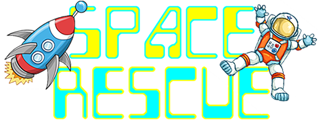

# Space Rescue

{ width="420" }

Build a 2D space game in Python, using Pygame and the GameFrame framework, then use game design ideas to make it better.

## How to use this site

- Work through the **Start** pages first. They set up Python, VS Code, GitHub and the GameFrame files.
- **Build the Game** has 14 lessons. Each lesson adds one feature to the game, so do them in order.
- **Game Design** explains what makes a game fun, then each page adds a game mechanic to Space Rescue. Do the Game Design page first; the mechanic pages can be done in any order after Audio and Unfair Punishment, but the code on each page continues from the one before.
- **Your Own Game** helps us plan and build our own GameFrame game.
- **Reference** has the GameFrame API, a topic index, common errors and the finished game.

## Callouts

Coloured boxes called **callouts** highlight different kinds of information. Each type of callout has its own colour and icon, so we can tell at a glance what it's for.

!!! learn "Learning intentions"
    This callout is at the top of every lesson page. It lists what we will learn on that page.

!!! terms "Terminology"
    This callout comes straight after the learning intentions. It lists the new technical terms on the lesson, with a short definition of each. Every term is also on the [Glossary](reference/glossary.md) page.

!!! primm "PRIMM"
    This callout comes after we change the game. It asks us to **predict** what the code will do, **run** it, and **investigate** how it works. Sometimes it asks us to **modify** the code.

!!! note "Code explanation"
    This callout comes after each piece of code and explains the new or changed lines, line by line. On the lesson pages it starts closed, so we can make our own prediction first. Click its title to open it.

!!! tip "Tip"
    This callout gives extra information, such as definitions, background facts, comparisons and hints.

!!! warning "Warning"
    This callout warns us about mistakes that are easy to make, or things that will stop our game working.

## Code blocks

We build one game across all the lessons, so the code is spread over lots of files. Each code block shows which file it belongs to:

```python linenums="1" hl_lines="2 14-15" title="Rooms/WelcomeScreen.py"
from GameFrame import Level
from Objects.Title import Title

class WelcomeScreen(Level):
    """
    Initial screen for the game
    """
    def __init__(self, screen, joysticks):
        Level.__init__(self, screen, joysticks)
        
        # set background image
        self.set_background_image("background.png")
        
        # add title object
        self.add_room_object(Title(self, 240, 200))
```

- the **file name** above the code tells us which file to open (here ***WelcomeScreen.py*** in the ***Rooms*** folder)
- **line numbers** match the line numbers in VS Code and in the Code explanation
- **highlighted lines** are new or changed since the last time we saw the file, so they're the lines we need to add or change
- the **copy** button in the top-right corner copies the code to paste into VS Code

Some code blocks only show part of a file. Their line numbers start where that part sits in the file.

## Error messages

Error messages are shown in red code blocks like this one:

``` { .text .error linenums="1" }
Traceback (most recent call last):
  File "MainController.py", line 34, in <module>
    room = class_name(screen, joysticks)
TypeError: 'module' object is not callable
```

Under each error message, the lesson breaks it down line by line, so we learn how to read the error and fix our code. The [Common Errors](reference/common_errors.md) page collects the errors we're most likely to see.

## Tutorial files

If your game stops working and you can't find the problem, you can start again from the end of any lesson. [Download the checkpoints](downloads/space_rescue_checkpoints.zip) and unzip them. There's a folder for each lesson and each game design page, holding the ***Objects***, ***Rooms*** and ***GameFrame*** files as they are at the end of that page.

To use a checkpoint:

1. Commit your current work in GitHub Desktop, so you can get it back if you need it.
2. Copy the ***Objects***, ***Rooms*** and ***GameFrame*** folders from the checkpoint into your Space Rescue folder, and choose to replace the files.
    - The images, sounds and the rest of GameFrame are already in your folder from [Setup](start/setup.md#gameframe-and-the-game-files), so the checkpoints don't include them.
3. Run ***MainController.py*** to check the game works.
