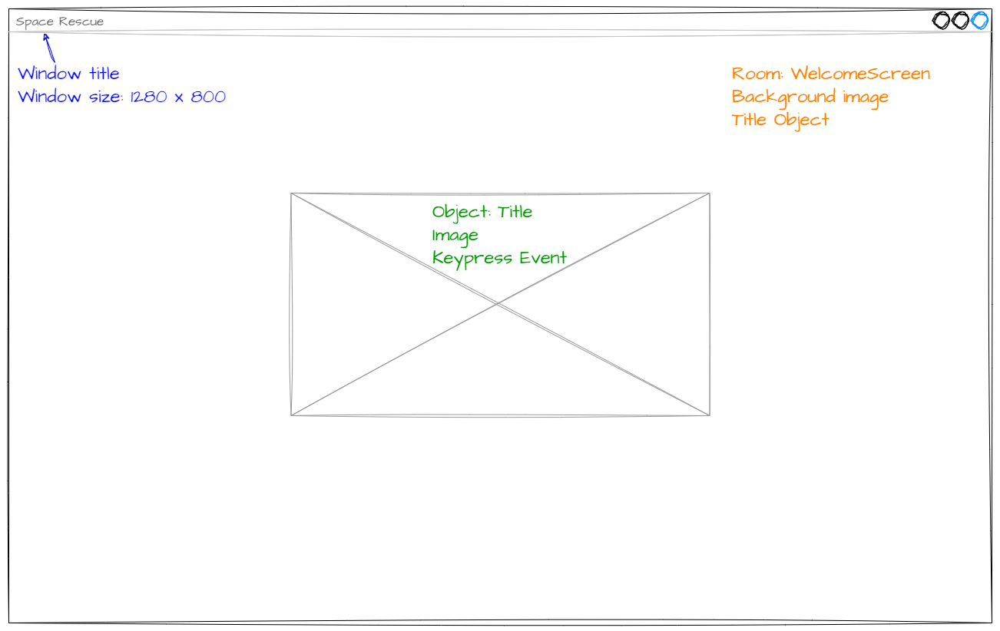
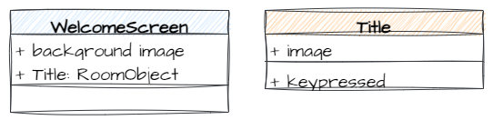
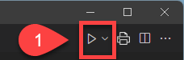
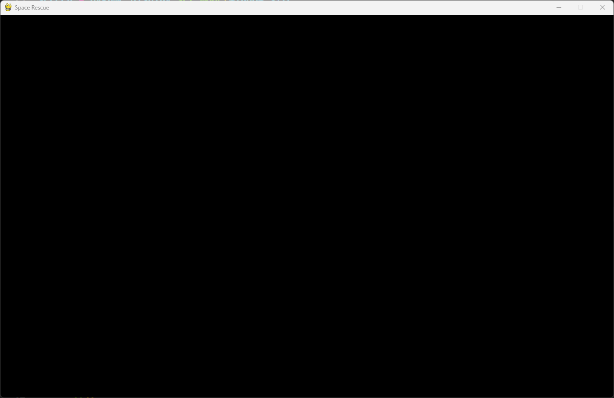
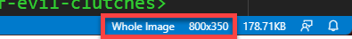
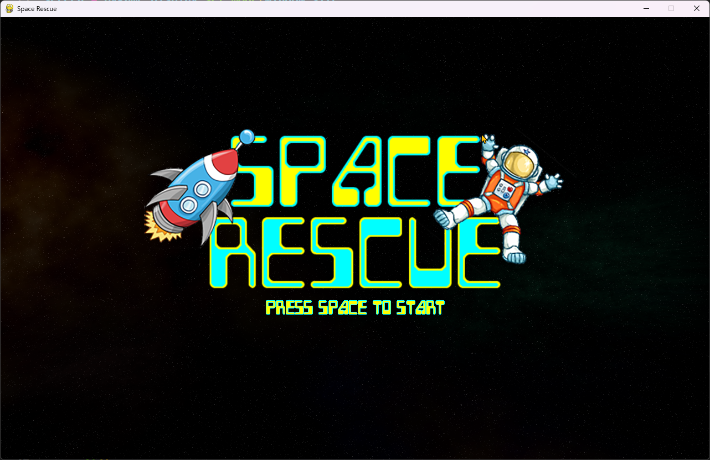
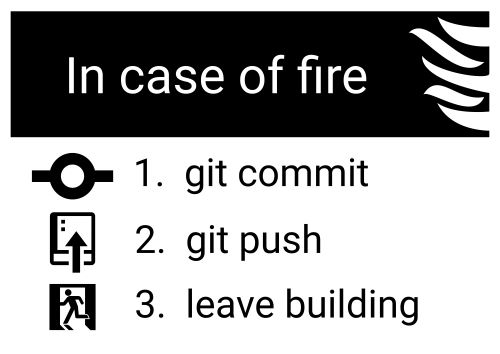

# 1. Welcome Screen

!!! learn "In this lesson we will learn"
    - how to plan a screen using a wireframe and a class diagram
    - how to change the window settings in ***Globals.py***
    - how to create a GameFrame Room and give it a background
    - how to create a RoomObject with an image and add it to a Room
    - how to commit and push our code to GitHub

!!! terms "Terminology"
    - **wireframe** – a simple plan of a screen that shows where things like buttons, images and text will go, focusing on layout rather than colours or details.
    - **placeholder** – a simple shape, such as a box with an X, that marks where something will go in a plan.
    - **class diagram** – a diagram that shows a class's name, its attributes and its methods.
    - **subclass** – a class that is built from another class (its parent) and gets all of the parent's attributes and methods.
    - **docstring** – a block of text in triple quotes at the start of a class or method that explains what it is for.
    - **inheritance** – when a subclass automatically receives all the attributes and methods of its parent class.
    - **traceback** – the error report Python prints when a program crashes, showing the path it took to the error with the most recent step last.
    - **module** – a Python file containing code, such as classes or functions, that can be imported into other files.
    - **structural comment** – a comment that says what the next block of code does, making our code easier to find our way around.
    - **case-sensitive** – treating capital and lower-case letters as different, so `background.png` and `Background.png` are not the same name.

To get started, we will create a welcome screen for the game. It's a simple screen, but it introduces the key ideas and processes we'll use in every lesson.

## Planning

### Wireframe

!!! tip "Wireframes"
    A **wireframe** is a simple plan for a screen. It shows where things like buttons, images and text will go. It focuses on layout, not colours or small details, a bit like a sketch before a finished drawing.

Below is a wireframe of the welcome screen.



The wireframe shows three parts of the program we need to work on:

- the game window (blue text):
    - this is the window that displays the game
    - we need to change its size and title
- the **WelcomeScreen** Room (orange text):
    - this is the area inside the window where the game runs
    - it has a background image and the Title object
- the **Title** object (green text):
    - shown as a placeholder (a box with an X)
    - it uses an image
    - it responds when the space key is pressed

### Class diagram

Now we know what the screen will look like, let's think about the classes. Check out [Deepest Dungeon](https://damom73.github.io/python-oop-with-deepest-dungeon/stages/stage_1/#class-diagram) if you need a refresher on class diagrams.



The **WelcomeScreen** class has two attributes:

- a background image
- a `Title` RoomObject

The **Title** class has:

- an `image` attribute
- a `key_pressed` method

So there are four tasks to create the welcome screen:

1. Adjust the window values
2. Create the `WelcomeScreen` Room
3. Create the `Title` RoomObject
4. Add the `Title` RoomObject to the `WelcomeScreen` Room

Let's get started.

---

## Adjust the window values

The window settings are in ***Globals.py*** in the ***GameFrame*** folder. Open ***GameFrame/Globals.py*** and change the highlighted code below, then save it.

```python linenums="7" hl_lines="1-2 10" title="GameFrame/Globals.py"
--8<-- "examples/lessons/01_welcome/step01/GameFrame/Globals.py:7:16"
```

??? note "Code explanation"
    - **lines 7–8** → set the width and height of the game window, in pixels.
    - **line 16** → sets the text shown in the window's title bar.

---

## Create the WelcomeScreen Room

Let's check the [GameFrame API](../reference/gameframe_api.md#roomslevels) to see how to create a Room. Rooms are subclasses of GameFrame's `Level` class.

Create a new file in the ***Rooms*** folder, add the code below and save it as ***WelcomeScreen.py***.

```python linenums="1" hl_lines="1 3-8" title="Rooms/WelcomeScreen.py"
--8<-- "examples/lessons/01_welcome/step02/Rooms/WelcomeScreen.py"
```

??? note "Code explanation"
    - **line 1** → imports the `Level` class from GameFrame.
    - **line 3** → defines the `WelcomeScreen` class as a subclass of `Level`.
    - **lines 4–6** → a **docstring** that explains what the class is for.
    - **line 7** → defines the `__init__` method, which runs automatically when a `WelcomeScreen` object is created.
    - **line 8** → runs the `__init__` method of the `Level` parent class, so `WelcomeScreen` **inherits** all of `Level`'s attributes and methods.

### Testing WelcomeScreen

Now that we've made the welcome screen, let's run the game and see what happens. Open ***MainController.py*** and click the **Run** button in the top-right corner.



That didn't go to plan. We should see this error:

``` { .text .error linenums="1" }
Traceback (most recent call last):
  File "d:\GIT\space_rescue_pygame\MainController.py", line 34, in <module>
    room = class_name(screen, joysticks)
           ^^^^^^^^^^^^^^^^^^^^^^^^^^^^^
TypeError: 'module' object is not callable
```

- **line 1** → Python is showing us the path it took to the error, most recent step last.
- **lines 2–4** → the error happened on line 34 of ***MainController.py***, where GameFrame tries to create our Room.
- **line 5** → the `TypeError` says GameFrame found a **module** (the file ***WelcomeScreen.py***) instead of a **class** it can call.

We'll see this error again, so it's worth remembering. Back in [Get to Know GameFrame](../start/gameframe.md#file-structure) we learnt that every new Room or Object must be added to ***\_\_init\_\_.py***. This is the error we get when we forget.

Open ***Rooms/\_\_init\_\_.py***, add the code below and save it.

```python linenums="1" hl_lines="1" title="Rooms/__init__.py"
--8<-- "examples/lessons/01_welcome/step03/Rooms/__init__.py"
```

??? note "Code explanation"
    - **line 1** → imports the `WelcomeScreen` class from the ***WelcomeScreen.py*** file, so GameFrame can find it.

!!! primm "PRIMM"
    1. **Predict** what you think will happen when we run ***MainController.py***. Be specific.
    2. **Run** the program.
    3. Time to **investigate**. What has changed since we edited ***Globals.py***?

We should now have a screen like this:



Not very exciting, but it's the right size and the title bar says **Space Rescue**, so that's a start.

### Adding the background

Let's make it less boring with a background image. Checking the [GameFrame API](../reference/gameframe_api.md#roomslevels-methods), there's a `set_background_image` method that takes an image file. We want the background to appear as soon as the Room is created, so we'll call it in the `__init__` method.

Go back to ***Rooms/WelcomeScreen.py*** and add the highlighted code below.

```python linenums="1" hl_lines="10-11" title="Rooms/WelcomeScreen.py"
--8<-- "examples/lessons/01_welcome/step04/Rooms/WelcomeScreen.py"
```

??? note "Code explanation"
    - **line 11** → calls the `set_background_image` method that `WelcomeScreen` inherited from `Level`, using the ***background.png*** file from the ***Images*** folder. We use `self` because the background belongs to this Room.

!!! tip "Structural comments"
    Line 10 is a **structural comment**. It says what the next block of code does, which makes our code much easier to find our way around as it grows. It's a good habit to get into.

!!! warning "File names are case-sensitive"
    The file is ***background.png***, all lower case. Windows doesn't mind if we type `"Background.png"`, but macOS and Linux can, and the game will crash with `FileNotFoundError`. Always match the file name exactly.

!!! primm "PRIMM"
    1. **Predict** what the window will look like now.
    2. **Run** ***MainController.py***.
    3. **Investigate**: open the ***Images*** folder and find ***background.png***. Is it the image you can see?

---

## Create the Title RoomObject

Now that we have a Room, we can create the Title RoomObject to put inside it. Let's check the [GameFrame API](../reference/gameframe_api.md#roomobject). It's a similar process to creating a Room:

1. Create a new file in the ***Objects*** folder
2. Import the parent class
3. Initialise the class
4. Add the new class to ***\_\_init\_\_.py***

Notice that `RoomObject` has many more methods than `Level`. That's because the game logic lives in the objects.

Create a new file in the ***Objects*** folder, add the code below and save it as ***Title.py***.

```python linenums="1" hl_lines="1 3-8" title="Objects/Title.py"
--8<-- "examples/lessons/01_welcome/step05/Objects/Title.py"
```

??? note "Code explanation"
    - **line 1** → imports the `RoomObject` class from GameFrame.
    - **line 3** → defines the `Title` class as a subclass of `RoomObject`.
    - **lines 4–6** → a docstring that explains what the class is for.
    - **line 7** → defines the `__init__` method, which takes the Room the object belongs to and its `x` and `y` position.
    - **line 8** → runs the `__init__` method of `RoomObject`, so `Title` inherits all of its attributes and methods.

This is very like the `WelcomeScreen` class. Next we need to give the object an image. Go back to ***Objects/Title.py*** and add the highlighted code below.

```python linenums="1" hl_lines="10-12" title="Objects/Title.py"
--8<-- "examples/lessons/01_welcome/step06/Objects/Title.py"
```

??? note "Code explanation"
    - **line 11** → loads ***Title.png*** from the ***Images*** folder and stores it in the `image` variable.
    - **line 12** → gives this object the image, at a width of `800` and a height of `350` pixels.

!!! tip "Finding an image's width and height"
    The easiest way to find an image's width and height is to open it in VS Code and look at the status bar in the bottom right.

    

Open ***Objects/\_\_init\_\_.py***, add the code below and save it.

```python linenums="1" hl_lines="1" title="Objects/__init__.py"
--8<-- "examples/lessons/01_welcome/step07/Objects/__init__.py"
```

??? note "Code explanation"
    - **line 1** → imports the `Title` class from ***Title.py***, so GameFrame can find it.

!!! tip "Keep the workspace clean"
    We'll be moving between lots of files, including files with the same name in different folders (like the two ***\_\_init\_\_.py*** files). To avoid working in the wrong file, close each file when you've finished with it.

Run ***MainController.py*** again. Nothing should change, because we haven't put the Title in the Room yet. We're just checking there are no errors so far.

---

## Add the Title to the WelcomeScreen

Now we can put the Title RoomObject into the WelcomeScreen Room. Go back to ***Rooms/WelcomeScreen.py*** and add the highlighted code below.

```python linenums="1" hl_lines="2 14-15" title="Rooms/WelcomeScreen.py"
--8<-- "examples/lessons/01_welcome/step08/Rooms/WelcomeScreen.py"
```

??? note "Code explanation"
    - **line 2** → imports the `Title` class so this Room can use it.
    - **line 15** → creates a new `Title` object at `x = 240` and `y = 200`, passing `self` so it knows it belongs to this Room, then adds it to the Room with `add_room_object`.

!!! tip "Pygame screen coordinates"
    Pygame coordinates start at `(0, 0)` in the top-left corner and increase as we move right and down. On our screen, the bottom-right corner is `(1279, 799)`.

!!! primm "PRIMM"
    1. **Predict** where the title will appear on the screen.
    2. **Run** ***MainController.py***.
    3. **Investigate**: change `240` and `200` to other values and run it again. How do they move the title? Change them back when you're done.

Our screen should look like this:



---

## Commit and push



We've finished and tested a section of code, so let's make a **commit**. Each commit is a roll-back point: if we break our code later, we can always go back to a version that worked.

1. In GitHub Desktop, type **Created WelcomeScreen** in the **Summary** box in the bottom left.
2. Click **Commit to main**.
3. Click **Push origin**.

Our work from this lesson is now saved and synced with GitHub.
