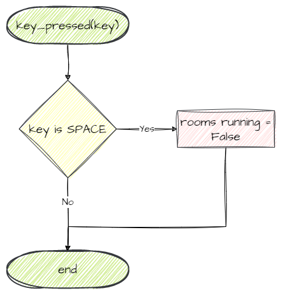

# 2. GamePlay Room

!!! learn "In this lesson we will learn"
    - what event-driven programming is
    - how to create a second Room and set the order of Rooms
    - how to plan an event handler with a flowchart
    - how to listen for and handle key presses in GameFrame
    - how to change from one Room to the next

!!! terms "Terminology"
    - **register** – to link an object or event handler to an event, so the program tells it when that event happens.
    - **event loop** – the part of an event-driven program that keeps checking for events and runs the matching event handlers.
    - **index** – the number that gives an item's position in a list, starting from `0`.
    - **trigger** – the event or condition that causes an action to happen.

In this lesson we'll create the main Room for our game. All the gameplay happens in this Room, so we'll call it **GamePlay**. We will:

- create a new Room called GamePlay
- make it the next Room after the WelcomeScreen
- make the game switch from the WelcomeScreen to GamePlay when the player presses space

Before we start, we need to understand event-driven programming.

## Event-driven programming

**Event-driven programming** is when a program waits for **events** to happen and then responds to them. Instead of running from top to bottom, the program listens for events, such as a key press or two objects colliding, and runs the code that matches each one.

That makes sense for a game. We want the game to respond when the player does something, or when objects bump into each other.

An event-driven program usually works like this:

1. Identify the **events** that will trigger actions.
2. Write **event handlers**: the code that runs when an event happens.
3. **Register** the event handlers, so each one is linked to its event.
4. Start the **event loop**, which keeps checking for events.
5. When an event happens, the event loop **runs** its event handler.
6. **Repeat** until the program ends.

GameFrame looks after most of these steps for us, but it's important to know the terms before we continue.

---

## Create the GamePlay Room

We create the GamePlay Room the same way we created the WelcomeScreen Room:

1. Create a new file in the ***Rooms*** folder
2. Import the `Level` class from GameFrame
3. Create and initialise the `GamePlay` class, and give it a background
4. Add the new class to ***Rooms/\_\_init\_\_.py***

Create a new file in the ***Rooms*** folder, add the code below and save it as ***GamePlay.py***.

```python linenums="1" hl_lines="1 3-5 7-8" title="Rooms/GamePlay.py"
--8<-- "examples/lessons/02_gameplay/step01/Rooms/GamePlay.py"
```

??? note "Code explanation"
    - **line 1** → imports the `Level` class from GameFrame.
    - **line 3** → defines the `GamePlay` class as a subclass of `Level`.
    - **line 4** → defines the `__init__` method, which runs when the Room is created.
    - **line 5** → runs `Level`'s `__init__` method, so `GamePlay` inherits everything a Room needs.
    - **line 8** → sets the Room's background to ***background.png***.

Open ***Rooms/\_\_init\_\_.py***, add the highlighted code below and save it.

```python linenums="1" hl_lines="2" title="Rooms/__init__.py"
--8<-- "examples/lessons/02_gameplay/step02/Rooms/__init__.py"
```

??? note "Code explanation"
    - **line 2** → imports the `GamePlay` class, so GameFrame can find it.

---

## Make GamePlay the next Room

Now we need to tell GameFrame that GamePlay comes after the WelcomeScreen. Open ***GameFrame/Globals.py*** and look for the `levels` variable. The [GameFrame API](../reference/gameframe_api.md#levels) tells us it holds the names of all the Rooms, in the order the player moves through them.

Right now it's the default list `["WelcomeScreen", "Maze", "ScrollingShooter", "BreakOut"]`. Our game doesn't have the last three Rooms, so change the highlighted code below and save the file.

```python linenums="18" hl_lines="2 8" title="GameFrame/Globals.py"
--8<-- "examples/lessons/02_gameplay/step03/GameFrame/Globals.py:18:25"
```

??? note "Code explanation"
    - **line 19** → lists our two Rooms in the order they're played: WelcomeScreen first, then GamePlay.
    - **line 25** → sets the Room GameFrame goes to when the game ends. Index `0` is the WelcomeScreen, the first Room in `levels`.

!!! warning "end_game_level must be a real Room"
    `end_game_level` is an **index** into the `levels` list. The default value `4` would point past the end of our two-Room list and crash the game, so we set it to `0`.

---

## Change Rooms with the space key

Now we can create the **trigger** that swaps from the WelcomeScreen to GamePlay. Remember, the game logic lives in RoomObjects, so let's look at `RoomObject` in the [GameFrame API](../reference/gameframe_api.md#roomobject).

There are two things about keys: the `handle_key_events` variable and the `key_pressed` method.

### Register for key events

The `handle_key_events` variable decides whether an object is told about key presses. To listen for key events we set it to `True`. We want the Title to listen for key presses, so go back to ***Objects/Title.py*** and add the highlighted code below.

```python linenums="1" hl_lines="14-15" title="Objects/Title.py"
--8<-- "examples/lessons/02_gameplay/step04/Objects/Title.py"
```

??? note "Code explanation"
    - **line 15** → **registers** the Title for key events, so GameFrame will call its `key_pressed` method on every frame.

### Handle key presses

When `handle_key_events` is `True`, GameFrame calls the object's `key_pressed` method and gives it a parameter called `key`. `key` holds the state of every key on the keyboard, and `key[pygame.K_SPACE]` is `True` while space is held down. The key names are in the [Pygame docs](https://www.pygame.org/docs/ref/key.html).

So what should happen when space is pressed? We want to close the WelcomeScreen Room so the game moves to the next Room, GamePlay. Checking the [GameFrame API](../reference/gameframe_api.md#roomslevels-variables), Rooms have a `running` variable, and setting it to `False` stops the Room. That's what we want.

Putting that together in a flowchart:



The only tricky part is that our code is in the Title, but `running` belongs to the WelcomeScreen. How can the Title reach its Room?

Remember how we added the Title to the WelcomeScreen:

```python linenums="15" title="Rooms/WelcomeScreen.py"
--8<-- "examples/lessons/01_welcome/step08/Rooms/WelcomeScreen.py:15:15"
```

The `self` we passed in is the WelcomeScreen, so the Title knows which Room it's in. The [GameFrame API](../reference/gameframe_api.md#roomobject-variables) says a RoomObject stores this in its `room` variable, so the Title can use `self.room.running`.

Now we can write our code. Still in ***Objects/Title.py***, add the highlighted code below and save it.

```python linenums="1" hl_lines="2 18-21 23-24" title="Objects/Title.py"
--8<-- "examples/lessons/02_gameplay/step05/Objects/Title.py"
```

??? note "Code explanation"
    - **line 2** → imports Pygame, because we need its key name `K_SPACE`.
    - **line 18** → defines the `key_pressed` **event handler**, which GameFrame calls with `key`, the state of every key.
    - **lines 19–21** → a docstring that explains what the method does.
    - **line 23** → checks if the space key is pressed…
    - **line 24** → …and sets the Room's `running` variable to `False`, which ends the WelcomeScreen so the game moves on to GamePlay.

!!! primm "PRIMM"
    1. **Predict** what will happen when we run the game and press space.
    2. **Run** ***MainController.py*** and press space.
    3. **Investigate**: what happens if you press another key? Why?

The welcome screen should show, and when we press space the title should disappear, because we're now in the empty GamePlay Room.

---

## Commit and push

We've finished and tested another section of code, so let's commit it.

1. In GitHub Desktop, type **Created GamePlay room** in the **Summary** box.
2. Click **Commit to main**.
3. Click **Push origin**.
