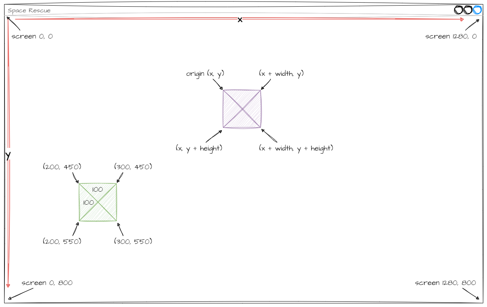
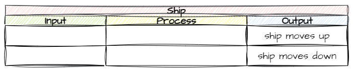
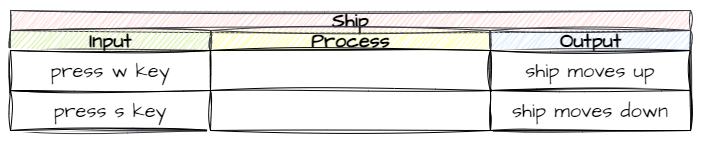
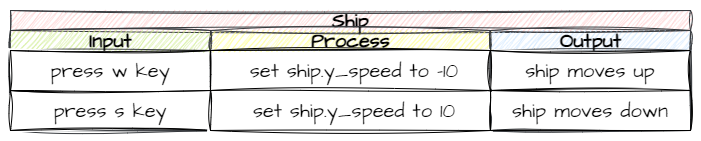

# 3. Spaceship

!!! learn "In this lesson we will learn"
    - how Pygame handles 2D graphics and coordinates
    - how to plan with an input → process → output (IPO) table
    - how to create a RoomObject and add it to a Room
    - how to move a RoomObject when the player presses keys

!!! terms "Terminology"
    - **avatar** – the character or object in a game that the player controls.
    - **origin** – the coordinate used as an object's position, which for objects with sprites is the top-left corner.

Every game needs a player **avatar**, and in our game it's a spaceship. In this lesson we'll create the spaceship and make it move up and down the screen when the player presses keys.

## Pygame graphics

Now that we're working with sprites, we need to look a bit deeper at how graphics work in GameFrame. GameFrame is built on Pygame, so that means understanding how Pygame handles graphics.

!!! tip "Graphics refresher"
    Computer screens are made up of millions of tiny dots called **pixels**. Each pixel can be more than 16 million colours.

    Each pixel has a **coordinate** made up of its x value (horizontal position) and its y value (vertical position), written as `(x, y)`.

We'll use the image below to explore graphics in Pygame.



### The screen

Pygame follows the common convention of putting `(0, 0)` in the top-left corner of the screen. The **x** value increases as we move right, and the **y** value increases as we move down. That means the largest coordinate is in the bottom-right corner, which on our screen is `(1280, 800)`. The edges of the screen are:

| Value | Range |
| :-- | :-- |
| x | from `0` to `1280` |
| y | from `0` to `800` |

### Objects

Every object on the screen has three values:

- its coordinates `(x, y)`
- its width in pixels
- its height in pixels

An object bigger than one pixel covers lots of coordinates, so each object has an **origin**, and that's its coordinate. For objects with sprites, the origin is the top-left corner.

Using these three values, we can work out the corners of the object. Check the purple object in the diagram.

| Corner | Calculation |
| :-- | :-- |
| top-left (origin) | `(x, y)` |
| top-right | `(x + width, y)` |
| bottom-left | `(x, y + height)` |
| bottom-right | `(x + width, y + height)` |

Let's try that with the green object. Its origin is `(200, 450)`, its width is `100` and its height is `100`.

| Corner | Calculation | Value |
| :-- | :-- | :-- |
| top-left (origin) | `(x, y)` | `(200, 450)` |
| top-right | `(x + width, y)` | `(300, 450)` |
| bottom-left | `(x, y + height)` | `(200, 550)` |
| bottom-right | `(x + width, y + height)` | `(300, 550)` |

### Movement

We make an object move around the screen by changing its origin coordinates.

| Coordinate change | Movement |
| :-- | :-- |
| increase **x** | moves right |
| decrease **x** | moves left |
| increase **y** | moves down |
| decrease **y** | moves up |

---

## Planning

To plan what our objects do, we'll use an **Input Process Output** (**IPO**) table. To fill in an IPO table:

1. Start with the **output** we want.
2. Choose an **input** from the ones available to trigger it.
3. Work out the **process** that gets us from the input to the output.

### Output

For this lesson, we want the spaceship to move up and down. So that's our output.



### Input

What input options do we have? The keyboard and mouse are the most common. It's really our choice, so let's use the keyboard. Which keys? The most common keys for up and down in games are ++w++ and ++s++, so let's use them.



### Process

So how do we get from key presses to a moving ship? Thinking about how Pygame handles graphics, we need to change the **y** value of the ship's origin: decrease it when ++w++ is pressed and increase it when ++s++ is pressed.

Let's check the [GameFrame API](../reference/gameframe_api.md#roomobject-variables) for RoomObject variables that could help. There are two possibilities:

- We could change `y`, but that would only move the ship once per press, so the player would have to keep tapping keys to keep moving.
- We could change `y_speed`. The API says this is the number of pixels the object moves up or down **every frame**. If we set it to `-10` for up and `10` for down, the ship keeps moving after the player presses the key. That sounds like our best bet.



That's the planning finished. Now let's code it.

---

## Add the Ship RoomObject

Adding the Ship starts with the same steps we used for the Title:

1. Define the `Ship` class
2. Initialise it and give it an image
3. Add it to ***Objects/\_\_init\_\_.py***
4. Add a Ship object to the GamePlay Room

Then we'll make it respond to keys:

5. Register the Ship for key events
6. Write its `key_pressed` method

Create a new file in the ***Objects*** folder, add the code below and save it as ***Ship.py***.

```python linenums="1" hl_lines="1 3-6 8-12 14-16" title="Objects/Ship.py"
--8<-- "examples/lessons/03_spaceship/step01/Objects/Ship.py"
```

??? note "Code explanation"
    - **line 1** → imports the `RoomObject` class from GameFrame.
    - **line 3** → defines the `Ship` class as a subclass of `RoomObject`.
    - **lines 4–6** → a docstring that explains what the class is for.
    - **line 8** → defines the `__init__` method, which takes the Room and the ship's starting position.
    - **lines 9–11** → a docstring that explains what the method does.
    - **line 12** → runs `RoomObject`'s `__init__` method, so the Ship inherits everything a RoomObject has.
    - **line 15** → loads ***Ship.png*** from the ***Images*** folder.
    - **line 16** → gives the Ship its image, 100 pixels wide and 100 pixels high.

Open ***Objects/\_\_init\_\_.py***, add the highlighted code below and save it.

```python linenums="1" hl_lines="2" title="Objects/__init__.py"
--8<-- "examples/lessons/03_spaceship/step02/Objects/__init__.py"
```

??? note "Code explanation"
    - **line 2** → imports the `Ship` class, so GameFrame can find it.

Open ***Rooms/GamePlay.py***, add the highlighted code below and save it.

```python linenums="1" hl_lines="2 11-12" title="Rooms/GamePlay.py"
--8<-- "examples/lessons/03_spaceship/step03/Rooms/GamePlay.py"
```

??? note "Code explanation"
    - **line 2** → imports the `Ship` class so the Room can use it.
    - **line 12** → creates a Ship at `(25, 50)`, near the top-left of the screen, and adds it to the Room.

!!! primm "PRIMM"
    1. **Predict** what you'll see after pressing space on the welcome screen.
    2. **Run** ***MainController.py*** and press space.
    3. **Investigate**: what happens when you press ++w++ or ++s++? Why?

We should have a spaceship in the GamePlay Room, but it doesn't move yet.

### Make the Ship move

Go back to ***Objects/Ship.py*** and add the highlighted code below.

```python linenums="1" hl_lines="2 19-20 22-25 27-30" title="Objects/Ship.py"
--8<-- "examples/lessons/03_spaceship/step04/Objects/Ship.py"
```

??? note "Code explanation"
    - **line 2** → imports Pygame, so we can use its key names.
    - **line 20** → registers the Ship for key events, so GameFrame calls `key_pressed` on every frame.
    - **line 22** → defines the `key_pressed` event handler, just like the one we wrote for the Title.
    - **lines 23–25** → a docstring that explains what the method does.
    - **line 27** → checks if ++w++ is pressed…
    - **line 28** → …and sets the Ship's `y_speed` to `-10`, so it moves 10 pixels up every frame.
    - **line 29** → otherwise, checks if ++s++ is pressed…
    - **line 30** → …and sets `y_speed` to `10`, so it moves 10 pixels down every frame.

!!! primm "PRIMM"
    1. **Predict** how the ship will move when you press ++w++, then let go.
    2. **Run** ***MainController.py***, press space, then try ++w++ and ++s++.
    3. **Investigate**: what happens when the ship reaches the top or bottom of the screen? We'll fix that in [Lesson 5](05_ship_in_room.md).

---

## Commit and push

We've finished and tested another section of code, so you know what to do.

1. In GitHub Desktop, type **Created Spaceship object** in the **Summary** box.
2. Click **Commit to main**.
3. Click **Push origin**.
