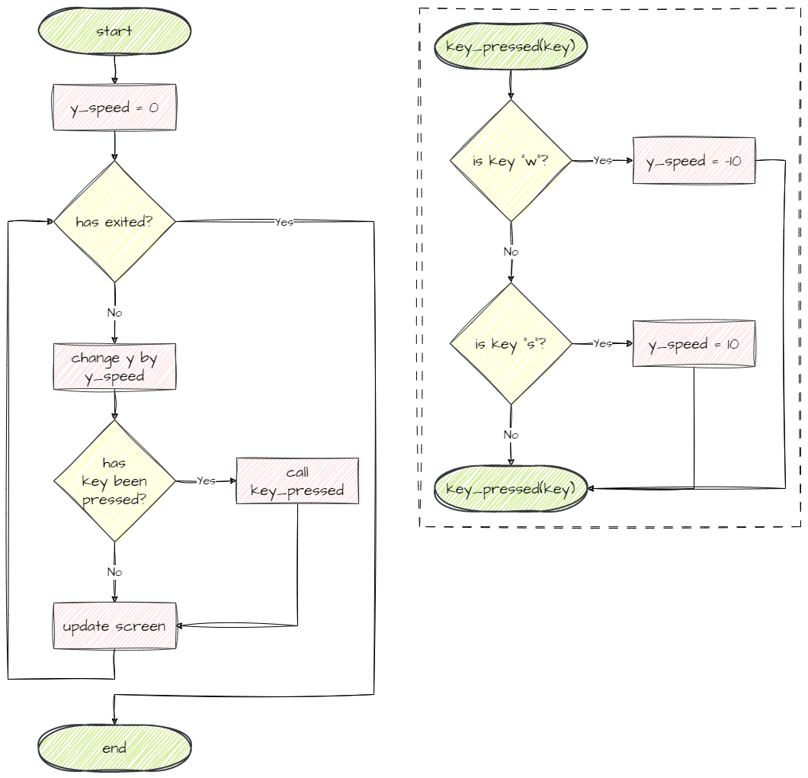
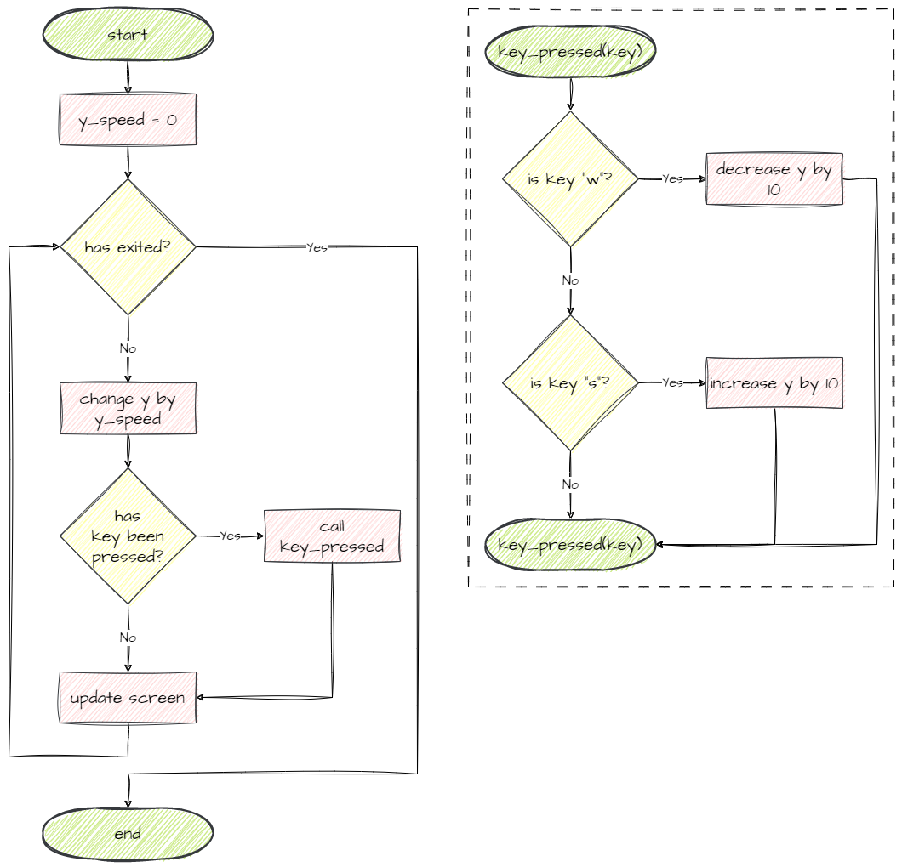
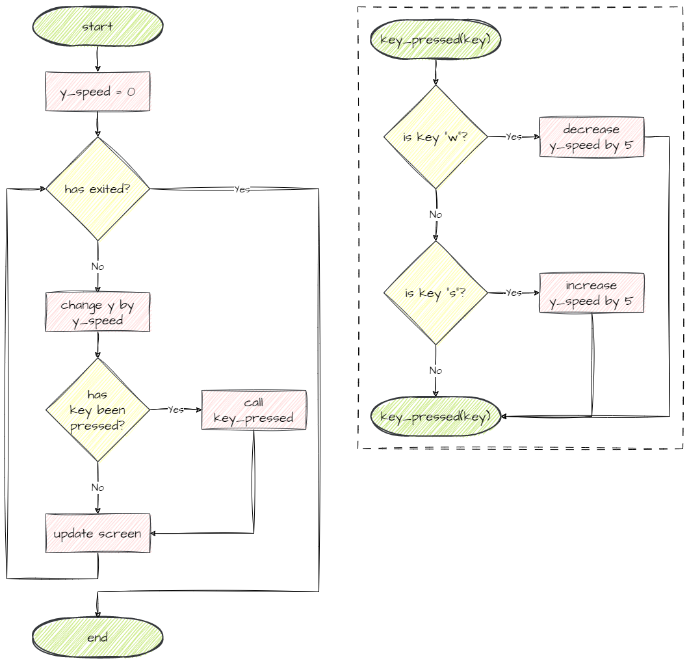

# 4. Advanced Movement

!!! learn "In this lesson we will learn"
    - what a frame is in GameFrame
    - three different ways to move an object with keys
    - how to use flowcharts to compare algorithms
    - how to move an object by changing its coordinates or its speed

!!! terms "Terminology"
    - **acceleration** – a change in speed over time, such as the ship moving faster the longer a key is held.
    - **frame** – each time the screen is redrawn while the game runs.
    - **frame rate** – how many frames are drawn each second, which in GameFrame is 30.

## Different ways to move

In the last lesson we made the spaceship move when a key is pressed. Pressing ++w++ starts the ship moving up and pressing ++s++ starts it moving down, and it keeps going until we press the other key. That's not the only way movement can work, though. We could have:

- **always in motion**
- **in motion while a key is pressed**
- **always in motion with acceleration**

To understand these, we need to know how GameFrame works with an object's coordinates. The [GameFrame API](../reference/gameframe_api.md#roomobject-variables) lists six variables to do with an object's position in the Room:

- `x` and `y` → the object's current coordinates
- `prev_x` and `prev_y` → the object's coordinates in the last frame
- `x_speed` and `y_speed` → how far the object moves in the `x` and `y` directions every frame

!!! tip "Frames"
    In GameFrame, a **frame** is each time the screen is redrawn. How often that happens is set by `FRAMES_PER_SECOND` in ***Globals.py***, which is `30`. So the screen is redrawn every 1/30 of a second (about 33 milliseconds), and `x_speed` and `y_speed` are how many pixels the object moves every 33 milliseconds.

### Always in motion

Below is the flowchart for **always in motion**. On every loop:

- the `y` position changes by the value of `y_speed`
- `y_speed` starts at `0`
- `y_speed` changes if ++w++ or ++s++ is pressed
- there's no way for `y_speed` to go back to `0`



This is the movement we already have in our `key_pressed` method:

```python linenums="22" title="Objects/Ship.py"
--8<-- "examples/lessons/04_advanced_movement/option_always/Objects/Ship.py:22:30"
```

### In motion while a key is pressed

Below is the flowchart for **in motion while a key is pressed**. Notice that:

- `y_speed` stays at `0`, so `y` never changes by itself
- the key press changes `y` directly, so while ++w++ is held down, `y` decreases by 10 every frame



To try this movement, change the highlighted lines in the `key_pressed` method in ***Objects/Ship.py***.

```python linenums="22" hl_lines="7 9" title="Objects/Ship.py"
--8<-- "examples/lessons/04_advanced_movement/option_while_pressed/Objects/Ship.py:22:30"
```

??? note "Code explanation"
    - **line 28** → while ++w++ is held, moves the ship up 10 pixels by decreasing `y` directly.
    - **line 30** → while ++s++ is held, moves the ship down 10 pixels by increasing `y` directly.

!!! primm "PRIMM"
    1. **Predict** how this movement will feel different from the last one.
    2. **Run** ***MainController.py*** and try it.
    3. **Investigate**: what happens when you let go of the key? Why?

### Always in motion with acceleration

Below is the flowchart for **always in motion with acceleration**. It combines the last two approaches:

- `y_speed` is used to update `y` every frame
- pressing a key increases or decreases `y_speed`
- this gives the ship a sense of **acceleration**: the longer we hold a key, the faster the ship moves that way



To try this movement, change the highlighted lines in the `key_pressed` method.

```python linenums="22" hl_lines="7 9" title="Objects/Ship.py"
--8<-- "examples/lessons/04_advanced_movement/option_acceleration/Objects/Ship.py:22:30"
```

??? note "Code explanation"
    - **line 28** → while ++w++ is held, reduces `y_speed` by 5 every frame, so the ship speeds up going up (or slows down if it was going down).
    - **line 30** → while ++s++ is held, increases `y_speed` by 5 every frame, so the ship speeds up going down.

!!! primm "PRIMM"
    1. **Predict** what will happen if you hold ++w++ for a long time.
    2. **Run** ***MainController.py*** and try it.
    3. **Investigate**: how do you stop the ship? Is this harder or easier to control?

### Choose your movement

Try all three options, then choose the one you want to use in your game.

!!! warning "The lessons use always in motion"
    The rest of the lessons show the **always in motion** code. If you choose a different movement, your `key_pressed` method will look a little different from the code on the pages, and that's fine. Just keep your own version when you add the highlighted lines.

---

## Commit and push

1. In GitHub Desktop, type **Chose ship movement** in the **Summary** box.
2. Click **Commit to main**.
3. Click **Push origin**.
