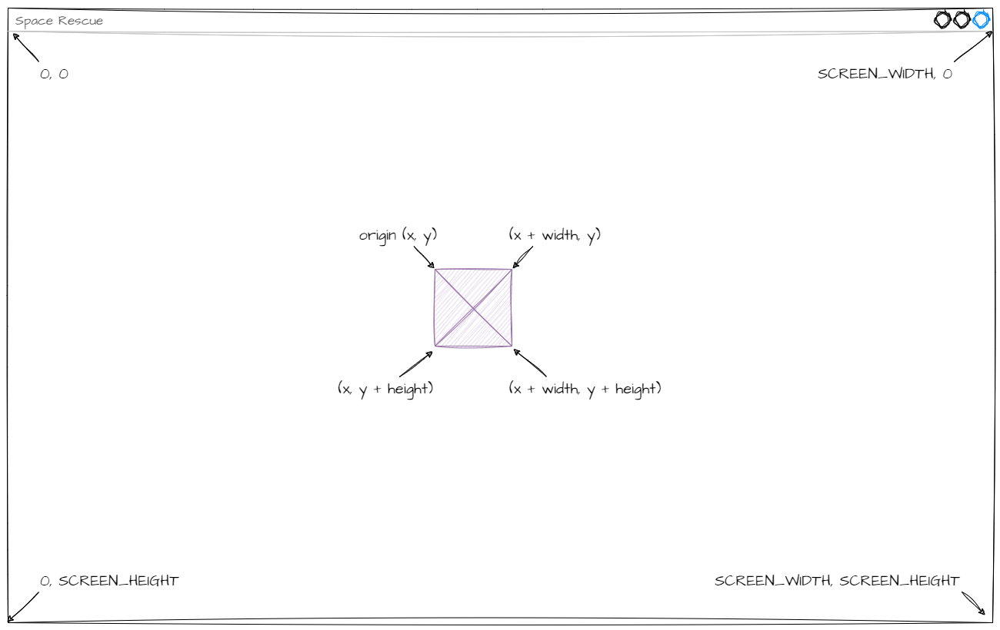
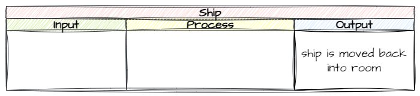
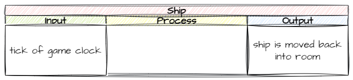
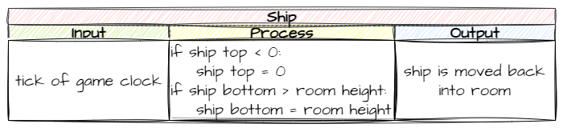

# 5. Keeping the Ship in the Room

!!! learn "In this lesson we will learn"
    - how screen coordinates and object coordinates work together
    - what a game clock is and how to run code on every tick
    - how to plan an algorithm with an IPO table
    - how to keep an object inside the Room

By now you've probably noticed that the ship can fly off the top and bottom of the screen. Let's stop that from happening.

## Planning

Before we can stop the ship flying off the screen, we need a way for the program to tell when it's happening. In plain English it's quite simple:

- if the top of the ship is above the screen → move it back inside the screen
- if the bottom of the ship is below the screen → move it back inside the screen

We need to turn these ideas into Python:

- top of the ship
- bottom of the ship
- above the screen
- below the screen

Let's look at the screen to see how we can describe each one.



Each idea matches a value in our program:

- top of the ship → the origin's **y** value → `self.y`
- bottom of the ship → the origin's **y** value + the ship's height → `self.y + self.height`
- above the screen → a **y** value less than zero → `< 0`
- below the screen → a **y** value greater than the screen height → `> Globals.SCREEN_HEIGHT`

So we need to keep checking that:

- `self.y` isn't less than `0`
- `self.y + self.height` isn't greater than `Globals.SCREEN_HEIGHT`

Now we need a way to check these regularly. Remember, the game logic lives in the objects, so let's look at the [RoomObject methods](../reference/gameframe_api.md#roomobject-methods). Notice the `step` method? The API says GameFrame runs it for the object on every tick of the game clock.

!!! tip "Game clocks"
    In the early days of computers, games ran as fast as the hardware would let them, so the same game ran faster or slower depending on the computer. When computers rapidly got faster, older games became unplayable. The **game clock** was created to fix this.

    A game clock makes every run of the **game loop** take the same amount of time. In each run, the game loop handles inputs, updates the game state and redraws the screen. If it finishes early, the computer waits for the next **tick** of the clock.

    In GameFrame, the game clock is the same as the frame rate, so there's a tick every 1/30 of a second.

Now we know the mechanism and the values, we can plan our code.

First, what **output** do we want?



Next, what **input** will trigger it?



Finally, what **process** gets us from the input to the output?



In summary: on every tick of the game clock, we check if the ship is outside the screen, and if it is, we move it back in.

---

## Coding

All this code goes in the `Ship` class, so open ***Objects/Ship.py***.

Now, where in the class? We could put it all in the `step` method and it would work. But what if we want the ship to do other things on every tick? `step` would get messy quickly.

To keep our code **maintainable**, we'll keep `step` as small as possible. We'll put each piece of game logic in its own method, then call those methods from `step`.

### keep_in_room

Let's put this game logic in a method called `keep_in_room`. Add the code below to the bottom of the `Ship` class.

```python linenums="32" hl_lines="1-8" title="Objects/Ship.py"
--8<-- "examples/lessons/05_ship_in_room/step01/Objects/Ship.py:32:39"
```

??? note "Code explanation"
    - **line 32** → defines the `keep_in_room` method.
    - **lines 33–35** → a docstring that explains what the method does.
    - **line 36** → checks if the top of the ship (`self.y`) is above the top of the screen (`0`)…
    - **line 37** → …and moves the ship's origin to the top of the screen.
    - **line 38** → otherwise, checks if the bottom of the ship (`self.y + self.height`) is below the bottom of the screen (`Globals.SCREEN_HEIGHT`)…
    - **line 39** → …and moves the ship up so its bottom sits on the bottom of the screen.

Notice the squiggly line under `Globals`? That's VS Code telling us it can't find it, because we haven't imported it. At the top of ***Objects/Ship.py***, change the highlighted code below.

```python linenums="1" hl_lines="1" title="Objects/Ship.py"
--8<-- "examples/lessons/05_ship_in_room/step02/Objects/Ship.py:1:2"
```

??? note "Code explanation"
    - **line 1** → imports `Globals` as well as `RoomObject`, so we can use `Globals.SCREEN_HEIGHT`.

### step

Now we need to call `keep_in_room` from the `step` method. Add the code below to the bottom of the `Ship` class, then save the file.

```python linenums="41" hl_lines="1-5" title="Objects/Ship.py"
--8<-- "examples/lessons/05_ship_in_room/step03/Objects/Ship.py:41:45"
```

??? note "Code explanation"
    - **line 41** → defines the `step` method, which GameFrame runs on every tick of the game clock.
    - **lines 42–44** → a docstring that explains what the method does.
    - **line 45** → calls `keep_in_room` on every tick, so the ship is checked 30 times a second.

!!! primm "PRIMM"
    1. **Predict** what will happen when the ship reaches the top or bottom of the screen now.
    2. **Run** ***MainController.py*** and fly the ship up and down.
    3. **Investigate**: what would happen if we forgot line 45? Why?

Here's the whole of ***Objects/Ship.py*** so far, so you can check your code:

```python linenums="1" title="Objects/Ship.py"
--8<-- "examples/lessons/05_ship_in_room/step03/Objects/Ship.py"
```

---

## Commit and push

1. In GitHub Desktop, type **Kept ship on screen** in the **Summary** box.
2. Click **Commit to main**.
3. Click **Push origin**.
