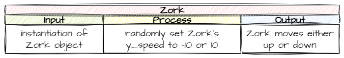
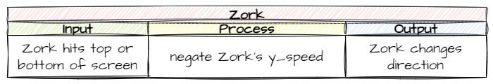

# 6. Zork

!!! learn "In this lesson we will learn"
    - how to create a new RoomObject from what we already know
    - how to plan movement with IPO tables
    - how to start an object moving when it's created
    - how to reverse a direction by negating a number

Our boss for this game is **Zork**, an evil alien. Creating Zork follows the same steps as creating the ship, so we'll race through those, then plan and code the parts that are different.

## Create the Zork class

Create a new file in the ***Objects*** folder, add the code below and save it as ***Zork.py***.

```python linenums="1" hl_lines="1 3-12 14-16" title="step01/Objects/Zork.py"
--8<-- "examples/lessons/06_zork/step01/Objects/Zork.py"
```

??? note "Code explanation"
    - **line 1** → imports the `RoomObject` class.
    - **line 3** → defines the `Zork` class as a subclass of `RoomObject`.
    - **lines 4–6** → a docstring that explains what the class is for.
    - **line 7** → defines the `__init__` method.
    - **lines 8–10** → a docstring that explains what the method does.
    - **line 12** → runs `RoomObject`'s `__init__` method, so Zork inherits everything a RoomObject has.
    - **lines 15–16** → loads ***Zork.png*** and gives it to Zork at 135 × 165 pixels.

Open ***Objects/\_\_init\_\_.py***, add the highlighted code below and save it.

```python linenums="1" hl_lines="3" title="step02/Objects/__init__.py"
--8<-- "examples/lessons/06_zork/step02/Objects/__init__.py"
```

??? note "Code explanation"
    - **line 3** → imports the `Zork` class, so GameFrame can find it.

Open ***Rooms/GamePlay.py***, add the highlighted code below and save it.

```python linenums="1" hl_lines="3 14" title="step03/Rooms/GamePlay.py"
--8<-- "examples/lessons/06_zork/step03/Rooms/GamePlay.py"
```

??? note "Code explanation"
    - **line 3** → imports the `Zork` class.
    - **line 14** → creates Zork at `(1120, 50)`, on the right-hand side of the screen, and adds it to the Room.

!!! primm "PRIMM"
    1. **Predict** where Zork will appear.
    2. **Run** ***MainController.py*** and press space.
    3. **Investigate**: what would you change to put Zork lower down the screen?

Our boss is on the screen. Now let's think about what makes Zork different.

---

## Planning

Zork is controlled by the computer, so we need to **automate** its movement. Like our spaceship, Zork only moves up and down, but not because of key presses. There are two parts to Zork's movement:

1. starting Zork moving when the game begins
2. reversing Zork's direction when it reaches the top or bottom of the screen

### Starting movement

Let's use an IPO table to plan Zork's first movement:

- **Output** → Zork moves up or down
- **Input** → Zork is created
- **Process** → randomly set Zork's `y_speed` to `-10` (up) or `10` (down)



!!! tip "Instantiation"
    Remember, a class is like a blueprint for creating objects. Each object made from a class is an **instance** of it, and creating one is called **instantiation**. When a Zork object is instantiated, its `__init__` method runs.

### Changing direction

When Zork reaches the top or bottom of the screen, we don't want it to stop. We want it to change direction, so `y_speed` goes from `-10` to `10` or the other way round.

- **Output** → Zork moves in the opposite direction
- **Input** → Zork touches the top or bottom of the screen
- **Process** → **negate** Zork's `y_speed` (`-10` becomes `10`, and `10` becomes `-10`)



Now we've planned both, let's code them.

---

## Starting movement

Our IPO table says the trigger is Zork being created. When an object is instantiated its `__init__` method runs, so that's where the code goes.

We can use `random.choice` to pick a random item from a list. If we give it a list of `-10` and `10`, it will choose one of them. Go back to ***Objects/Zork.py*** and add the highlighted code below.

```python linenums="1" hl_lines="2 19-20" title="step04/Objects/Zork.py"
--8<-- "examples/lessons/06_zork/step04/Objects/Zork.py"
```

??? note "Code explanation"
    - **line 2** → imports the `random` module so we can use `choice`.
    - **line 20** → randomly chooses `-10` or `10` and sets it as Zork's `y_speed`, so Zork starts moving up or down.

!!! primm "PRIMM"
    1. **Predict** what Zork will do when the game starts.
    2. **Run** ***MainController.py*** a few times.
    3. **Investigate**: does Zork always go the same way? What happens when it reaches the edge?

Zork should move up or down until it's off the screen.

---

## Reverse Zork's direction

To reverse Zork's direction, we'll use the same pattern we used to keep the ship on screen: `step` calls a `keep_in_room` method. The difference is what `keep_in_room` does. Instead of moving Zork back, it reverses Zork's `y_speed`.

Go back to ***Objects/Zork.py*** and add the highlighted code below.

```python linenums="1" hl_lines="1 22-27 29-33" title="step05/Objects/Zork.py"
--8<-- "examples/lessons/06_zork/step05/Objects/Zork.py"
```

??? note "Code explanation"
    - **line 1** → imports `Globals` so we can use the screen height.
    - **line 22** → defines the `keep_in_room` method.
    - **lines 23–25** → a docstring that explains what the method does.
    - **line 26** → checks if Zork has gone past the top of the screen **or** past the bottom (the screen height minus Zork's height)…
    - **line 27** → …and **negates** `y_speed` by multiplying it by `-1`. `*=` works like `+=`: it multiplies `y_speed` by `-1` and stores the answer back in `y_speed`.
    - **line 29** → defines the `step` method, which runs on every tick.
    - **lines 30–32** → a docstring that explains what the method does.
    - **line 33** → calls `keep_in_room` on every tick.

!!! primm "PRIMM"
    1. **Predict** what Zork will do when it reaches the top or bottom now.
    2. **Run** ***MainController.py***.
    3. **Investigate**: change `-10` and `10` on line 20 to other numbers. What changes? Change them back when you're done.

---

## Commit and push

1. In GitHub Desktop, type **Created Zork** in the **Summary** box.
2. Click **Commit to main**.
3. Click **Push origin**.
