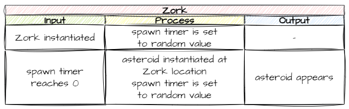
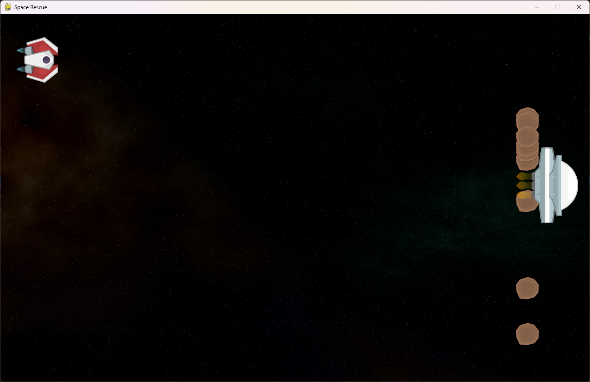

# 7. Asteroids

!!! learn "In this lesson we will learn"
    - how to create a new RoomObject from what we already know
    - how one object can create (spawn) other objects
    - how to use GameFrame timers to make things happen at random times
    - how to pass a method as an argument

!!! terms "Terminology"
    - **spawn** – to make a new object appear in the game.
    - **de-spawn** – to remove an object from the game.
    - **timer** – a countdown that calls a chosen method when it reaches `0`.
    - **argument** – a value we pass into a method or function when we call it.

In the game, Zork hurls asteroids at the player's ship, and the player has to dodge them. Creating the Asteroid RoomObject uses many of the steps we used for the Ship and Zork.

## Create the Asteroid object

The code for a new RoomObject should be very familiar by now. Create a new file in the ***Objects*** folder, add the code below and save it as ***Asteroid.py***.

```python linenums="1" hl_lines="1 3-6 8-13 15-17" title="Objects/Asteroid.py"
--8<-- "examples/lessons/07_asteroids/step01/Objects/Asteroid.py"
```

??? note "Code explanation"
    - **line 1** → imports the `RoomObject` class.
    - **line 3** → defines the `Asteroid` class as a subclass of `RoomObject`.
    - **lines 4–6** → a docstring that explains what the class is for.
    - **line 8** → defines the `__init__` method.
    - **lines 9–11** → a docstring that explains what the method does.
    - **line 13** → runs `RoomObject`'s `__init__` method.
    - **lines 16–17** → loads ***asteroid.png*** and gives it to the asteroid at 50 × 49 pixels.

Open ***Objects/\_\_init\_\_.py***, add the highlighted code below and save it.

```python linenums="1" hl_lines="4" title="Objects/__init__.py"
--8<-- "examples/lessons/07_asteroids/step02/Objects/__init__.py"
```

??? note "Code explanation"
    - **line 4** → imports the `Asteroid` class, so GameFrame can find it.

Run ***MainController.py***. Nothing should change, because no asteroids have been created yet. We're just checking there are no mistakes.

---

## Spawn asteroids

Now we have an Asteroid class, we need to:

1. make asteroids **spawn** (appear in the game)
2. make them move in a random direction across the screen
3. bounce them off the top and bottom of the screen
4. **de-spawn** (remove) them when they leave the left of the screen

We'll do the first one in this lesson, and the rest in the next.

### Planning

Let's think about spawning:

- we want asteroids to spawn at Zork's location
- we want them to spawn at **random intervals**, because regular intervals are too predictable and less fun

Spawning at Zork's location is easy, because we know Zork's location is `self.x` and `self.y`.

Spawning at random times is a bit trickier. The [RoomObject methods](../reference/gameframe_api.md#roomobject-methods) include `set_timer`. It starts a timer that calls a method when its countdown reaches `0`. That's what we need.

So where does the code go? Zork spawns the asteroids, so the spawning code goes in the `Zork` class.



There are two steps to this:

1. When Zork is created, start a timer with a random length.
2. When the timer reaches `0`, it calls a method that spawns an asteroid, then starts the timer again.

### Start the timer

Open ***Objects/Zork.py*** and add the highlighted code below. Starting the timer needs to happen when Zork is created, so it goes in `__init__`.

```python linenums="1" hl_lines="2 23-25" title="Objects/Zork.py"
--8<-- "examples/lessons/07_asteroids/step03/Objects/Zork.py"
```

??? note "Code explanation"
    - **line 2** → imports the `Asteroid` class, so Zork can create asteroids.
    - **line 24** → chooses a random number of ticks between 15 and 150 (half a second to five seconds).
    - **line 25** → starts a timer for that many ticks, and tells it to call `self.spawn_asteroid` when it reaches `0`.

!!! tip "Passing a method as an argument"
    When we pass a method as an argument (like we do to the timer), we only use its name: `self.spawn_asteroid`. We leave off the `()`.

    If we included the `()`, the method would run straight away, and the timer would get whatever it returns instead of the method itself.

### Spawn an asteroid

The timer calls `self.spawn_asteroid`, which doesn't exist yet, so let's create it. Add the highlighted code below to the bottom of the `Zork` class, then save the file.

```python linenums="1" hl_lines="40-46 48-50" title="Objects/Zork.py"
--8<-- "examples/lessons/07_asteroids/step04/Objects/Zork.py"
```

??? note "Code explanation"
    - **line 40** → defines the `spawn_asteroid` method, which the timer calls.
    - **lines 41–43** → a docstring that explains what the method does.
    - **line 45** → creates a new asteroid in Zork's Room, at Zork's `x` and halfway down Zork's height.
    - **line 46** → adds the new asteroid to the Room.
    - **lines 49–50** → chooses a new random time and starts the timer again, so asteroids keep spawning.

!!! primm "PRIMM"
    1. **Predict** what you'll see when the game starts.
    2. **Run** ***MainController.py*** and press space.
    3. **Investigate**: change `15` and `150` on lines 24 and 49 to `5` and `20`. What happens? Change them back when you're done.

Zork should move up and down, spawning asteroids like this:



The next thing to do is make the asteroids move. We'll do that in the next lesson.

---

## Commit and push

1. In GitHub Desktop, type **Spawned asteroids** in the **Summary** box.
2. Click **Commit to main**.
3. Click **Push origin**.
