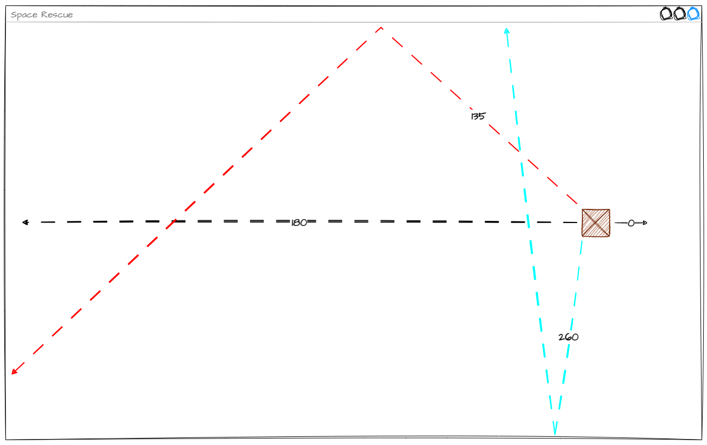
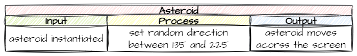
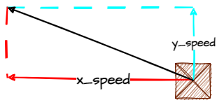
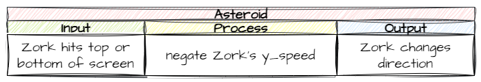
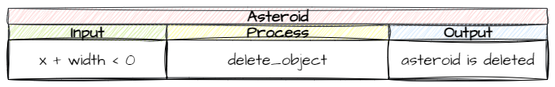

# 8. Moving Asteroids

!!! learn "In this lesson we will learn"
    - how to set an object's direction with an angle
    - how to bounce an object off the top and bottom of the screen
    - how to tell when an object has left the screen
    - how to delete an object from a Room
    - how to use `print` and the terminal for testing

In this lesson we'll add all the movement for the asteroids:

- moving left at a random angle when they spawn
- bouncing off the top and bottom of the screen
- de-spawning when they move past the left of the screen

Let's get going.

## Starting movement

### Planning

So far, our objects have only moved up and down the y-axis. We want the asteroids to move **diagonally**, on both the x-axis and the y-axis. We could use trigonometry to work out the `x_speed` and `y_speed` we need, but Steven Tucker has already done the hard work for us.

The [RoomObject methods](../reference/gameframe_api.md#roomobject-methods) include `set_direction`, which makes an object move at an angle and a speed. In GameFrame, `0°` is moving right, and the angles go **clockwise** (because y increases going down the screen): `90°` is down, `180°` is left and `270°` is up.

We want some randomness in the direction, so we'll choose an angle from a range. Let's look at our options.



- `180°` (black line) moves straight across the screen
- `135°` (red line) is 45° less than 180° and gives a nice bounce across the screen
- `260°` (blue line) is 80° more than 180° and mostly bounces up and down, barely crossing the screen

So the best range is 180° plus or minus 45°, which is `135` to `225`.

!!! tip "Which way do the angles go?"
    The diagram measures angles anticlockwise, like in maths. GameFrame measures them **clockwise**, because y increases going down the screen, so in our game `135°` actually heads down and to the left, and `225°` heads up and to the left. Our range is the same distance either side of `180°`, so it works the same either way.



### Coding

Open ***Objects/Asteroid.py*** and add the highlighted code below.

```python linenums="1" hl_lines="2 20-22" title="Objects/Asteroid.py"
--8<-- "examples/lessons/08_moving_asteroids/step01/Objects/Asteroid.py"
```

??? note "Code explanation"
    - **line 2** → imports the `random` module so we can use `randint`.
    - **line 21** → chooses a random whole number from 135 to 225 for the angle.
    - **line 22** → starts the asteroid moving at that angle, at a speed of 10 pixels per frame.

!!! primm "PRIMM"
    1. **Predict** how the asteroids will move now.
    2. **Run** ***MainController.py***.
    3. **Investigate**: what happens when an asteroid reaches the top or bottom of the screen?

---

## Bouncing off the top and bottom

### Planning

We want the asteroids to bounce off the top and bottom of the screen so they stay in the window. To do that, we need to understand how `set_direction` works.

The screen is a Cartesian plane (it has x and y coordinates), so any movement is made of an **x component** and a **y component**.



When we use `set_direction`, GameFrame uses trigonometry to work out the `x_speed` and `y_speed`. That means we already know how to bounce an object off the top and bottom, because we did it for Zork: negate its `y_speed`. The only difference is that Zork's `x_speed` is `0`.



### Coding

Just like Zork, we need:

- a `keep_in_room` method that negates the asteroid's `y_speed` if it's touching the top or bottom of the screen
- a `step` method that calls `keep_in_room` on every tick

Go back to ***Objects/Asteroid.py*** and add the highlighted code below.

```python linenums="1" hl_lines="1 24-28 30-39" title="Objects/Asteroid.py"
--8<-- "examples/lessons/08_moving_asteroids/step02/Objects/Asteroid.py"
```

??? note "Code explanation"
    - **line 1** → imports `Globals` so we can use the screen height.
    - **line 24** → defines the `step` method, which runs on every tick.
    - **lines 25–27** → a docstring that explains what the method does.
    - **line 28** → calls `keep_in_room` on every tick.
    - **line 30** → defines the `keep_in_room` method.
    - **lines 31–33** → a docstring that explains what the method does.
    - **line 34** → checks if the asteroid has gone above the top of the screen…
    - **line 35** → …moves it back to the top edge, so it can't get stuck outside the screen…
    - **line 36** → …and negates `y_speed`, so it bounces back down.
    - **line 37** → otherwise, checks if the asteroid has gone below the bottom of the screen…
    - **line 38** → …moves it back to the bottom edge…
    - **line 39** → …and negates `y_speed`, so it bounces back up.

!!! primm "PRIMM"
    1. **Predict** what the asteroids will do at the top and bottom of the screen now.
    2. **Run** ***MainController.py***.
    3. **Investigate**: how is this different from Zork's `keep_in_room`? Why do lines 35 and 38 help?

---

## De-spawning asteroids

When an asteroid leaves the screen on the left, we want to destroy it. Why? Each object uses a little bit of memory. If we never destroy them, all those little bits add up, slow the computer down and can eventually crash it. That's called a **memory leak**. It would take a very long game for our asteroids to do that, but it's good programming practice to destroy objects we no longer need.

!!! tip "Memory leaks"
    A **memory leak** is when a program keeps using memory it no longer needs. The program uses more and more memory over time, which can cause performance problems and even crashes.

### Planning

We know how to tell when an object touches the top or bottom of the screen, but how do we know when it has gone past the left edge? Let's work it out:

- left and right is the x-axis, so we're looking at x values
- the left edge of the screen is at `x = 0`
- an object has left the Room when its right-hand side is less than `0`
- the right-hand side of an object is `x + width` (see below)


So the trigger is `self.x + self.width < 0`.

Now, how do we de-spawn an object? Looking at the [RoomObject methods](../reference/gameframe_api.md#roomobject-methods), there's a `delete_object` method. That sounds about right.



### Coding

Still in ***Objects/Asteroid.py***, add the highlighted code below.

```python linenums="1" hl_lines="29 42-47" title="Objects/Asteroid.py"
--8<-- "examples/lessons/08_moving_asteroids/step03/Objects/Asteroid.py"
```

??? note "Code explanation"
    - **line 29** → calls `outside_of_room` on every tick, to check if the asteroid has left the screen.
    - **line 42** → defines the `outside_of_room` method.
    - **lines 43–45** → a docstring that explains what the method does.
    - **line 46** → checks if the asteroid's right-hand side has gone past the left edge of the screen (the trigger in our IPO table)…
    - **line 47** → …and deletes the asteroid. `self.room` is the Room this asteroid is in, and `(self)` is the object to delete: this asteroid.

!!! tip "Why self.room.delete_object(self)?"
    It looks repetitive, but it hints at what else `delete_object` can do. Because we tell it which object to delete, the same method can delete **other** objects in the Room, not just this one. We'll use that when lasers hit asteroids.

!!! primm "PRIMM"
    1. **Predict** what you'll see when an asteroid leaves the screen.
    2. **Run** ***MainController.py***.
    3. **Investigate**: how can you tell whether the asteroid was deleted?

How did it go? Were the asteroids deleted? How could you tell?

The problem is that the asteroid is already off the screen when `outside_of_room` deletes it, so we can't see anything happen. In situations like this, it's useful to `print` to the terminal to see what's going on inside our program.

Go back to ***Objects/Asteroid.py*** and add the highlighted line below.

```python linenums="42" hl_lines="6" title="Objects/Asteroid.py"
--8<-- "examples/lessons/08_moving_asteroids/step04/Objects/Asteroid.py:42:48"
```

??? note "Code explanation"
    - **line 47** → prints `asteroid deleted` in the terminal every time an asteroid is deleted.

!!! primm "PRIMM"
    1. **Predict** what will appear in the terminal.
    2. **Run** ***MainController.py*** and watch the terminal in VS Code.
    3. **Investigate**: count the asteroids that leave the screen. Does the terminal agree?

!!! tip "Testing with print"
    Printing to the terminal is a quick way to check that code we can't see is running. Once we're sure it works, we can delete the `print` line or leave it there while we keep building.

---

## Commit and push

1. In GitHub Desktop, type **Moved asteroids** in the **Summary** box.
2. Click **Commit to main**.
3. Click **Push origin**.
