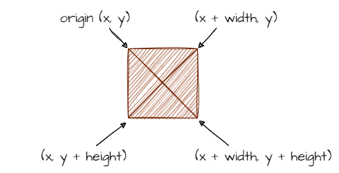
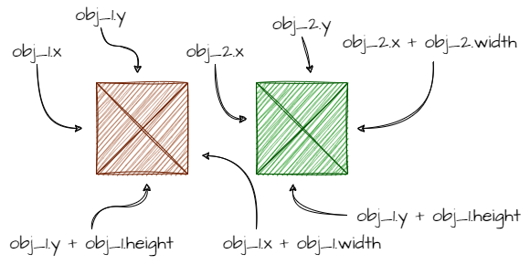
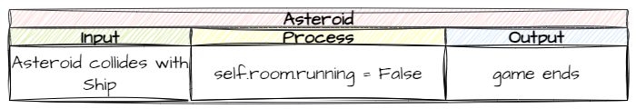

# 9. Ship and Asteroid Collision

!!! learn "In this lesson we will learn"
    - what hitboxes and collisions are
    - how to detect a collision between two objects
    - what `self` and `other` mean in a collision
    - how to use GameFrame's built-in collision handling

!!! terms "Terminology"
    - **collision** – when two objects in a game touch or overlap.
    - **rectangular collision** – a way of detecting collisions by putting a rectangle around each object and checking whether the rectangles touch or overlap.
    - **hitbox** – the invisible rectangle around an object that is used to detect collisions.

## Hitboxes

**Collisions** are when two objects in a game touch or overlap. GameFrame uses **rectangular collisions**, which put a rectangle around each object. These rectangles are often called **hitboxes**.

We've already been using hitboxes. For example, our asteroids look like this:


But in our planning we've been treating them like this:



When the top of Zork's hitbox touches the top of the screen, we reverse Zork's direction. That's a hitbox colliding with the edge of the screen.

---

## Collisions

Two objects collide when their hitboxes touch or overlap. That's when:

- obj_1's left side is less than obj_2's right side **and**
- obj_1's right side is greater than obj_2's left side **and**
- obj_1's top is less than obj_2's bottom **and**
- obj_1's bottom is greater than obj_2's top

Using the coordinates in this image:



the code would be:

```python
if (obj1.x < obj2.x + obj2.width and
    obj1.x + obj1.width > obj2.x and
    obj1.y < obj2.y + obj2.height and
    obj1.y + obj1.height > obj2.y):
```

That's a lot of code to understand and remember. Luckily this is just background, because GameFrame (using Pygame) has collisions built in.

Let's check the [RoomObject methods](../reference/gameframe_api.md#roomobject-methods) to see how GameFrame handles collisions. There are two methods:

- `register_collision_object(collision_object)`
- `handle_collision(self, other, other_type)`

!!! tip "Collision terms"
    Every collision involves two objects:

    - **self** → the object whose event handler is running
    - **other** → the object that **self** has collided with

### Register collision objects

A Room can have lots of objects, so an object could collide with many others. We might not care about all of those collisions, so we **register** the ones we do care about with `register_collision_object`. We call it in the object's `__init__` method, and it tells GameFrame to watch for collisions between this object (`self`) and objects of the class we name.

### Handle collisions

On every tick, GameFrame checks whether any registered collisions have happened. If one has, it calls the object's `handle_collision` method and passes it two things:

- `other` → the object we collided with, so we can use its attributes and methods (for example `other.x_speed = 0`)
- `other_type` → the class name of the other object as a string, so we can handle different kinds of collision differently (for example, hitting the player vs hitting a bullet)

With that theory sorted, let's plan the collision between asteroids and the ship.

---

## Planning

First, which class should handle the collision between `Ship` and `Asteroid`? Either could, but to make life easier later on, we'll get the `Asteroid` to handle it.

Let's use the simplest outcome for the collision: end the Room. Thinking back to the WelcomeScreen, we end a Room with `self.room.running = False`. GameFrame then moves to the next Room in `levels`. GamePlay is the last Room, so the game goes back to the WelcomeScreen.



---

## Coding

Open ***Objects/Asteroid.py*** and add the highlighted code below to the `__init__` method.

```python linenums="9" hl_lines="16-17" title="Objects/Asteroid.py"
--8<-- "examples/lessons/09_ship_asteroid_collision/step01/Objects/Asteroid.py:9:25"
```

??? note "Code explanation"
    - **line 25** → registers collisions with `Ship` objects, so GameFrame tells this asteroid when it touches the ship.

Now add the code below to the bottom of the `Asteroid` class, then save the file.

```python linenums="53" hl_lines="1-4 6-7" title="Objects/Asteroid.py"
--8<-- "examples/lessons/09_ship_asteroid_collision/step02/Objects/Asteroid.py:53:59"
```

??? note "Code explanation"
    - **line 53** → defines `handle_collision`, which GameFrame calls when a registered collision happens.
    - **lines 54–56** → a docstring that explains what the method does.
    - **line 58** → checks if the collision is with a `Ship`…
    - **line 59** → …and ends the GamePlay Room, which ends the game.

!!! primm "PRIMM"
    1. **Predict** what will happen when an asteroid hits the ship.
    2. **Run** ***MainController.py*** and fly into an asteroid.
    3. **Investigate**: why does the game go back to the welcome screen?

---

## Commit and push

1. In GitHub Desktop, type **Ship and asteroid collision** in the **Summary** box.
2. Click **Commit to main**.
3. Click **Push origin**.
