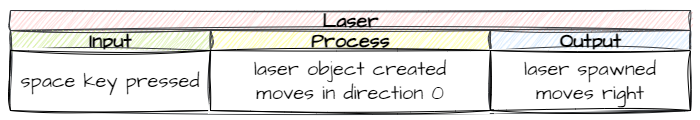
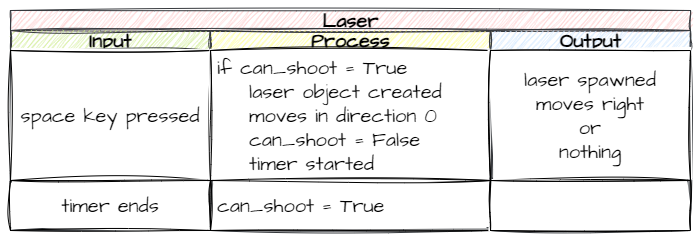

# 10. Laser

!!! learn "In this lesson we will learn"
    - how to plan a new object with an IPO table
    - how to spawn an object when a key is pressed
    - how to split a long instruction over several lines
    - how to use a flag variable to track the state of the program

!!! terms "Terminology"
    - **style guide** – a set of rules for how code should be written and laid out so it is easy to read, such as keeping lines to 79 characters or fewer.
    - **flag variable** – a variable that is either `True` or `False` and records the state of something, which our code checks to decide what to do.
    - **state** – the current condition of something in a program, such as whether the ship is allowed to shoot.

Zork is hurling asteroids at our defenceless spaceship, so we'd better give it a way to fight back. In this lesson we'll arm the ship with a laser.

## Shooting the laser

### Planning

We want the ship to spawn a laser whenever we press the space key.



This involves:

- creating a new `Laser` class
- adding a space-key event handler to the Ship, which creates a Laser
- making the laser move across the Room when it spawns
- deleting the laser when it leaves the Room

We already know how to do all of this, so let's get coding.

### Create the Laser class

Create a new file in the ***Objects*** folder, add the code below and save it as ***Laser.py***.

```python linenums="1" hl_lines="1 3-6 8-13 15-17 19-20 22-26 28-33" title="Objects/Laser.py"
--8<-- "examples/lessons/10_laser/step01/Objects/Laser.py"
```

??? note "Code explanation"
    - **line 1** → imports `RoomObject` and `Globals`.
    - **line 3** → defines the `Laser` class as a subclass of `RoomObject`.
    - **lines 4–6** → a docstring that explains what the class is for.
    - **line 8** → defines the `__init__` method.
    - **lines 9–11** → a docstring that explains what the method does.
    - **line 13** → runs `RoomObject`'s `__init__` method.
    - **lines 16–17** → loads ***laser.png*** and gives it to the laser at 33 × 9 pixels.
    - **line 20** → starts the laser moving at `0°` (right) at 20 pixels per frame.
    - **line 22** → defines the `step` method, which runs on every tick.
    - **lines 23–25** → a docstring that explains what the method does.
    - **line 26** → calls `outside_of_room` on every tick.
    - **line 28** → defines the `outside_of_room` method.
    - **lines 29–31** → a docstring that explains what the method does.
    - **line 32** → checks if the laser has gone past the right edge of the screen. The laser moves right, so we check its `x` against the screen width…
    - **line 33** → …and deletes the laser.

Open ***Objects/\_\_init\_\_.py***, add the highlighted code below and save it.

```python linenums="1" hl_lines="5" title="Objects/__init__.py"
--8<-- "examples/lessons/10_laser/step02/Objects/__init__.py"
```

??? note "Code explanation"
    - **line 5** → imports the `Laser` class, so GameFrame can find it.

### Shoot from the Ship

Open ***Objects/Ship.py*** and add the highlighted code below.

```python linenums="1" hl_lines="2 32-33 50-57" title="Objects/Ship.py"
--8<-- "examples/lessons/10_laser/step03/Objects/Ship.py"
```

??? note "Code explanation"
    - **line 2** → imports the `Laser` class, because the Ship creates lasers.
    - **line 32** → checks if the space key is pressed…
    - **line 33** → …and calls the Ship's `shoot_laser` method.
    - **line 50** → defines the `shoot_laser` method.
    - **lines 51–53** → a docstring that explains what the method does.
    - **lines 54–56** → create a new Laser in the Ship's Room, at the right-hand side of the ship (`self.x + self.width`) and halfway down it (`self.y + self.height/2`, moved up 4 pixels because the laser is 9 pixels high).
    - **line 57** → adds the new laser to the Room.

!!! tip "Splitting instructions over several lines"
    Lines 54–56 are one instruction split over three lines to make it easier to read.

    The [Python style guide](https://peps.python.org/pep-0008/) recommends lines of no more than 79 characters, so we don't have to scroll sideways to read them. We can start a new line after any `,` between arguments (like in the code above), and after any `,` in a list, dictionary or tuple. Putting a long expression inside brackets `( )` lets us start a new line after any operator too.

!!! primm "PRIMM"
    1. **Predict** what will happen when you press space.
    2. **Run** ***MainController.py*** and press space. Then hold space down.
    3. **Investigate**: what happens when you hold space down? Why?

---

## Limiting the laser

When you held down space, did you see a constant stream of lasers? Some of the other objects may have even frozen.

The Ship's `key_pressed` method runs every frame, so holding space spawns a laser 30 times a second. That's a lot of lasers! We need to limit how often the ship can shoot.

### Planning

We'll use a **flag variable** to limit how often the Ship can spawn a Laser.

!!! tip "Flag variables"
    A **flag variable** (or **Boolean flag**) is a variable that's either `True` or `False`. It records the **state** of something in the program, like a flag that's either up or down, and our code checks it to decide what to do.

We'll create a flag called `can_shoot`, starting as `True`. A laser can only spawn when `can_shoot` is `True`. Every time a laser spawns, `can_shoot` is set to `False` and a timer starts. When the timer ends, `can_shoot` goes back to `True`.



### Coding

This is all about spawning lasers, which happens in the Ship, so go back to ***Objects/Ship.py*** and change the highlighted code below.

```python linenums="1" hl_lines="23 56-62 64-68" title="Objects/Ship.py"
--8<-- "examples/lessons/10_laser/step04/Objects/Ship.py"
```

??? note "Code explanation"
    - **line 23** → creates the `can_shoot` flag and sets it to `True`, so the ship can shoot when the game starts.
    - **line 56** → checks if the ship is allowed to shoot.
    - **lines 57–60** → create and add the laser like before. They haven't changed, except they're indented one more level so they're inside the `if`.
    - **line 61** → sets `can_shoot` to `False`, so no more lasers can spawn yet.
    - **line 62** → starts a 10-tick timer (one third of a second) that calls `reset_shot` when it finishes.
    - **line 64** → defines the `reset_shot` method, which the timer calls.
    - **lines 65–67** → a docstring that explains what the method does.
    - **line 68** → sets `can_shoot` back to `True`, so the ship can shoot again.

!!! primm "PRIMM"
    1. **Predict** what will happen when you hold space down now.
    2. **Run** ***MainController.py*** and hold space down.
    3. **Investigate**: change the `10` on line 62 to `3`, then to `30`. How does it change the game? Choose the value you like best.

---

## Commit and push

1. In GitHub Desktop, type **Added laser** in the **Summary** box.
2. Click **Commit to main**.
3. Click **Push origin**.
