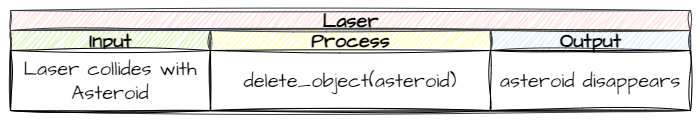

# 11. Laser and Asteroid Collision

!!! learn "In this lesson we will learn"
    - how to plan a collision with an IPO table
    - how to delete the **other** object in a collision

Our lasers are shooting at a sensible rate. Now they need to do something: destroy any asteroid they hit.

## Planning

We've written very similar code for the collision between an Asteroid and the Ship. This time, instead of ending the game, we want to destroy the asteroid. When a Laser collides with an Asteroid:

- the asteroid is destroyed
- the laser keeps moving across the screen

We already know how to destroy objects: the `delete_object` method we used in [Lesson 8](08_moving_asteroids.md#de-spawning-asteroids). We'll put this code in the `Laser` class.



---

## Coding

Remember, handling collisions in GameFrame takes two steps:

1. register which collisions to detect with `register_collision_object`
2. write a `handle_collision` method with the game logic for the collision

Open ***Objects/Laser.py*** and add the highlighted code below.

```python linenums="1" hl_lines="22-23 38-44" title="Objects/Laser.py"
--8<-- "examples/lessons/11_laser_asteroid_collision/step01/Objects/Laser.py"
```

??? note "Code explanation"
    - **line 23** → registers collisions with `Asteroid` objects.
    - **line 39** → defines `handle_collision`, which GameFrame calls when the laser hits a registered object.
    - **lines 40–42** → a docstring that explains what the method does.
    - **line 43** → checks if the laser hit an `Asteroid`…
    - **line 44** → …and deletes the **other** object (the asteroid) from this laser's Room.

!!! primm "PRIMM"
    1. **Predict** what will happen when a laser hits an asteroid.
    2. **Run** ***MainController.py*** and shoot some asteroids.
    3. **Investigate**: what happens to the laser after it hits an asteroid? We'll come back to this in [Unfair Punishment](../design/unfair_punishment.md).

---

## Commit and push

1. In GitHub Desktop, type **Laser destroys asteroids** in the **Summary** box.
2. Click **Commit to main**.
3. Click **Push origin**.
