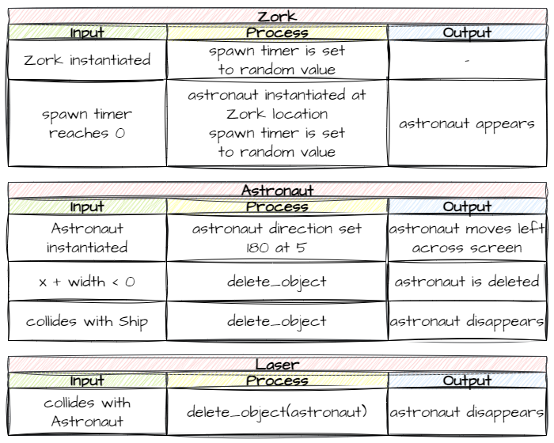

# 12. Astronauts

!!! learn "In this lesson we will learn"
    - how to plan a new object with several IPO tables
    - how to use what we already know to create, move and delete an object
    - how to handle collisions with more than one kind of object

Now we'll add the people we're trying to rescue: the astronauts. This lesson doesn't introduce any new ideas. It puts together things we've already done, so let's go straight to planning.

## Planning

We want to:

- create an `Astronaut` class
- have Zork spawn astronauts at random times
- move astronauts across the screen when they spawn
- delete astronauts when they leave the left of the screen
- rescue (delete) an astronaut when it collides with the Ship
- vaporise (delete) an astronaut when it collides with a Laser

Here they are as IPO tables.



We've done every part of these before. They're just put together differently, so let's code them.

---

## Coding

### Create the Astronaut class

Create a new file in the ***Objects*** folder, add the code below and save it as ***Astronaut.py***.

```python linenums="1" hl_lines="1 3-6 8-13 15-17 19-20 22-23 25-29 31-38 40-45" title="Objects/Astronaut.py"
--8<-- "examples/lessons/12_astronauts/step01/Objects/Astronaut.py"
```

??? note "Code explanation"
    - **line 1** → imports the `RoomObject` class.
    - **line 3** → defines the `Astronaut` class as a subclass of `RoomObject`.
    - **lines 4–6** → a docstring that explains what the class is for.
    - **line 8** → defines the `__init__` method.
    - **lines 9–11** → a docstring that explains what the method does.
    - **line 13** → runs `RoomObject`'s `__init__` method.
    - **lines 16–17** → loads ***Astronaut.png*** and gives it to the astronaut at 50 × 49 pixels.
    - **line 20** → starts the astronaut moving left (`180°`) at 5 pixels per frame, slower than the asteroids.
    - **line 23** → registers collisions with `Ship` objects.
    - **line 25** → defines the `step` method, which runs on every tick.
    - **lines 26–28** → a docstring that explains what the method does.
    - **line 29** → calls `outside_of_room` on every tick.
    - **line 32** → defines `handle_collision`.
    - **lines 33–35** → a docstring that explains what the method does.
    - **line 37** → checks if the astronaut collided with the Ship…
    - **line 38** → …and deletes the astronaut, because it's been rescued.
    - **line 40** → defines the `outside_of_room` method.
    - **lines 41–43** → a docstring that explains what the method does.
    - **line 44** → checks if the astronaut has gone past the left edge of the screen…
    - **line 45** → …and deletes it.

Open ***Objects/\_\_init\_\_.py***, add the highlighted code below and save it.

```python linenums="1" hl_lines="6" title="Objects/__init__.py"
--8<-- "examples/lessons/12_astronauts/step02/Objects/__init__.py"
```

??? note "Code explanation"
    - **line 6** → imports the `Astronaut` class, so GameFrame can find it.

### Spawn astronauts

Now we need Zork to spawn astronauts at random times, the same way it spawns asteroids. Open ***Objects/Zork.py*** and add the highlighted code below.

```python linenums="1" hl_lines="3 28-30" title="Objects/Zork.py"
--8<-- "examples/lessons/12_astronauts/step03/Objects/Zork.py"
```

??? note "Code explanation"
    - **line 3** → imports the `Astronaut` class, so Zork can create astronauts.
    - **line 29** → chooses a random number of ticks between 30 and 200.
    - **line 30** → starts a timer that calls `spawn_astronaut` when it finishes.

Then add the highlighted code below to the bottom of the `Zork` class, and save the file.

```python linenums="1" hl_lines="57-63 65-67" title="Objects/Zork.py"
--8<-- "examples/lessons/12_astronauts/step04/Objects/Zork.py"
```

??? note "Code explanation"
    - **line 57** → defines the `spawn_astronaut` method, which the timer calls.
    - **lines 58–60** → a docstring that explains what the method does.
    - **line 62** → creates a new astronaut at Zork's `x`, halfway down Zork's height.
    - **line 63** → adds the new astronaut to the Room.
    - **lines 66–67** → choose a new random time and start the timer again, so astronauts keep spawning.

!!! primm "PRIMM"
    1. **Predict** what will happen when the ship touches an astronaut, and when a laser hits one.
    2. **Run** ***MainController.py*** and try both.
    3. **Investigate**: which of the two works? Why doesn't the other one yet?

### Laser and astronaut collision

Finally, we need to handle a Laser hitting an Astronaut. Open ***Objects/Laser.py*** and add the highlighted code below.

```python linenums="1" hl_lines="24 46-47" title="Objects/Laser.py"
--8<-- "examples/lessons/12_astronauts/step05/Objects/Laser.py"
```

??? note "Code explanation"
    - **line 24** → registers collisions with `Astronaut` objects as well as asteroids.
    - **line 46** → otherwise, checks if the laser hit an `Astronaut`…
    - **line 47** → …and deletes the astronaut, because it's been vaporised.

!!! primm "PRIMM"
    1. **Predict** what will happen when a laser hits an astronaut now.
    2. **Run** ***MainController.py***.
    3. **Investigate**: how does `other_type` let one `handle_collision` method deal with two kinds of object?

---

## Commit and push

1. In GitHub Desktop, type **Added astronauts** in the **Summary** box.
2. Click **Commit to main**.
3. Click **Push origin**.
