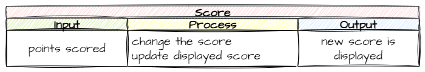

# 13. Scoring

!!! learn "In this lesson we will learn"
    - how to create a TextObject to show text on the screen
    - how to use and change the variables in ***Globals.py***
    - how to change the score when events happen
    - how to test several changes with a testing table

!!! terms "Terminology"
    - **TextObject** – a special kind of GameFrame RoomObject that displays text on the screen.
    - **HUD** – short for heads-up display, the information such as score and lives that is shown on the screen while the game is played.

Now we have all our moving parts, it's time to reward the player for their efforts, and what better reward than a score?

GameFrame is event-driven, so the easiest way to add scoring is to connect it to events. We'll give the player both positive and negative scoring events:

- rescuing an astronaut → +50 points
- shooting an asteroid → +5 points
- shooting an astronaut → −10 points

Let's work out how to add this to our code.

## Display the score

### Planning

First we need somewhere to keep the score. The [Globals variables](../reference/gameframe_api.md#globals-variables) include `SCORE`, so we can use that.

Next we need a way to draw the score on the screen. The [Text Object](../reference/gameframe_api.md#text-object) is a special kind of RoomObject that displays text, so we can treat it like any other RoomObject. Its `__init__` method takes some extra arguments, and it has an `update_text` method that redraws the text.

So we have a way to record the score and a way to display it. Before we start changing the score, let's display the current `SCORE` on the screen.

### Create the Score class

Create a new file in the ***Objects*** folder, add the code below and save it as ***Hud.py***.

```python linenums="1" hl_lines="1 3-12 14-19" title="Objects/Hud.py"
--8<-- "examples/lessons/13_scoring/step01/Objects/Hud.py"
```

??? note "Code explanation"
    - **line 1** → imports `TextObject` (the parent class) and `Globals` (where `SCORE` lives).
    - **line 3** → defines the `Score` class as a subclass of `TextObject`.
    - **lines 4–6** → a docstring that explains what the class is for.
    - **line 7** → defines the `__init__` method, which takes the Room, the `x` and `y` position, and the `text` to display.
    - **lines 8–10** → a docstring that explains what the method does.
    - **line 12** → runs `TextObject`'s `__init__` method with the same four values.
    - **lines 15–18** → set the font size, font, colour (white, as red, green and blue values) and whether the text is bold.
    - **line 19** → draws the text with these settings. Without this call, nothing appears on the screen.

!!! tip "The file name and class name can be different"
    For the first time, the file name (***Hud.py***) and the class name (`Score`) are different. They don't have to match. We'll have two **HUD** (heads-up display) items, the score and the lives, so it makes sense to keep both classes in one file. We could have made ***Score.py*** and ***Lives.py*** instead. In coding there are often many good ways to reach the same result.

Open ***Objects/\_\_init\_\_.py***, add the highlighted code below and save it.

```python linenums="1" hl_lines="7" title="Objects/__init__.py"
--8<-- "examples/lessons/13_scoring/step02/Objects/__init__.py"
```

??? note "Code explanation"
    - **line 7** → imports the `Score` class from ***Hud.py***, so GameFrame can find it.

### Add the score to the Room

Now we need to add a Score to the GamePlay Room. Open ***Rooms/GamePlay.py***, add the highlighted code below and save it.

```python linenums="1" hl_lines="1 4 17-21" title="Rooms/GamePlay.py"
--8<-- "examples/lessons/13_scoring/step03/Rooms/GamePlay.py"
```

??? note "Code explanation"
    - **line 1** → imports `Globals` as well as `Level`, so we can use `SCORE` and the screen width.
    - **line 4** → imports the `Score` class.
    - **lines 18–20** → create a Score near the top centre of the screen, showing the current `SCORE` as a string. We store it in `self.score` so other objects can find it later.
    - **line 21** → adds the Score to the Room.

!!! primm "PRIMM"
    1. **Predict** what you'll see at the top of the screen.
    2. **Run** ***MainController.py***.
    3. **Investigate**: why do we use `str(Globals.SCORE)` instead of `Globals.SCORE`?

---

## Change the score

We have a score on the screen. Now we need a way to change it. Several different collisions change the score, so the easiest way is a method that any object can call to update it.

### Planning

The method needs to do two things:

1. change the value of `Globals.SCORE`
2. write the new score on the screen



### Coding

Open ***Objects/Hud.py*** and add the code below to the end of the `Score` class, then save it.

```python linenums="21" hl_lines="1-7" title="Objects/Hud.py"
--8<-- "examples/lessons/13_scoring/step04/Objects/Hud.py:21:27"
```

??? note "Code explanation"
    - **line 21** → defines the `update_score` method, which takes `change`, the number of points to add.
    - **lines 22–24** → a docstring that explains what the method does.
    - **line 25** → adds `change` to `Globals.SCORE` (a negative `change` takes points away).
    - **line 26** → sets the Score's text to the new score, as a string.
    - **line 27** → redraws the text on the screen.

Run ***MainController.py*** to check there are no errors.

---

## Add scores to collisions

Our plan has three collisions that change the score:

1. Laser → Asteroid
2. Laser → Astronaut
3. Astronaut → Ship

We already have event handlers for all three, so we just need to add to them. Let's start with the Laser.

Open ***Objects/Laser.py***, add the highlighted code below to the `handle_collision` method and save it.

```python linenums="39" hl_lines="8 11" title="Objects/Laser.py"
--8<-- "examples/lessons/13_scoring/step05/Objects/Laser.py:39:49"
```

??? note "Code explanation"
    - **line 46** → when a laser shoots an asteroid, adds 5 to the score. `self.room.score` is the Score object we stored in the GamePlay Room.
    - **line 49** → when a laser shoots an astronaut, takes 10 off the score.

Now open ***Objects/Astronaut.py***, add the highlighted code below to the `handle_collision` method and save it.

```python linenums="31" hl_lines="9" title="Objects/Astronaut.py"
--8<-- "examples/lessons/13_scoring/step06/Objects/Astronaut.py:31:39"
```

??? note "Code explanation"
    - **line 39** → when the ship rescues an astronaut, adds 50 to the score.

---

## Testing

We've made three changes, so we need to test all three. We'll use a **testing table** with four columns:

- **Test**: what we're testing
- **Expected result**: what we expect to happen
- **Actual result**: what actually happened when we tested
- **Remedy**: if the actual result was different, how we fixed it

Here's our testing table with the first two columns filled in. Copy it, then run the game and finish it off.

| Test | Expected result | Actual result | Remedy |
| --- | --- | --- | --- |
| Laser shoots asteroid | score + 5 | | |
| Laser shoots astronaut | score − 10 | | |
| Ship rescues astronaut | score + 50 | | |

---

## Commit and push

1. In GitHub Desktop, type **Added scoring** in the **Summary** box.
2. Click **Commit to main**.
3. Click **Push origin**.
