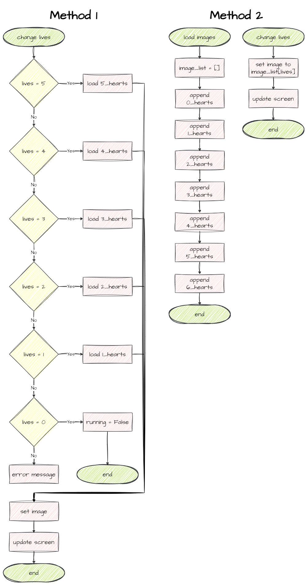
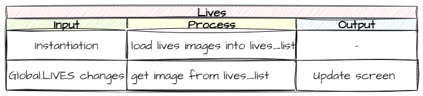

# 14. Lives

!!! learn "In this lesson we will learn"
    - how to compare two algorithms with flowcharts
    - how to change an object's image while the game is running
    - how to store images in a list and choose one with an index
    - how to reset global variables so the game can be played again

At the moment, hitting just one asteroid ends the game. That's a bit harsh, so the last step in building our game is to give the player **lives**.

## Planning

What mechanism can we use for lives? The [Globals variables](../reference/gameframe_api.md#globals-variables) include `LIVES`, which works just like `SCORE`.

We could show the number of lives as a number, but that's a bit boring. Instead we'll show hearts. Look in the ***Images/Lives_frames*** folder and you'll see five images, with 1 to 5 hearts. When the player loses a life, we'll change the image. How can we do that?

So far we've only used `set_image` in `__init__`, to give an object its image when it's created. But nothing stops us using `set_image` at other times, like when the player loses a life. Remember, we use `load_image` to find an image before we pass it to `set_image`.

Here are flowcharts of two ways we could do this:

- **Method 1** → **each** time `LIVES` changes, load the image and then set it
- **Method 2** → load all the images into a list **once**, then set the image when `LIVES` changes



If lives only ever go down, both methods do the same amount of work, because each number of lives is only shown once.

**Method 2** is better if lives can go up as well as down. Then any number of lives might be shown several times. **Method 1** would load an image every time, but **Method 2** still only loads each image once.

!!! tip "When to use data structures"
    **Data structures** organise and store data so it's easy to use. The most common Python data structures are **lists**, **tuples**, **dictionaries** and **sets**.

    Use a data structure to group values that belong together. For example, we use a tuple to group coordinates, because `x` and `y` belong together: `(x, y)`.

We want to leave the door open for bonus lives later, so we'll use **Method 2**.



---

## Coding

### Create the Lives class

The hearts are part of the HUD, so the `Lives` class goes in ***Objects/Hud.py***. Open it, add the highlighted code below and save it.

```python linenums="1" hl_lines="1 30-38 40-44 46-50" title="Objects/Hud.py"
--8<-- "examples/lessons/14_lives/step01/Objects/Hud.py"
```

??? note "Code explanation"
    - **line 1** → imports `RoomObject` as well, because `Lives` shows an image, so it's a RoomObject rather than a TextObject.
    - **line 30** → defines the `Lives` class as a subclass of `RoomObject`.
    - **lines 31–33** → a docstring that explains what the class is for.
    - **line 34** → defines the `__init__` method.
    - **lines 35–37** → a docstring that explains what the method does.
    - **line 38** → runs `RoomObject`'s `__init__` method.
    - **line 41** → creates an empty list called `lives_icon` to store the images.
    - **line 42** → loops through the numbers 1 to 5 (`range(1, 6)` stops before 6)…
    - **line 43** → …and adds each image to the list. The f-string builds each file name from the number, for example `Lives_frames/Lives_3.png`.
    - **line 44** → calls `update_image` to show the starting number of lives.
    - **line 46** → defines the `update_image` method.
    - **lines 47–49** → a docstring that explains what the method does.
    - **line 50** → sets the image to the one that matches `Globals.LIVES`. List indexes start at `0`, so we subtract 1: with 3 lives it shows `lives_icon[2]`, which is ***Lives_3.png***.

Open ***Objects/\_\_init\_\_.py***, change the highlighted code below and save it.

```python linenums="1" hl_lines="7" title="Objects/__init__.py"
--8<-- "examples/lessons/14_lives/step02/Objects/__init__.py"
```

??? note "Code explanation"
    - **line 7** → imports the `Lives` class from ***Hud.py*** as well as `Score`.

### Add the lives to the Room

Open ***Rooms/GamePlay.py***, add the highlighted code below and save it.

```python linenums="1" hl_lines="4 22-23" title="Rooms/GamePlay.py"
--8<-- "examples/lessons/14_lives/step03/Rooms/GamePlay.py"
```

??? note "Code explanation"
    - **line 4** → imports the `Lives` class as well as `Score`.
    - **line 22** → creates a Lives object near the top-right of the screen and stores it in `self.lives`, so other objects can update it.
    - **line 23** → adds the Lives object to the Room.

!!! primm "PRIMM"
    1. **Predict** what you'll see in the top-right corner.
    2. **Run** ***MainController.py***.
    3. **Investigate**: change `LIVES = 3` in ***Globals.py*** to `5`. What changes? Change it back when you're done.

### Lose a life

Now we connect `Globals.LIVES` to the collision between an Asteroid and the Ship. That collision is handled in the `Asteroid` class, so open ***Objects/Asteroid.py***, change the highlighted code below and save it.

```python linenums="53" hl_lines="7-12" title="Objects/Asteroid.py"
--8<-- "examples/lessons/14_lives/step04/Objects/Asteroid.py:53:64"
```

??? note "Code explanation"
    - **line 59** → deletes **this** asteroid, so it can't hit the ship again.
    - **line 60** → takes one life off `Globals.LIVES`.
    - **line 61** → checks if the player still has lives left…
    - **line 62** → …and if so, updates the hearts on the screen…
    - **line 63** → …otherwise…
    - **line 64** → …ends the GamePlay Room, so the game is over.

!!! primm "PRIMM"
    1. **Predict** what will happen each time an asteroid hits the ship.
    2. **Run** ***MainController.py*** and lose all three lives.
    3. **Investigate**: now press space on the welcome screen to play again. What happens?

---

## Playing again

When the game ends, we go back to the welcome screen. But if we press space to play again, something strange happens: the screen shows five hearts, and the first asteroid that hits us ends the game. Let's work out why.

1. `Globals` keeps its values for as long as the program runs, so when the new game starts, `Globals.LIVES` is still `0` from the last game.
2. `update_image` shows `self.lives_icon[Globals.LIVES - 1]`, which is `lives_icon[-1]`. In Python, index `-1` is the **last** item in a list, so we see ***Lives_5.png***.
3. When an asteroid hits us, `Globals.LIVES` goes down to `-1`, which isn't greater than `0`, so the game ends straight away.

The score has the same problem: it carries over from the last game. We need to reset both when a new game starts.

A new game starts when the player presses space on the welcome screen, so open ***Objects/Title.py***, add the highlighted code below and save it.

```python linenums="1" hl_lines="1 24-26" title="Objects/Title.py"
--8<-- "examples/lessons/14_lives/step05/Objects/Title.py"
```

??? note "Code explanation"
    - **line 1** → imports `Globals` so the Title can reset the score and lives.
    - **line 25** → sets the score back to `0` for the new game.
    - **line 26** → sets the lives back to `3` for the new game.

!!! primm "PRIMM"
    1. **Predict** what will happen when you play a second game now.
    2. **Run** ***MainController.py***, lose all your lives, then press space to play again.
    3. **Investigate**: what would happen if we reset the score in `GamePlay` instead? Is there a difference?

---

## Commit and push

1. In GitHub Desktop, type **Added lives** in the **Summary** box.
2. Click **Commit to main**.
3. Click **Push origin**.

That's the core game finished. Next, in [Game Design](../design/game_design.md), we'll learn what makes games fun and use those ideas to improve Space Rescue.
