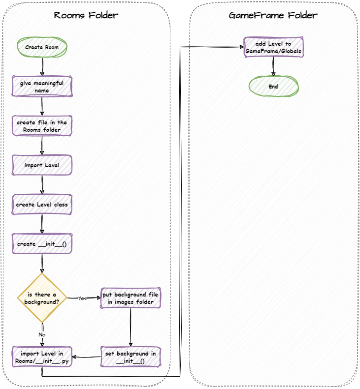
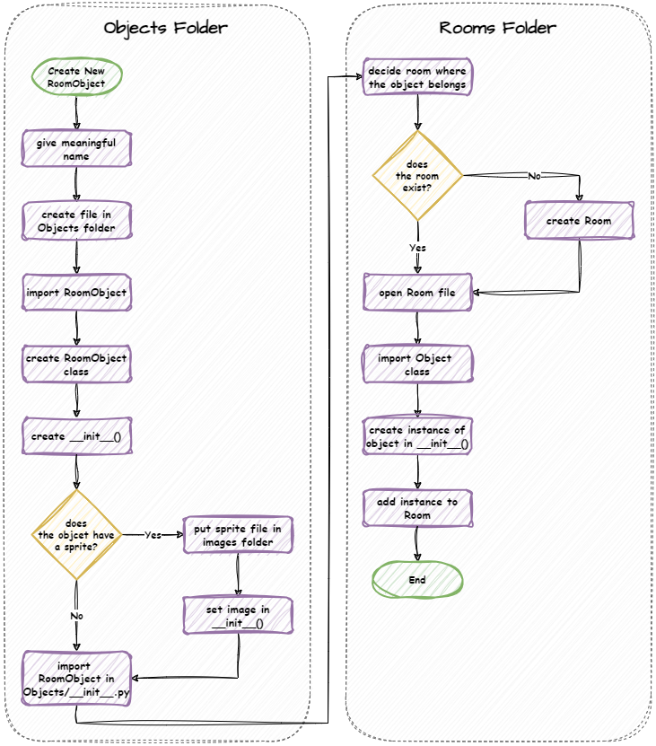
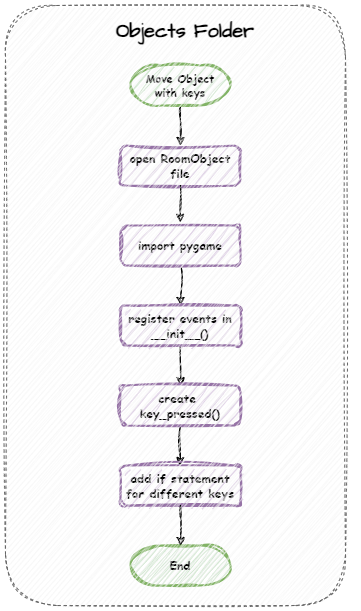
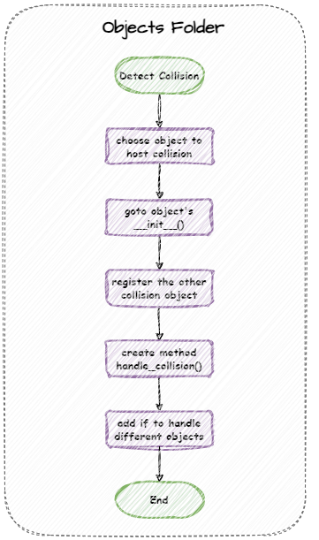

# Coding Flowcharts

!!! learn "On this page we will learn"
    - the steps for the most common GameFrame coding tasks
    - where to find an example of each task in the lessons

Below are flowcharts for the most common steps in coding a GameFrame game. Each one has a link to a lesson where we did it in Space Rescue.

## Create a Room

Example: [Lesson 2: GamePlay Room](../lessons/02_gameplay.md#create-the-gameplay-room)

---

## Create an object

Example: [Lesson 3: Spaceship](../lessons/03_spaceship.md#add-the-ship-roomobject)

---

## Move an object with keys

Example: [Lesson 3: Spaceship](../lessons/03_spaceship.md#make-the-ship-move)

---

## Detect a collision

Example: [Lesson 9: Ship and Asteroid Collision](../lessons/09_ship_asteroid_collision.md#coding)

!!! tip "More examples"
    The [Index of Topics](../reference/index_of_topics.md) lists every lesson that covers each task.
