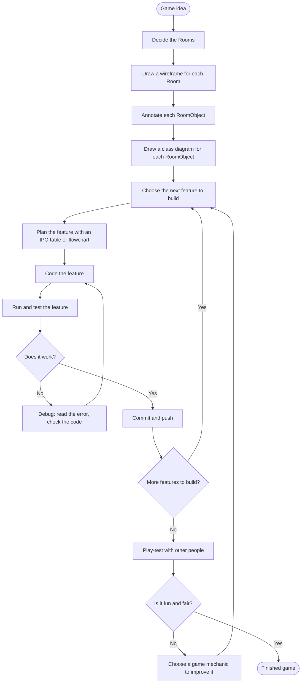

# Design Thinking Flowchart

!!! learn "On this page we will learn"
    - the steps for turning a game idea into a working game
    - where planning, coding and testing fit together
    - why we keep looping back to improve the game

!!! terms "Terminology"
    - **debugging** – finding and fixing the mistakes in a program, for example by reading the error and checking the code.
    - **play-testing** – getting other people to play our game so we can find out whether it is fun and fair.

Making a game isn't a straight line from idea to finished product. We plan a little, build a little, test, and then improve. The flowchart below shows the whole process we followed for Space Rescue, so you can use it for your own game.

## How we used it in Space Rescue

| Step | In Space Rescue |
| --- | --- |
| Decide the Rooms | WelcomeScreen and GamePlay, then DifficultySelect and ShipSelect |
| Wireframes, annotations and class diagrams | [Lesson 1](../lessons/01_welcome.md#planning) and [Planning Your Game](planning.md) |
| Plan each feature | an IPO table or flowchart at the start of each lesson |
| Code and test each feature | the code and PRIMM steps in each lesson |
| Debug | reading the error in [Lesson 1](../lessons/01_welcome.md#testing-welcomescreen), and [Common Errors](../reference/common_errors.md) |
| Commit and push | the end of every lesson |
| Play-test and improve | [Game Design](../design/game_design.md) and the mechanic pages |

!!! tip "Small steps"
    Notice the inner loop: plan, code, test, commit, repeat. Each loop adds **one** feature. When something breaks, we know it's in the code we just wrote, and our last commit is a working version we can go back to.
