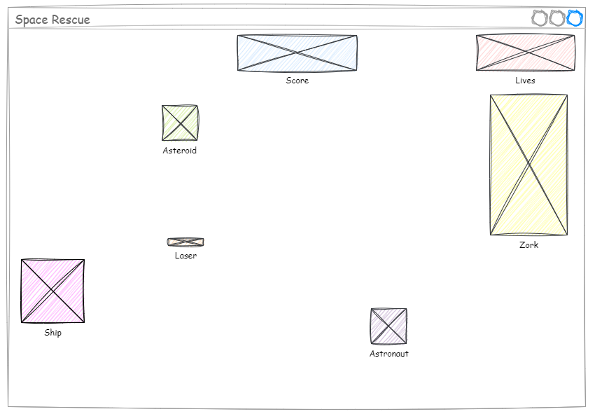
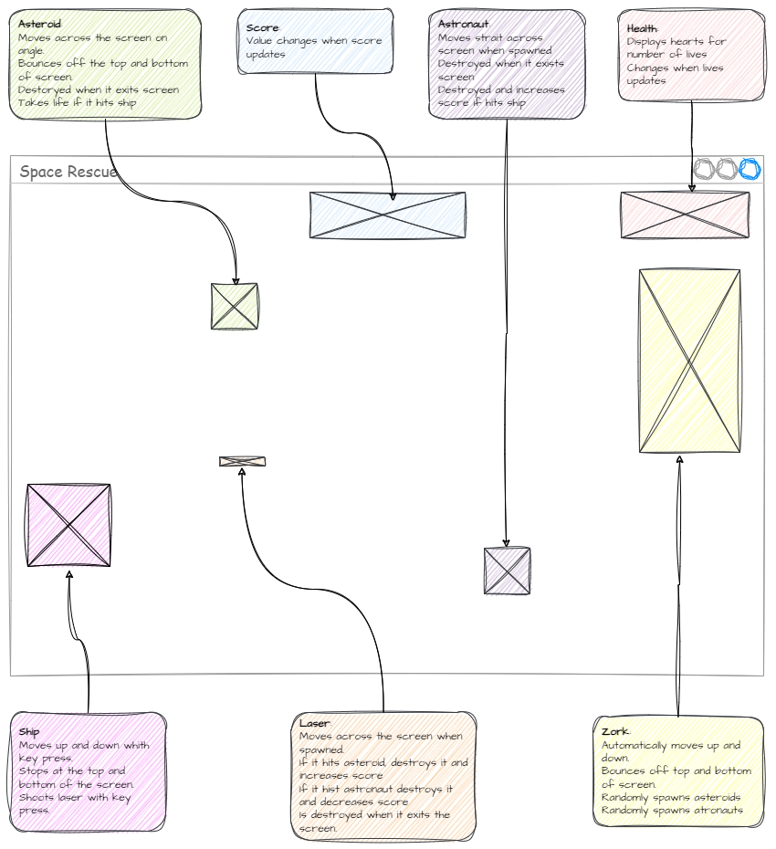
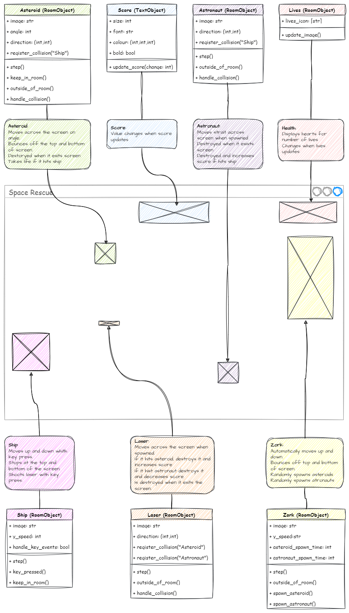

# Planning Your Game

!!! learn "On this page we will learn"
    - how to plan a new game for the GameFrame framework
    - how to use wireframes to plan Rooms and RoomObjects
    - how to describe RoomObjects with annotations and class diagrams
    - how to set up a new GameFrame project

!!! terms "Terminology"
    - **annotation** – a note added to a plan or diagram that explains what part of it does.
    - **attribute** – a variable that belongs to an object and describes one of its features.
    - **method** – a function that belongs to an object and describes an action the object can take.

## Planning the game

Back in [Get to Know GameFrame](../start/gameframe.md) we learnt that a GameFrame game is made of RoomObjects inside a series of Rooms. We'll use that idea to plan a new game.

### Step 1: Work out the Rooms

First, work out how many Rooms (levels or screens) the game will have. For example, the core Space Rescue game has two Rooms: WelcomeScreen and GamePlay. After the Game Design pages it has four, because we added DifficultySelect and ShipSelect.

### Step 2: Draw wireframes

Once we know the Rooms, we draw a **wireframe** for each one.

!!! tip "Wireframes"
    A **wireframe** is like a blueprint for a screen. It's a simple outline that shows where things like characters, buttons, images and text will go. It focuses on layout, not colours or details. It's a quick way to see and discuss ideas before building anything, like a rough sketch before a finished drawing.

A Room's wireframe should have a placeholder for every RoomObject in the Room. The placeholder can be as simple as a box, but it should be roughly the right size.

Below is a wireframe for Space Rescue's GamePlay Room. To keep it short we only show this one, but your plan should have a wireframe for every Room that looks different.

### Step 3: Annotate the RoomObjects

Now we know all the Rooms and all the RoomObjects in each Room, it's time to describe the game.

Remember, a GameFrame game works through the interactions between RoomObjects. So we describe the game by describing what each RoomObject does. Add an **annotation** to each RoomObject explaining what it does.

Below is the Space Rescue GamePlay wireframe with annotations.

### Step 4: Create class diagrams

Now we know what we want each RoomObject to do, we need to fit that into the GameFrame framework. RoomObjects are classes, so we turn each description into a **class diagram**. We've been using class diagrams since [Deepest Dungeon](https://damom73.github.io/python-oop-with-deepest-dungeon/stages/stage_1/#class-diagram).

Make a class diagram for each RoomObject. Remember:

- **attributes**:
    - describe features of the object
    - are the variables that belong to the object
    - go above the line
- **methods**:
    - describe actions the object takes
    - are the functions that belong to the object
    - go below the line

Below is the Space Rescue GamePlay wireframe with class diagrams added.

!!! tip "Plan the events too"
    For each method, think about the **event** that triggers it: a key press, a collision, a timer, or every tick of the game clock. An IPO table for each event, like the ones in the lessons, makes the coding much easier.

### Step 5: Start coding

Now we've sketched out the structure of the new game, it's time to start coding.

A blank copy of GameFrame is on GitHub at [DamoM73/GameFrame](https://github.com/DamoM73/GameFrame). Set it up the same way we did in [Setup](../start/setup.md#gameframe-and-the-game-files), using its URL instead of the Space Rescue resources.

Then build the game one small piece at a time, testing as you go, just like the lessons did. The [Coding Flowcharts](coding_flowcharts.md) page has the steps for the most common tasks, and the [Design Thinking Flowchart](design_flowchart.md) shows the whole process from idea to finished game.
