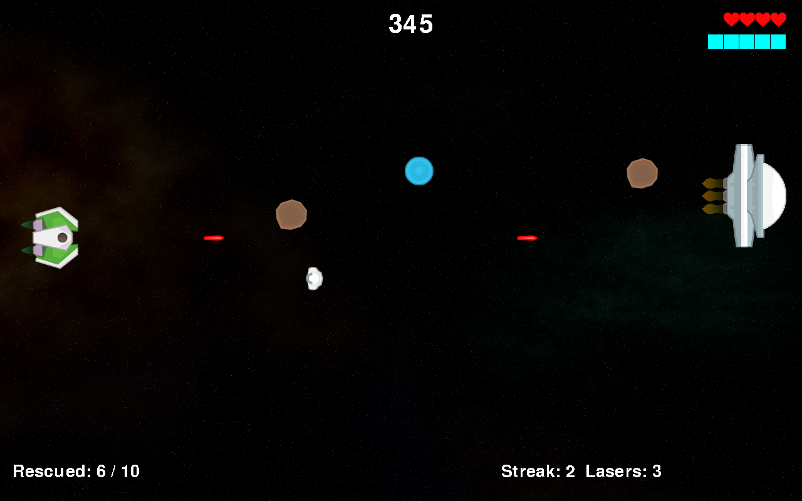

# Finished Game

!!! learn "On this page we will learn"
    - what Space Rescue looks like with every mechanic added
    - how the Rooms and objects in the finished game fit together
    - where to find the finished code

This is Space Rescue after the 14 lessons and all the [Game Design](../design/game_design.md) pages. The Attractor ship has 4 lives, has rescued 6 of its 10 astronauts, and has a streak of 2, so it can have 3 lasers on the screen. A shield pickup is floating towards it.

## How to play

1. Press ++space++ on the welcome screen.
2. Choose a difficulty: ++e++ (Easy), ++m++ (Medium) or ++h++ (Hard).
3. Choose a ship: ++s++ (Swerver) or ++a++ (Attractor).
4. Fly up and down with ++w++ and ++s++, and shoot with ++space++.
5. Rescue 10 astronauts by flying into them. Don't shoot them!
6. Shoot or dodge the asteroids Zork throws at you.
7. Press ++ctrl++ to use your ship's special power when the power meter is full.

## Rooms

| Room | What it does | Page |
| --- | --- | --- |
| WelcomeScreen | shows the title, starts the music, resets the game when space is pressed | [1. Welcome Screen](../lessons/01_welcome.md), [Audio](../design/audio.md) |
| DifficultySelect | lets the player choose Easy, Medium or Hard | [Difficulty](../design/difficulty.md) |
| ShipSelect | lets the player choose the Swerver or the Attractor | [Ship Choice](../design/ship_choice.md) |
| GamePlay | the game itself, plus the HUD and the sound effects | [2. GamePlay Room](../lessons/02_gameplay.md) onwards |
| HighScores (extension) | saves the score and shows the top five | [Saving Data with a Database](../own_game/databases.md) |

## Objects

| Object | What it does |
| --- | --- |
| Title | shows the title image and starts a new game |
| DifficultyMenu, ShipMenu | show the menu images and save the player's choice |
| Ship | moves, shoots lasers, uses its shield and special power |
| Zork | moves up and down, and spawns asteroids, astronauts and bonus pickups |
| Asteroid | bounces across the screen, and takes a life when it hits an unshielded ship |
| Astronaut | drifts across the screen, and is rescued when it touches the ship |
| Laser | flies right, and destroys the first asteroid or astronaut it hits |
| RepairKit, Shield | bonus pickups that add a life or turn on the ship's shield |
| Score, Lives, Rescued, Streak, PowerMeter | the HUD items |

## The code

The finished code is in the [tutorial files](../index.md#tutorial-files), in the ***design/ship_choice*** folder (or ***own_game/databases*** with the high score table). Compare it with your own game if something isn't working, or use it as a starting point for your own improvements.

!!! tip "Where next?"
    Space Rescue still has room to grow. Some ideas:

    - use the animation frames in ***Images*** (for example ***Asteroid_frames*** and ***Zork_Frames***) to animate the sprites
    - add a **You Win** Room that shows when the player reaches the goal
    - make Zork fire faster as the player gets closer to the goal
    - add a boss fight where the player has to shoot Zork

    Use the [Design Thinking Flowchart](../own_game/design_flowchart.md) to plan each one.
