# Using Thonny

!!! learn "On this page we will learn"
    - how to set up Thonny as the editor for Space Rescue instead of VS Code
    - how to create and check a virtual environment in Thonny
    - how to install Pygame in Thonny

!!! terms "Terminology"
    - **package** – an extra library, such as Pygame, that we install so our program can use it.

!!! warning "Thonny instead of VS Code"
    This page finishes setting up your computer with **Thonny** instead of VS Code. Before you start, complete the [Setup](../start/setup.md) page up to and including [GitHub Desktop](../start/setup.md#github-desktop).

**Thonny** is a Python editor for beginners. It comes with Python built in, which makes setup easier. Even though it's made for beginners, it has many of the features of professional editors. The lessons are written for VS Code, but everything works the same in Thonny: open ***MainController.py*** and click **Run**.

## Install and set up Thonny

1. Download Thonny from [thonny.org](https://thonny.org/) and install it.
2. Open Thonny, open the **View** menu and tick **Files** and **Shell**.
    - Why: the Files panel lets us move around the GameFrame folders, and the Shell shows errors and `print` output.
    - Result: the Files panel appears on the left and the Shell at the bottom.

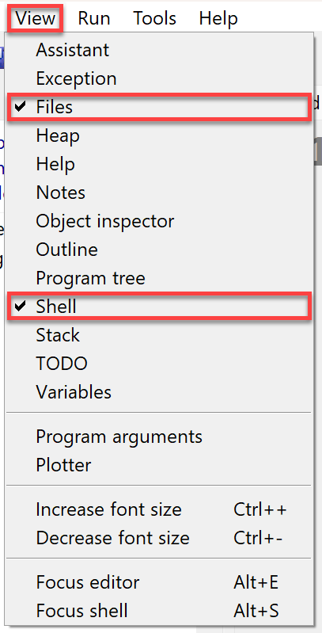

---

## Get the game files

!!! tip "GameFrame"
    GameFrame was developed by Steven Tucker, a Queensland teacher. The latest version is on his [GitLab repo](https://gitlab.com/tuxta/gameframe).

We'll use a repo that has a modified version of GameFrame and all the images and sounds for Space Rescue. We need to **clone** (copy) it from GitHub.

1. Go to the [Space Rescue Resources repo](https://github.com/DamoM73/space-rescue-resources), click the green **Code** button, then click the **copy** button beside the HTTPS URL.

    

2. In GitHub Desktop, open the **File** menu and click **Clone repository**.

    

3. Choose the **URL** tab and paste the URL into the **URL or username/repository** box.
4. Write down the **Local path**, because we'll need to find this folder in Thonny. Then click **Clone**.
    - Result: GitHub Desktop shows **space-rescue-resources** as the **Current repository**.

    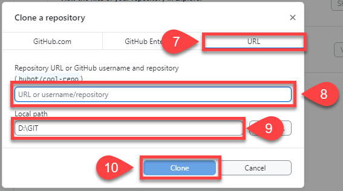

---

## Open the repo in Thonny

1. In Thonny's **Files** panel, click **This computer**.

    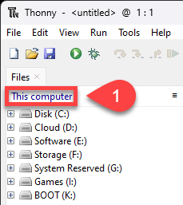

2. Click through the drives and folders until you reach the **Local path** you wrote down.
    - Result: the Files panel shows the same files as the image below.

    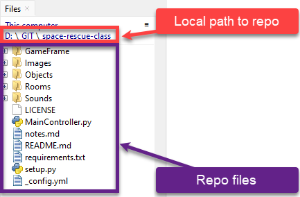

---

## Virtual environment

A **virtual environment** keeps each Python project separate. Each project gets its own space with its own Python setup and libraries, so changes in one project don't affect another. It's like giving each project its own room with its own tools.

### Create a virtual environment

!!! warning "Be in the repo folder first"
    Thonny creates the virtual environment in the folder showing in the Files panel, so make sure the Files panel is showing your repo folder.

1. Open the **Tools** menu and choose **Options...**

    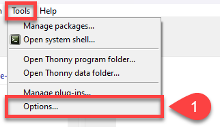

2. Click the **Interpreter** tab, then click **New virtual environment**.

    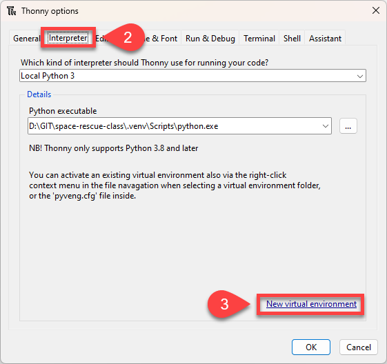

3. Click **OK** on the **Creating new virtual environment** message.
4. In the folder dialogue, right-click in the white space and choose **New** → **Folder**.

    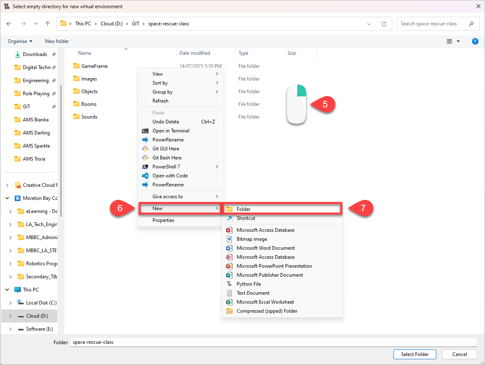

5. Name the new folder ***venv***, make sure it's highlighted, and click **Select**.

    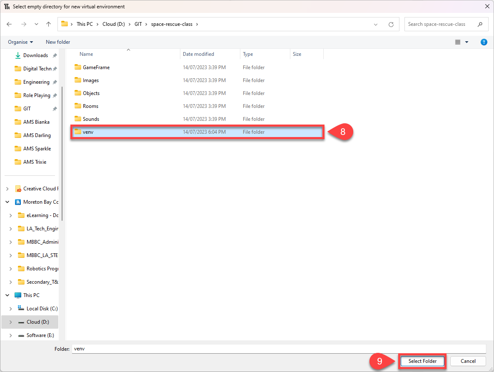

6. Wait for the **Creating virtual environment** message to close.

    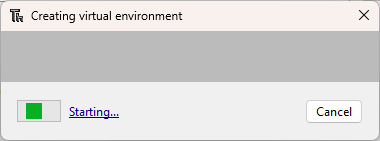

7. Check the **Python executable** points to the ***venv*** folder in your repo, then click **OK**.

    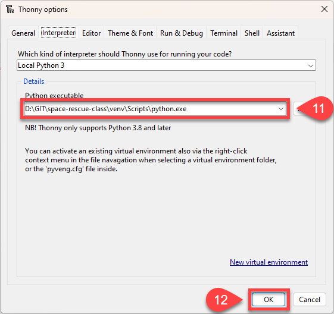

### Install Pygame

The new virtual environment is empty, so we need to install Pygame into it.

1. Open the **Tools** menu and choose **Manage packages...**
2. Search for **pygame**, click it in the results, then click **Install**.
    - Result: Thonny shows Pygame as installed. Close the window.

### Check the virtual environment

Each time you open Thonny, make sure the virtual environment is active. The Python version in the Shell should point to your ***venv*** folder.

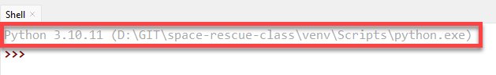

If it doesn't:

1. Right-click the ***venv*** folder in the **Files** panel.
2. Choose **Activate virtual environment**.
    - Result: the Shell restarts and points to ***venv***.

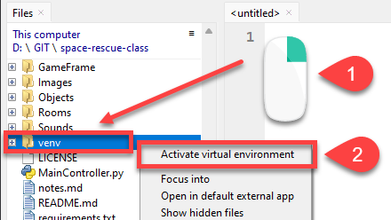

---

## First commit and push

Let's make a small change, then commit and push it, so our own copy of the repo is on GitHub. The Git terms are explained on the [Setup](../start/setup.md#gameframe-and-the-game-files) page.

1. Open ***README.md***, replace its contents with the text below and save it.

    ```text
    # SPACE RESCUE

    Try to save the helpless astronauts who are being left stranded in space by the evil Zork.
    ```

2. In GitHub Desktop, type **Made first change** in the **Summary (required)** box and click **Commit to main**.

    

3. Click **Push origin**.
    - Result: an error appears, because the repo belongs to someone else.

    

4. Choose **Fork this repository**, then **For my own purposes**, and click **Continue**.
5. Click **Push origin** again.
    - Result: our commit is now on GitHub, in our own copy of the repo.
