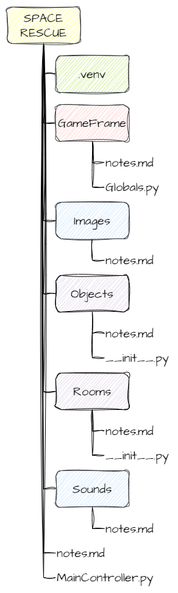

# Get to Know GameFrame

!!! learn "In this lesson we will learn"
    - how a GameFrame game is made of Objects inside Rooms
    - how a GameFrame project is organised into files and folders
    - which GameFrame files we will work with and what they do

!!! terms "Terminology"
    - **game logic** – all the code that makes a game work, such as what happens when keys are pressed, when objects collide or when the score changes.
    - **sprite** – the image used to show an object on the screen.
    - **root folder** – the top-level folder of a project, which contains all of its other files and folders.
    - **asset** – a file the game uses that isn't code, such as an image or a sound.

## How GameFrame works

The GameFrame framework is built around **objects**.

We create objects that contain the logic for how our game works. These objects are then placed inside **Rooms**, which is where the game takes place.

!!! tip "Game logic"
    **Game logic** is all the code that makes a game work. It controls things like:

    - what happens when the player presses keys
    - what happens when objects collide
    - how and when the score changes

The image below shows what our finished game will look like.


Everything we can see on the screen is an **object**:

- the player's spaceship on the left
- the enemy spaceship (called Zork) on the right
- the asteroids
- the astronauts
- the score
- the player's lives

All of these are inside a Room called **GamePlay**.

### Looking closer

The player's ship object, called **Ship**, has:

- its **sprite** (image)
- code that responds to key presses
- code that stops it moving off the top and bottom of the room
- code that shoots lasers

The other objects have their own game logic. For example:

- the **Zork** object controls when asteroids and astronauts appear
- the **Asteroid** object takes a life when it hits the ship
- the **Astronaut** object increases the score when the ship collects it
- the **Laser** object destroys asteroids and astronauts when it hits them

So when we create a game in GameFrame, we need to think about:

- which objects are in our game
- how they interact with each other
- how they interact with the player

---

## Documentation

These lessons cover many of GameFrame's features. To explore further, or to use GameFrame for your own games, the full details are on the [GameFrame API](../reference/gameframe_api.md) page.

---

## File structure

The other important part of GameFrame is its file structure. The image below shows how the files are organised.



- The yellow **SPACE RESCUE** folder is the **root** folder. It contains everything for the project.
- The green ***.venv*** folder stores our virtual environment. VS Code created it during [Setup](setup.md#virtual-environment).
- All the other folders and files belong to GameFrame. Each GameFrame folder has a ***notes.md*** file with documentation for that folder.
- The red ***GameFrame*** folder is the engine of the framework and holds most of the core code. The file we need to know about is ***Globals.py***, which stores variables used across the whole game.
- The blue ***Images*** and ***Sounds*** folders store the game's **assets**. They already have everything Space Rescue needs. If we want to add our own images or sounds, they go in these folders.
- The purple ***Objects*** and ***Rooms*** folders are where we write most of our code. This is where we create our own classes. For example, we'll create ***Ship.py*** in the ***Objects*** folder to hold the `Ship` class.

Both the ***Objects*** and ***Rooms*** folders also have an ***\_\_init\_\_.py*** file. This file connects all the parts of the program together. Every time we create a new file and class, we must add it to ***\_\_init\_\_.py*** so GameFrame can find it. For example:

```python
from Objects.Ship import Ship
```

The last important file is ***MainController.py*** in the root folder. This is the file we run to start the game.
