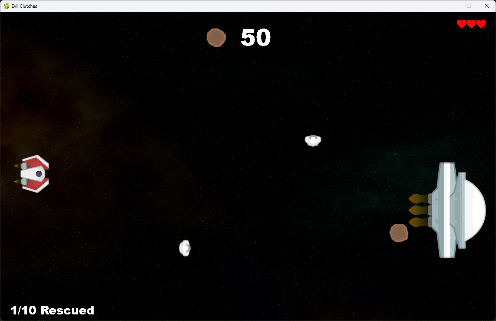
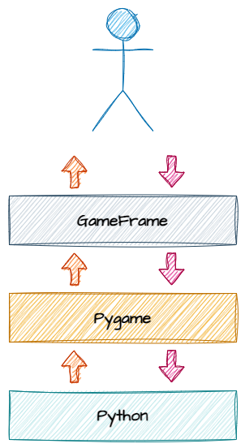

# Introduction

!!! learn "In this lesson we will learn"
    - what this course is about and the game we will build
    - the Python knowledge we need before we start
    - how Pygame is used to make 2D games
    - how GameFrame makes building games with Pygame easier
    - how Python, Pygame and GameFrame work together as a stack

!!! terms "Terminology"
    - **Pygame** – a free, open-source Python library for building 2D games and other interactive graphical programs.
    - **open source** – software whose code is freely available for anyone to use, study and change.
    - **game engine** – software that provides the tools needed to build and run games, such as drawing graphics and detecting collisions.
    - **event-driven framework** – a set folder structure and collection of ready-made classes that we build on, where our code runs in response to events such as key presses or collisions.
    - **Room** – a GameFrame screen or level where the game takes place and which holds the game's objects.
    - **RoomObject** – a GameFrame object, such as the ship or an asteroid, that is placed inside a Room and contains game logic.
    - **stack** – the layers of tools and technologies that work together to run a program, with each layer building on the one below it.
    - **API** – short for application programming interface, the set of commands one piece of software provides so other code can use it.

In this course we will build a 2D game called **Space Rescue** using Python, Pygame and GameFrame. Along the way we will also learn some basic game design ideas, and use them to make our game better.

Before we start, let's look at the tools we will use.

## Python

To follow this course, we need a good understanding of basic Python programming. We should be familiar with:

- core syntax, including:
    - `for` and `while` loops
    - `if`, `elif` and `else` statements
    - how to create and use functions
    - mathematical, conditional and Boolean operations
    - different data types
- how screen coordinates work
- how to import and use libraries
- object-oriented programming (OOP), including:
    - using objects
    - creating our own objects with `class`

If you're not confident with these skills yet, complete these courses before continuing:

- [A Turtle Introduction to Python](https://damom73.github.io/turtle-introduction-to-python/) for the core syntax
- [Deepest Dungeon - Python OOP](https://damom73.github.io/python-oop-with-deepest-dungeon/) for object-oriented programming

---

## Pygame

**Pygame** is a popular, open-source library used to build 2D games and interactive programs in Python. It gives us the tools we need to create games, simulations and graphical applications.

Pygame makes complex programming tasks simpler by using **abstraction**. For example, it can work out when two sprites collide. This makes game development much easier than building everything from scratch in Python.

Pygame is a 2D game engine, so it isn't used for large, high-budget (AAA) games like Call of Duty. It can still make large and detailed games, though, and some games on Steam have been built with Pygame.

More information is on the [Pygame website](https://www.pygame.org/docs/).

---

## GameFrame

In the words of its developer, Steven Tucker, "GameFrame has been developed to take the excellent Pygame libraries and make them more accessible and easy to use for beginner to intermediate programmers."

Just like Pygame makes it easier to create games in Python, GameFrame makes it easier to build games with Pygame.

GameFrame isn't a library like Pygame. It's an **event-driven framework**: a set folder structure and a collection of Python files that contain classes.

When we use GameFrame, we:

- define **Rooms** and **RoomObjects**
- write methods that respond to events, such as collisions or key presses

GameFrame also has clear rules about where files must be stored, and built-in commands that help us develop our game.

---

## The stack

The diagram below shows the full **stack** of tools and technologies used in this course.

Let's break this down:

- at the top, we (the **programmers**) work with **GameFrame**, using its folder structure and built-in commands (its API)
- GameFrame talks to **Pygame** through Pygame's API
- Pygame works with the core **Python** libraries to run the program

!!! tip "Languages"
    Our code, GameFrame and Pygame are all written in Python, but this isn't always the case.

    Some libraries used by Pygame are written in other languages. For example, NumPy is written in C and C++, which makes it faster and more efficient.

We can use the Pygame API directly if we want to. This means we can use Pygame commands that aren't part of the GameFrame API. We won't need these commands to finish this course, but we can use them to add extra features to our games.

Full details are in the [Pygame documentation](https://www.pygame.org/docs/).
