# Setup

!!! learn "On this page we will learn"
    - how to install Python, Git, GitHub Desktop and VS Code
    - how to get the GameFrame files for Space Rescue
    - how to create a virtual environment for our project
    - how to commit and push our code to GitHub

!!! terms "Terminology"
    - **version control** – a system that tracks changes to our files over time, so we can save versions of our work and go back to an earlier one if something breaks.
    - **Git** – the industry-standard version control system, which is free and open source.
    - **repository** – a special folder, often called a repo, that stores our project files and the history of every change made to them.
    - **GitHub** – a website that stores Git repositories online, syncs them with our computer and adds features for sharing and collaboration.
    - **GitHub Desktop** – an app that lets us use Git and GitHub without typing commands.
    - **VS Code** – short for Visual Studio Code, a professional IDE that works with many programming languages through extensions.
    - **clone** – to copy a repository from GitHub onto our computer.
    - **commit** – a saved snapshot of our changes, with a message saying what we did.
    - **push** – to send our commits from our computer to the online copy of the repository.
    - **fork** – our own copy of someone else's repository on GitHub, which we are allowed to push to.
    - **virtual environment** – a separate space for one Python project with its own Python setup and libraries, so changes in one project don't affect another.

In this course we will build good programming habits. That means using a proper development environment and **version control** to manage our code. So before we write any code, we need to install a few programs and set them up to work together.

!!! tip "Why this workflow?"
    There are many reasons for using this workflow, but most are outside the scope of this course.

    Put simply, it helps us avoid the common mistakes beginners make, so we spend more time writing code and less time fixing problems.

## Python

The first step is to install Python, the programming language we will use.

If you've used beginner editors like Thonny or Mu, Python came with them. In most real-world setups we need to install Python ourselves.

!!! tip "Python versions"
    New versions of Python 3 come out about once a year. The exact version doesn't matter for this course, so install the latest one available.

### Windows

1. Open the **Microsoft Store**, search for **Python** and install the latest version.
    - Why: the Store version updates itself and adds Python to the system path, so we can use it anywhere.
    - Result: Python appears in the Start menu.

### macOS

1. Go to [python.org](https://www.python.org/downloads/) and click the yellow **Download Python 3.x.x** button.
    - Why: the site detects our system and gives us the right installer.
    - Result: an installer file downloads.
2. Open the installer and follow the steps.
    - Result: Python appears in the **Applications** folder.

---

## Version control

**Version control** tracks the changes to our files over time. It lets us save versions of our work and go back to an earlier version if something breaks.

It's a bit like OneDrive, but it isn't automatic. After saving our work, we choose when to sync it to the cloud.

### Git

**Git** is the industry-standard version control system. It's free and open source. Git stores our code in a special folder called a **repository** (or **repo**), which keeps track of every change we make.

We won't use Git directly. Instead, it's built into the tools we'll use, but we still need to install it.

1. Go to [git-scm.com/downloads](https://git-scm.com/downloads) and download the installer for your operating system (Windows or macOS).
    - Why: GitHub Desktop and VS Code use Git behind the scenes.
    - Result: an installer file downloads.
2. Run the installer and accept all the default settings.
    - Result: Git is installed. Nothing new appears on screen, because we won't use Git by itself.

### GitHub

**GitHub** is the website that stores our repos online and syncs them with our computer. The free account is all we need.

1. Go to [github.com](https://github.com/) and click **Sign up**.
2. Use your school email to create your account (you can change it later).
    - Result: you can sign in to GitHub.

!!! tip "Git vs GitHub"
    Git is the tool that tracks changes to files and manages repos on our computer. GitHub is a website that stores those repos online and adds features for sharing and collaboration.

    GitHub is the most popular option, but there are others, such as GitLab and Bitbucket.

### GitHub Desktop

**GitHub Desktop** is an app that lets us use Git and GitHub without typing commands.

1. Go to [desktop.github.com](https://desktop.github.com/), download GitHub Desktop and run the installer, accepting the default options.
    - macOS: move the app to **Applications** and restart when asked.
2. Open GitHub Desktop and sign in with your GitHub account.
    - Result: GitHub Desktop shows your account name and an empty list of repositories.

---

## VS Code

An **Integrated Development Environment** (**IDE**) is a program that lets us write, edit and test code in one place. It gives suggestions and shows errors as we type, organises our files, and runs our programs.

We will use **Visual Studio Code** (**VS Code**) for this course.

!!! warning "Alternative to VS Code"
    VS Code is a professional IDE with many features we won't need. It also works with deeper parts of the computer, which can make setup more difficult.

    If you'd prefer something simpler, you can use Thonny instead. Follow the [Using Thonny](../reference/using_thonny.md) guide instead of the VS Code steps below.

1. Go to [code.visualstudio.com](https://code.visualstudio.com/), click **Download** and run the installer, accepting the default options.
    - Result: VS Code opens with a Welcome tab.
2. Install the [Python extension](https://marketplace.visualstudio.com/items?itemName=ms-python.python): click **Install**, then allow the page to open VS Code.
    - Why: VS Code works with many languages, and the extension adds Python support (running code, error checking and virtual environments).
    - Result: the Python extension shows as installed in VS Code's **Extensions** panel.
3. Install the [Material Icon Theme](https://marketplace.visualstudio.com/items?itemName=PKief.material-icon-theme) the same way.
    - Why: by default VS Code doesn't show icons in the file panel, which makes it harder to tell files and folders apart.
    - Result: files and folders in VS Code have coloured icons.

---

## GameFrame and the game files

!!! tip "GameFrame"
    GameFrame was developed by Steven Tucker, a Queensland teacher. The latest version is on his [GitLab repo](https://gitlab.com/tuxta/gameframe).

We will use a repo that has a modified version of GameFrame and all the images and sounds for Space Rescue. We need to **clone** (copy) this repo onto our computer.

1. Go to the [Space Rescue Resources repo](https://github.com/DamoM73/space-rescue-resources), click the green **Code** button, then click the **copy** button beside the HTTPS URL.
    - Result: the repo's URL is on the clipboard.

    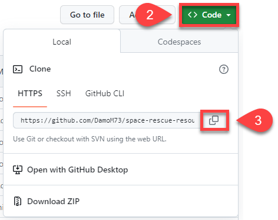

2. In GitHub Desktop, open the **File** menu and click **Clone repository**.

    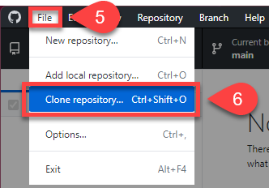

3. Choose the **URL** tab, paste the URL into the **URL or username/repository** box, and click **Clone**.
    - Result: GitHub Desktop shows **space-rescue-resources** as the **Current repository**.

    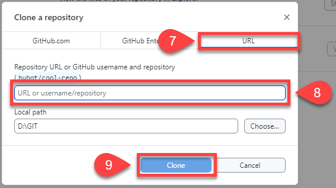

!!! tip "Git and GitHub terms"
    - **Repository (repo)**: a special folder that stores our project files and their history
    - **Commit**: a saved snapshot of our changes, with a message saying what we did
    - **Push**: sending our commits to the online copy of the repo
    - **Pull**: getting the latest changes from the online copy
    - **Remote**: the online copy of the repo (on GitHub)
    - **Origin**: the main remote copy of our repo
    - **Clone**: copying a repo from GitHub to our computer
    - **Local**: the copy of the repo on our computer
    - **Fork**: our own copy of someone else's repo

---

## Open the repo in VS Code

We will use GitHub Desktop to manage our workflow: opening our code in VS Code, **committing** (saving) our work to the local repo, and **pushing** (syncing) it to GitHub.

1. In GitHub Desktop, check the **Current repository** is **space-rescue-resources**, then click **Open in Visual Studio Code**.

    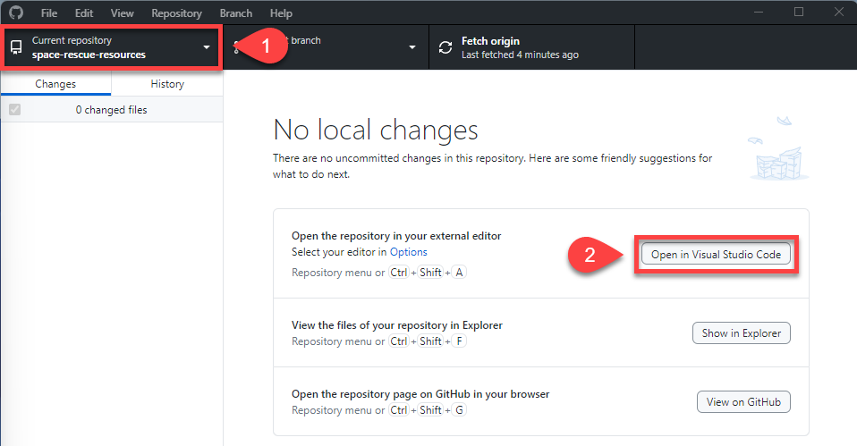

    - Result: VS Code opens, and the file panel shows **SPACE-RESCUE-RESOURCES** with the folders below.

    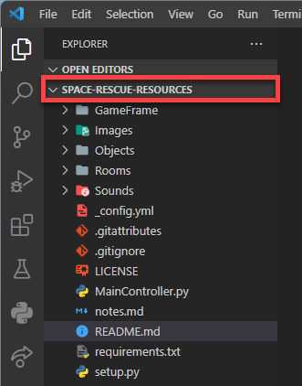

---

## Virtual environment

A **virtual environment** keeps each Python project separate. Each project gets its own space with its own Python setup and libraries, so changes in one project don't affect another. It's like giving each project its own room with its own tools.

!!! tip "requirements.txt"
    The ***requirements.txt*** file lists the extra libraries our project needs. For Space Rescue that's just `pygame`. VS Code reads this file when it creates the virtual environment.

!!! warning "Windows: allow scripts first"
    On Windows, we may need to run one PowerShell command before creating a virtual environment for the first time:

    1. Open **PowerShell** as Administrator.
    2. Run `Set-ExecutionPolicy -ExecutionPolicy RemoteSigned -Scope CurrentUser`

    We only need to do this once on each computer.

1. In VS Code, press ++ctrl+shift+p++ (++cmd+shift+p++ on macOS), type **Python** and choose **Python: Create Environment...**

    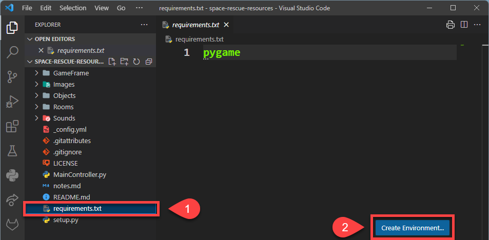

2. Choose **Venv**.

    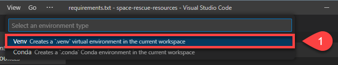

3. Choose the latest version of Python you installed.

    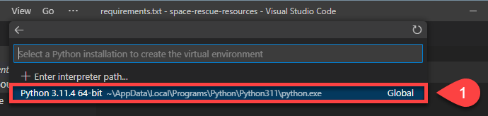

4. Tick **requirements.txt**, then click **OK**.
    - Why: this installs Pygame into the new environment.
    - Result: VS Code creates a ***.venv*** folder, installs Pygame and activates the environment.

    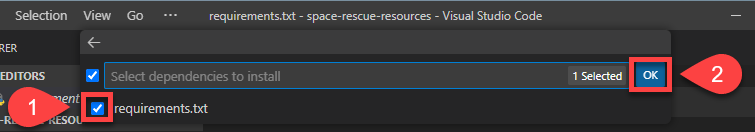

5. Check the status bar in the bottom right of VS Code.
    - Result: it shows the Python version and the name of the virtual environment (`.venv`). If both are there, the environment is active.

    

---

## First commit and push

Let's make a small change, then commit and push it, so our own copy of the repo is on GitHub.

1. Open ***README.md***, replace its contents with the text below and save it.

    ```text
    # SPACE RESCUE

    Try to save the helpless astronauts who are being left stranded in space by the evil Zork.
    ```

2. In GitHub Desktop, type **Made first change** in the **Summary (required)** box and click **Commit to main**.
    - Result: the change disappears from the **Changes** list.

    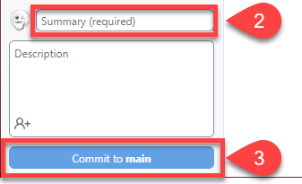

3. Click **Push origin**.
    - Result: an error appears, because the repo belongs to someone else and we can't push to it.

    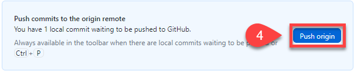

4. Choose **Fork this repository**, then **For my own purposes**, and click **Continue**.
    - Why: a **fork** is our own copy of the repo on GitHub, so we can push to it.
5. Click **Push origin** again.
    - Result: our commit is now on GitHub, in our own copy of the repo.

We're ready to start coding.
